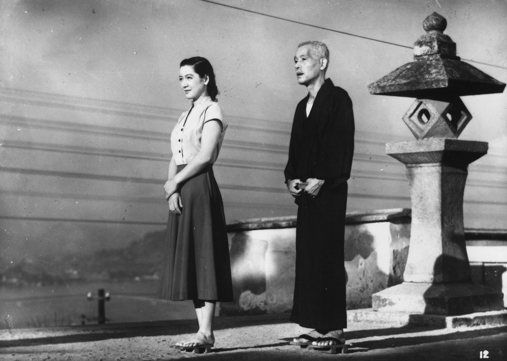
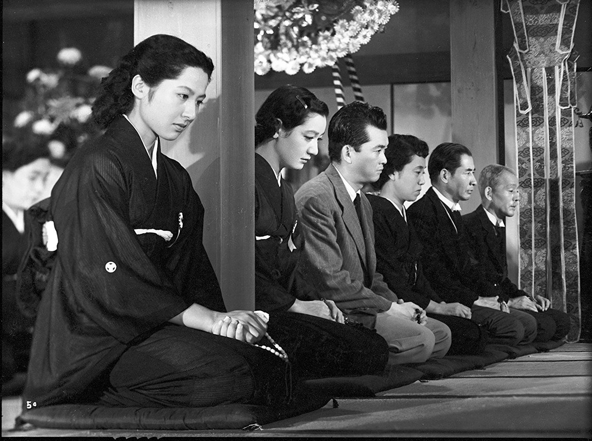
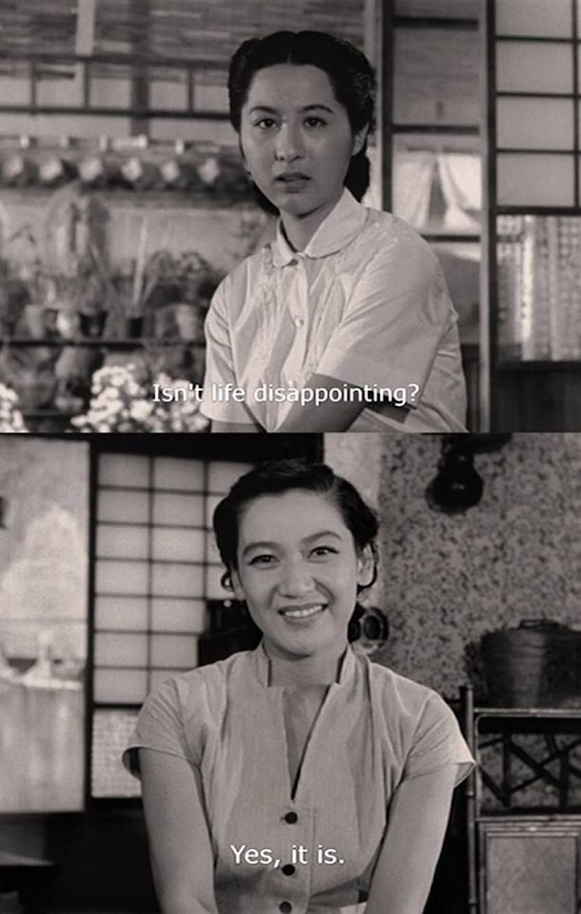
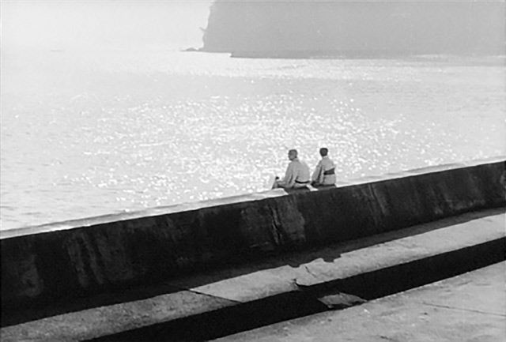
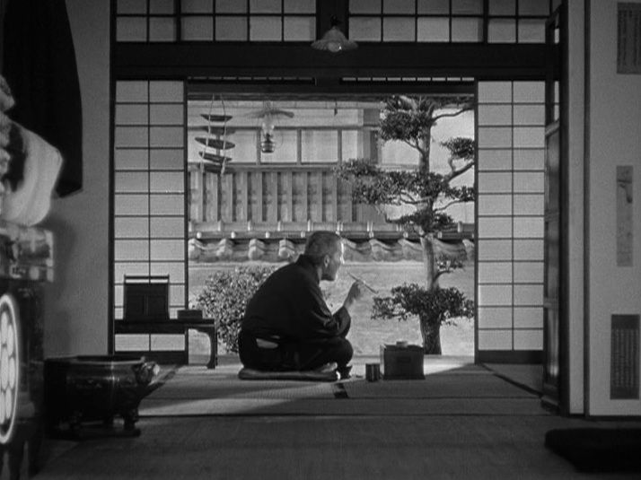

Another two weeks of work and pandemic boredom.

All images this week are stills from *Tokyo Story*, which you’ll read about below.

## That which is spontaneously so: the *Daodejing*

As I continue to explore world classics, I read the *Daodejing*, the famously inscrutable classic at the very heart of Daoism. I… am not so sure it is comprehensible! I read the “philosophical translation” (with commentary) by Roger Ames and David Hall, which I’ve heard is the most precise translation. Unfortunately, being academic philosophers, their commentary is… not so comprehensible either! In any case, here’s the quick-and-dirty summary I came up with at the end:[^1]  

> Traditional Daoist thought is not based on an object ontology - that is, unlike Western thought, there is no recognition of the "reality" (e.g. Platonic forms, atoms) behind the "appearance", but rather reality just *is* the continuous flow of experience (that is, it is that which is *ziran* - spontaneously so). Thus, "dao" is not best understood as some final reality, but rather the "natural course" of things (which has both a "natural" and moral component) as an ongoing process (hence Ames' and Hall's translation as "way-making"). In this view, there is not (and cannot be) a strict division between anything; thus, names can only ever be conventional and opposites always imply each other (e.g. light turns into dark turns into light).
>
> Ames and Hall argue that the *Daodejing* emphasizes both "field" and "focus". Field here refers to the ongoing flow of experience that makes up *dao*, while focus emphasizes the fact that there is no "view from nowhere" - experience is always experienced from a particular viewpoint. However, focus is "holographic" in that any individual experience implies everything that went into making it up, which is to say, everything that exists - so focus in fact requires attention to be paid to the network of relationships in which the experience is embedded.
>
> Thus, to have *de* (virtue) is to act in accordance with this "natural course", which is to say noncoercively and with deference to the social and natural relationships in which we are embedded, and the *Daodejing* goes on to apply this to governance (where it says a type of anarchism is best) and warfare (which, though perhaps unavoidable, is a grievous loss due to its inherent coerciveness). This is in contrast to Confucianism, which emphasizes ritual norms in the social sphere, which Daoists feel ignores both the natural world and the "spontaneity" required for the good life.

Is that a fair rendering of their arguments, let alone the *Daodejing* itself? I have no idea, but that’s what I got out of it.

In any case, one connection I *did* make was with [field theory](https://en.wikipedia.org/wiki/Field_(physics)) in physics. I’m obviously not a physicist, but my understanding is that these days it’s popular to express physical problems as the time evolution of a field, with e.g. photons not being “particles” at all but rather [bundles of energy in a particular field](https://en.wikipedia.org/wiki/Force_carrier). And, of course, there’s quantum mechanics, where quantum systems are “fuzzy” and [interconnected](https://en.wikipedia.org/wiki/Quantum_entanglement) [until “measured”](https://en.wikipedia.org/wiki/Quantum_decoherence). Both of these have obvious parallels with the classic Daoist continuous/processual worldview noted above, so perhaps this still has some relevance today.

## “I can’t stand that sound”: Ancestral rites in *Tokyo Story*

*Tokyo Story* is a simple story. An elderly couple visits their grown children in booming postwar Tokyo, only to find that their children, who are not as successful as they thought, are too busy for them. But (spoiler alert, although the plot really isn’t the point here) upon returning home, the wife falls ill and her condition rapidly deteriorates, and the children must come back home for the funeral. In a heartbreaking scene[^2], the youngest son, who was on a business trip and couldn’t make it back before she passed, leaves the Buddhist-style funeral, telling his sister “I can’t stand that sound [of chanting]. It makes mother seem smaller and smaller.” Yet ultimately, they leave after a few days, back to their own lives and problems.

I sometimes wonder if the pointedly death-negative (death-fearing, death-avoiding) culture of the United States, or the West more generally, has to do with the development of modern individualism and the end of ancestral rites. The idea of being remembered after your death is important to many cultures—it’s referenced in the *Daodejing* and of course that’s essentially the plot of *Coco*[^3]—and it seems psychologically important that someone remember us after death, at least until we’re far enough removed from the world of the living that we can be safely forgotten. Or, perhaps more importantly, it is important for those left behind with the grief—to paraphrase Keanu Reeves, the ones who will miss us—to remember and know that that remembrance is socially sanctioned, and that others will remember them after.

But *Tokyo Story* is no conservative story, pining for an imagined pastoral past where children had perfect filial piety. It does not provide easy answers. After the funeral, the couple’s youngest daughter (who looked after her parents) rages that her older siblings, in their modern lives, couldn’t be bothered to stay more than a day or two. But the couple’s widowed daughter-in-law Noriko, the only one to pay them any attention, points out to her that she should be understanding—someday, she too would have a life of her own (and, as we eventually learn, Noriko is herself desperately lonely in the wake of her husband’s death). And then:

Which, despite its simplicity, is probably the most profound thing I’ve ever seen a film say.

Anyway, *Tokyo Story* is a masterpiece and quite possibly the best film ever made, even though it was released in 1953. There’s a lot to talk about and I doubt this will be the last time you see it here (or that I watch it). I cannot recommend it highly enough.

In case all that was too heavy, here’s a [related joke](https://twitter.com/charles_irl/status/1289414073688367105) on Twitter.

## The abstraction of gender

A brief, floating thought, not very fleshed out: arguably the story of civilization—the defining feature, perhaps—is a history of abstraction. “Supply chains” is just the capitalist take on this—by getting takeout, we are abstracting away cooking, and the restaurants get their food from some supplier, which abstracts away getting supplies. But what if we apply this to other parts of culture, like gender?

The [latest Conversations with Tyler](https://conversationswithtyler.com/episodes/nathan-nunn/) references a study wherein cultures that had a history of plow use had lower levels of female labor force participation, as plows require more upper body strength than rival technologies (like the hoe) and so these regions culturally evolved an economy with men working in the fields and women working , thanks to [comparative advantage](https://en.wikipedia.org/wiki/Comparative_advantage). But we’re a long way removed from the days of backbreaking labour in the fields, and that comparative advantage no longer exists. So, in a certain sense, “gender” is a vestigial organ of culture, evolved for certain purposes that no longer make sense (but only to a certain extent, of course).

So my hypothesis, then, would be that civilization has brought us to a point where gender itself is being abstracted away—it continues to exist and yet is not so tied to anything biological. (Obviously, we are very much not at that point yet—but I would argue we’re on the way.) That’s not to deny the reality of gender identity, mind—but I would hold our personal sense of gender, or even our sense of what is even possible gender-wise, is very much culture-dependent. I don’t think it’s an accident that non-binary genders suddenly exist—indeed, I would say they were catalyzed by the Internet, where, as the saying goes, nobody knows you’re a dog; in other words, the Internet, or at least some corners of it, already have completely abstracted gender, in no small part because they are virtual, and one of the upshots of abstraction is the ability to be much more creative and loose (compare programming, which is definitely more abstract and also much looser than most other forms of engineering, or the heights of abstract financial engineering, like negative oil prices).

Anyway, that probably didn’t make a whole lot of sense, and I should probably clean it up. But that’s a peek into the inner workings of my mind for you 😛

## Miscellanea

I read through Stephanie Dalley’s translations of *Myths from Mesopotamia*, most notably the [Epic of Gilgamesh](https://en.wikipedia.org/wiki/Epic_of_Gilgamesh), the [Enuma Elish](https://en.wikipedia.org/wiki/En%C3%BBma_Eli%C5%A1), and the [Atrahasis](https://en.wikipedia.org/wiki/Atra-Hasis), aka the original flood myth[^4]. I thought I’d have a lot more to say about them, as they are some of the oldest writing we still posses; and while there is a lot to be said, especially about Gilgamesh and his quest for immortality after the death of his BFF Enkidu, it is a bit tough to enjoy the stories when they’re mis[                   ]  and even entire episodes, which can only be very speculatively reconstructed. Still, given they’re quite short (you can read the entirety of what we have of Gilgamesh in maybe an hour and a half), I think they’re well worth spending some time with.

I also watched two more late-‘60s King Hu wuxia films, both fairly acclaimed, namely [*Come Drink With Me*](https://en.wikipedia.org/wiki/Come_Drink_with_Me) and [*Dragon Inn*](https://en.wikipedia.org/wiki/Dragon_Inn). Both were, of course, highly entertaining, and the opening of *Come Drink With Me* in particular is a masterpiece of editing and choreography. But both suffer from a letdown of an ending; *Dragon Inn* because the ending is slow paced and feels twenty minutes too long, and *Come Drink With Me* because the ending focuses on a side character that is far less interesting than Cheng Pei-pei’s fiery Golden Swallow and because (thanks to studio interference) it’s thematically incoherent, simultaneously praising restraint and forgiveness while also drenching audiences in gallons of stage blood. Still, the first half of both are so enjoyable that I don’t hesitate to recommend them.

I’ve exclusively listened to albums on repeat all week, Philip Glass’ 1985 soundtrack to *Mishima* and Taylor Swift’s recent *folklore*, which makes an interesting contrast. Not much to add other than to say that both are excellent and well worth the time.

[^1]: Perhaps consider this the inaugural “random Zettelkasten note”.

[^2]: The second time I cried watching this movie.

[^3]: Another movie that made me cry.

[^4]: Unfortunately, I discovered the collection only includes the later Akkadian [descent of Ishtar to the underworld](https://en.wikipedia.org/wiki/Inanna#Descent_into_the_underworld) and not the earlier (and much more detailed) Sumerian version.