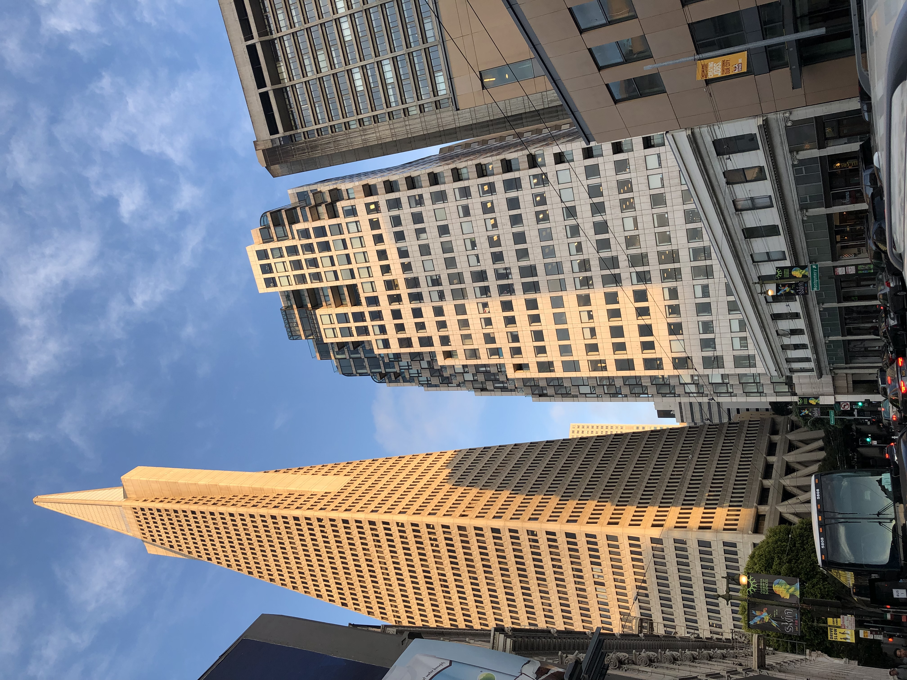
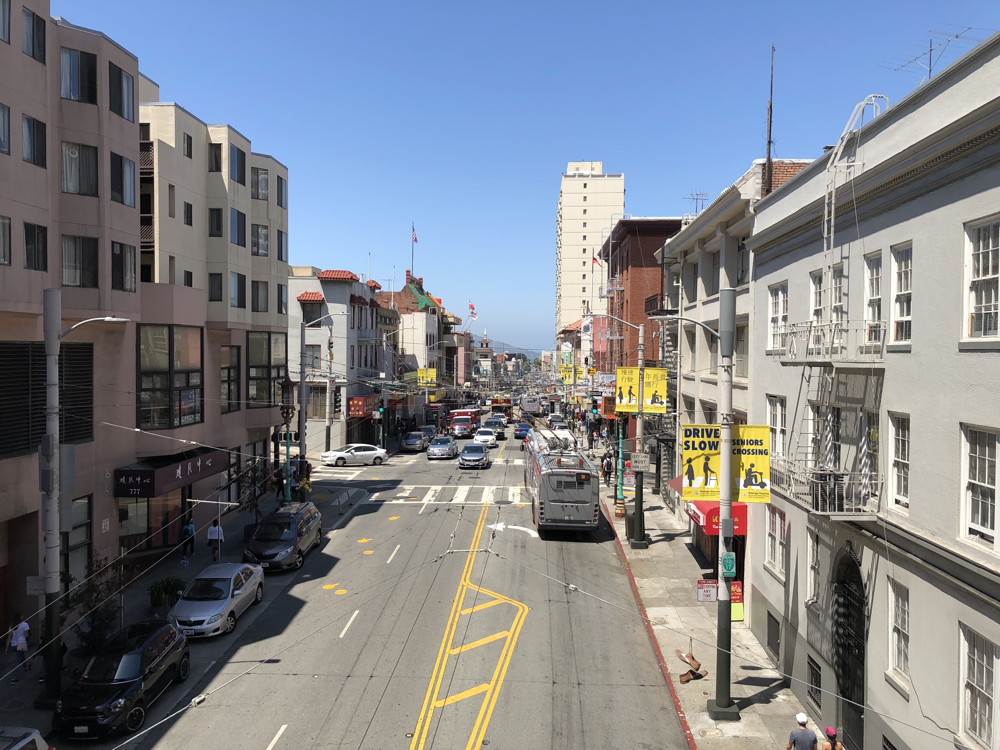
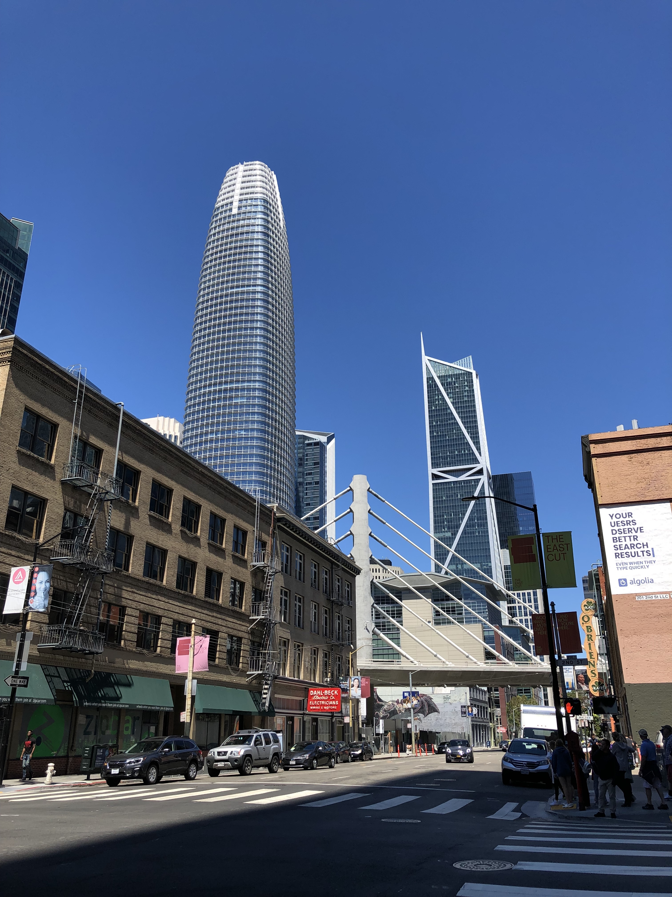
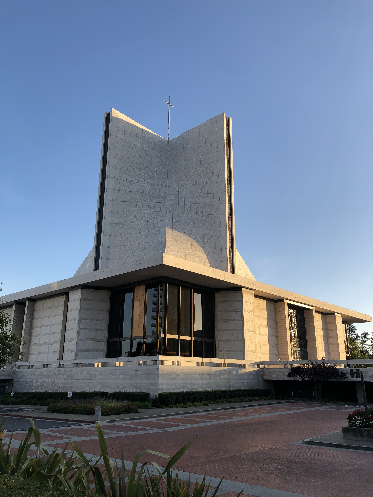

So, I've gone and done it—I’ve moved to San Francisco.

I guess in a way this is the culmination of a long-term dream—when I first visited the Bay Area, ten years ago or so, I remember thinking “ah, yes, I'll live here some day.” Of course, I'm a much different person now than I was then, and it feels much more bittersweet than my young middle-grade self would have suspected. After a month here, I can't say it feels much like home yet—it feels distinctly temporary, as if I'm going to spend four months here and not four years (or, more likely, more). But I suppose Vancouver took many months to really start feeling like home.

San Francisco is just as weird as people say. It's not as hipster as one might expect—there’s matcha and cold brews aplenty, sure, but there's few dispensaries and even fewer man buns—which I think might be a product of demographics—most folks seem to fall into “historic inner-city residents” and “tech workers,” who I’ve found around here are generally pretty normal, if somewhat nerdy. Politically, though, the city is a strange beast. There’s a... group?... called [gay shame](https://buttondown.email/running-costs) that puts up badly-designed posters targeting the evil YIMBYs and their white techie gentrifier supporters (which would be me). Apparently gay shame's plan for high housing costs is to... stop building and kick all the tech workers out? It is interesting (and, probably, indicative of the very different social class systems in Canada and the United States) that that kind of resentment is rather rare in Vancouver, at least on the surface.

So, what else is new? I started at [Asana](https://asana.com/), which is about as nice a workplace as I can imagine and pays quite well to boot. Better yet, I get to fulfill another middle-grade dream of developing iOS apps for a living (on a related note, it's funny to think that most of my coworkers have been developing iOS apps since I've been in middle school!).

As one final housekeeping note, I switched the newsletter to [Buttondown](https://buttondown.email/). It seems everybody has left TinyLetter, mostly for the VC-funded Substack, but I prefer to support the small guy (who even has a [neat graph](https://buttondown.email/running-costs) of his running costs, topped off with a description of what those costs are going towards). In any case, if this email looks strange (or, worse yet, went straight to your spam folder), that's probably why.

To my surprise, I find myself thinking about *The Shining* a lot. I watched it for the first time last Halloween and definitely enjoyed it, though I wouldn't have rated it as a favourite. But given how often I find myself drawn to it—the image of Jack limping around with an axe in particular—I think I should probably upgrade its status in my mind. It's just such a tightly-crafted machine. And, like all great horror films, the ghosts or zombies or aliens are just set dressing; the real horror, in this case, is domestic abuse—yes, there's competing theories, like how it's actually about American Indian genocide, but at least in this case I prefer to hold to the surface reading. (As an aside, I recently read Bart Ehrman’s *Lost Christianities*, in which he briefly speculated about what would have happened if some form of Gnosticism had won over orthodox Christianity, and concludes that we would focus much more on extracting the “real,” hidden meaning of our media. Speculative, of course, but interesting!). I also find it interesting that it's set in a hotel, since one of my *other* favourite movies, *The Grand Budapest Hotel*, is obviously about a hotel, and so is my favourite game, *The Norwood Suite*. Maybe I just like fiction about hotels. (Of course my other favourite movies are *Pan’s Labyrinth*, because it's a Spanish Civil War-set fairytale chock full of religious imagery so of *course* I love it, *Dr Strangelove*, because it’s a Cold War-set black comedy full of sexual imagery so of *course* I love it, and *Princess Mononoke*, because it’s a pacifist fantasy chock full of wolf imagery so of *course* I love it.)

On the other hand, I also watched Alfred Hitchcock’s *Vertigo*, allegedly one of the best films of all time (or so Wikipedia’s summary would claim, citing the 2012 Sight & Sound poll) and... honestly, it left me pretty cold. Watching it blind a week before the move, it was a nice surprise to find that it's basically a tour of historic San Francisco landmarks, but overall I found it mediocre. Certainly part of the problem is the very '50s attitude towards gender relations (which makes large parts of the film all-but-incomprehensible to a 2019 audience), but even then I found the plot fairly flimsy, especially after the big reveal that, strangely, comes about two-thirds into the film. I *really* struggled to stay awake after that—the (possibly supernatural) mystery at the core of the story is exactly what I was interested in!
Apparently, putting the big twist reveal a good 40 minutes from the end was quite controversial, but in any case, it was the wrong decision.

### What I’m Reading

I'm *this* close to finishing *A Storm of Swords*, which remains delightful despite its length. Speaking of massive fantasy known for world-building, a coworker (multiple coworkers, actually) is a huge Brandon Sanderson fan and highly recommended I promote his position on my to-read pile, so I may find myself reading *Mistborn* sooner rather than later. But, first, I have to read postmodern horror story *House of Leaves*, which is the latest Russell & Sherry Book Club book (you can tell we’re official because we have a [Goodreads group](https://www.goodreads.com/group/show/998090-russell-sherry-book-club), and we're seriously considering a podcast). Plus there's *The Peach Blossom Fan*, a classic Chinese play about the fall of the Ming dynasty, which I'm hoping to use as a source for my still-in-progress-I-haven’t-forgotten-about-it fantasy novel. Oh, and I can’t forget about *A Series of Unfortunate Events*, which is just as fantastic as I remembered; hopefully this time I'll actually finish it! (As a fun side story, the same coworker mentioned above also noted that his family went to school with Daniel Handler. Something something small world—I suppose I went to school with a [famous YouTuber](https://www.youtube.com/channel/UCmh5gdwCx6lN7gEC20leNVA)).

### What I’m Listening To

I'm totally here for Billie Eilish’s revival of trip-hop. Now, before you complain, note the similarities. Melancholy but catchy beats? Check. Dark, paranoid lyrics? Check. Husky sprachgesang? Check. She’s just missing the belting female vocalist, but I'm not sure that was ever a good thing anyway. I'm also (finally) catching up on Thom Yorke’s latest, *Anima*, which is more Thom Yorke and therefore automatically good.

In the podcast world, I’ve been taken by *You Must Remember Manson*, a season of Panoply’s *You Must Remember This*, which covers not just the grisly Manson murders but, more importantly, their cultural context and cultural influence. I've also been listening to a bunch of *Our Opinions Are Correct*, in which Annalee Newitz and Charlie Jane Anders basically just shoot the shit about a science fiction topic of the week. I enjoy listening to it even though they honestly don't seem to say all that much; it's perfect background noise.

### What I’m Learning

I'm following along with Bob Nystrom’s [*Crafting Intepreters*](http://www.craftinginterpreters.com/), in preparation for the long-awaited release of the closures chapter. In particular, I've been trying to convert his code into more-or-less equivalent Rust, which is a bit time-consuming, since it's Very C™️ code.

### What I’m Building

I'm not building it *yet*, but Goodreads is kind of garbage, no? I'm sure alternatives exist, but it would be an interesting challenge to build a fully-featured competitor, complete with mobile apps.

Well, that's all, folks. I'll be back in *hopefully* a week with more to say. *Hopefully.*