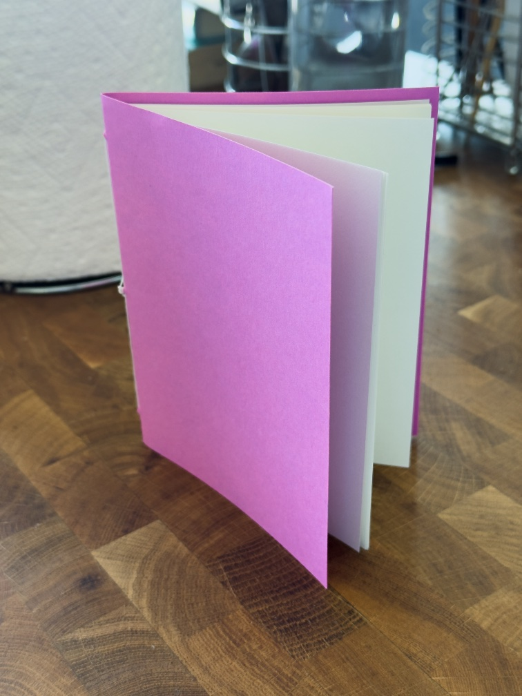

- You too could make one of these! Read on!

So recently I attended one of the Intro to Bookbinding classes at [San Francisco Center for the Book](https://www.sfcb.org/). Lovely little class of eight people with a charming instructor, even if what we actually learned[^1] was relatively simple[^2] — I’m definitely interested in going back for more of their bookbinding and letterpress classes, and maybe doing some small projects of my own. Maybe I’ll become one of those book arts people!

SFCB is representative of a very particular Northern California arts-and-crafts-and-cooking culture. I was recently[^3] discussing this with some friends and had some trouble expressing it, so I’m not sure how well I’ll be able to explain it here, but — Northern California, and the Bay Area more specifically, has a (surprising?) amount of energy towards small-scale, but professional, arts-and-crafts-and-cooking. I’m thinking here of SFCB or [Arion Press](https://arionpress.com/) or the [Letterform Archive](https://letterformarchive.org/) or [Dandelion Chocolate](https://www.dandelionchocolate.com/) or [J. Street Chocolate](https://www.jstchocolate.com/) or [Fat Gold](https://fat.gold/) or [Scintillant Studio](https://www.scintillantstudio.com/) or [Heath Ceramics](https://www.heathceramics.com/) or [Clay and Steel](https://www.clayandsteel.com/) or [Brucato Amaro](https://brucatospirits.com/)[^4] or [Moonwake Coffee Roasters](https://moonwakecoffeeroasters.com/) or [Song Tea & Ceramics](https://songtea.com/) or the dozens of craft fairs, like [SF Zine Fest](https://www.sfzinefest.org/) or the [Art Book Fair](https://sfartbookfair.com/) or the various craft fairs that pop up at [Fort Mason](https://fortmason.org/). Just lots of artisanal crafts, belying the reputation of the Bay Area as a soulless hellscape of B2B SaaS billboards.

Now, every major metropolitan area has some sort of arts-and-crafts scene, and so do more rural parts of the United States.[^6] The United States is not _so_ thoroughly deindustrialized, even if it’s no longer possible to produce a T-shirt at scale in the US. But Bay Area crafts feels... _different_ in a way that’s hard to describe. Like, I read _Salt, Fat, Acid, Heat_[^5] and go... of _course_ Samin Nosrat’s based in Berkeley. Of course!

Part of it is just the sheer money flowing through the Bay Area. The crafts scene thrives in spite of, but also _because of_, the wealth of Silicon Valley. Tech billionaires don’t pal about at the SFCB or Scintillant Studio, but their employees sure do![^7] And I _suspect_ that’s not so often the case in major industries in other cities like finance in New York. So there is in fact a market for all the high-end chocolate and vermouth and pottery that’s put out. _And_ there’s money floating around to actually start these businesses in an urban area that is (not-quite-proverbially[^8]) expensive; famously, Dandelion was founded by ex-Google employees, and my understanding is that Brucato is a similar story.

But there’s also something about how _open_ many of those businesses are. Most of them at least offer tours or classes or exhibits, if not basing most of their business on them. And many of them regularly attend craft fairs, even quite small or local ones. They are, proverbially, [“working with the garage door up”](https://notes.andymatuschak.org/About_these_notes?stackedNotes=z21cgR9K3UcQ5a7yPsj2RUim3oM2TzdBByZu).

But also also this goes along with the general _obsessiveness_ of Bay Area culture, which is equally hard to explain. The same urge that drives people into a frenzy over Web 3.0 or OpenClaw also drives (a slightly different set of) people into making really good amaros. You meet random people at a house party that seem like average tech industry worker bees and then find out that they, like, spend their weekends as semi-professional metalworkers or whatever.[^9]

One of the friends I was discussing this with had a hypothesis, which I’ll term the “normie vs nerd spectrum.” A lot of cities _do_ have major subcultures around crafts, or fashion, or art, etc etc, but they’re just that — subcultures. They’re gatekept, to one degree or another, and they’re not something “normies” would necessarily interact with day-to-day. But the Bay Area doesn’t really _have_ normies, in the same way. _Everyone_ is a bit nerdy, and those subcultures are much closer to the surface. It’s much easier to sink into one of them and suddenly find yourself an expert in some weird craft field.

Curiously, the one craft the Bay Area _doesn’t_ have a strong foothold in is hot sauces (plural). Where’s the Bay Area-native chili crisp?? Where’s the California kumquat habanero sauce??

Anyway, I’m still not sure any of that made much sense, but I’ll continue refining it. Also obviously I haven’t lived in every major metropolitan area in the United States so I’m sure fair objections could be made, but still, if you spend enough time in Northern California _something_ feels different here.

---

Only one link this week that I am absolutely certain you have seen already, because it seems to be _everywhere_, but: [did you know that story about Lorem Ipsum coming from the 1500s is _fake???_](https://youtube.com/watch?v=kL1PDqzqhM4)

[^1]: A basic zine fold, a simple slipcase for a zine, a pamphlet stitch, and a Japanese-style stab binding.

[^2]: Or, as the instructor put it while advertising the eight-hour-long core classes, “making a whole book definitely takes _at least_ eight hours” 😅

[^3]: By “recently” I mean like two months ago...

[^4]: Or [Mommenpop](https://mommenpop.com/), or [Lo-Fi Aperitifs](https://www.lofiaperitifs.com/), or [Veso](https://drinkveso.com/), or [Heidrun Meadery](https://heidrunmeadery.com/)...

[^5]: On a vaguely related note: I recently learned Nosrat’s (famous?) distaste for iodized salt is actually quite incorrect — iodized salt is still [really, really important](https://youtube.com/watch?v=XRcwwZXJ8gk), especially if you’re planning to get pregnant soon.

[^6]: Every Midwestern resort town is legally required to have at least one woodworking shop named “Unbearably Rustic”, after all.

[^7]: Ahem speaking for my self.

[^8]: Though I suppose “as expensive as commercial real-estate Manhattan” really _is_ proverbial in a way that San Francisco isn’t, quite.

[^9]: Which reminds me of a [long-ago Andy Matuschak tweet](https://x.com/andy_matuschak/status/1511560841644052484) where he points out that “SF can be hard to for visitors to see” because you just have to go to informal dinner parties with weird people. That then reminded me of [Dan Wang’s 2025 letter](https://danwang.co/2025-letter/), where he complained that San Francisco is an underperformer in national culture and has a general lack of cultural awareness, which always sat wrong with me, and I’m now realizing why — yes, that’s true... if you only interact with the kind of tech people that spend all their time at AI meetups and don’t engage with the broader Bay Area culture. See also Celine Nguyen’s [“in defense of san francisco's art scene”](https://www.personalcanon.com/p/in-defense-of-san-franciscos-art).
