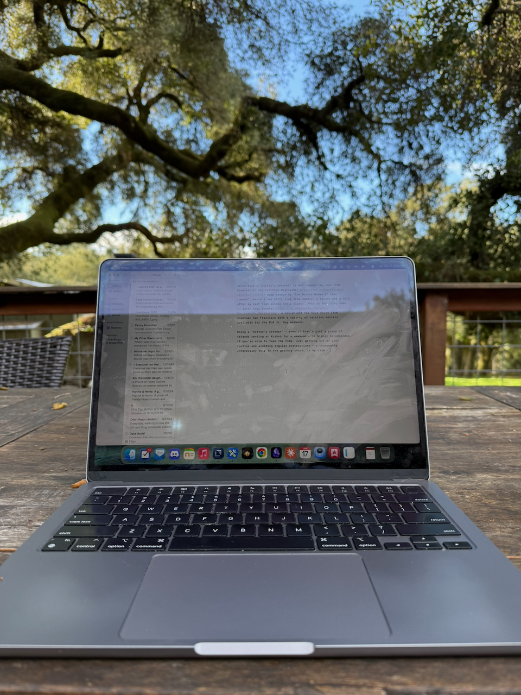

Hello from a “writer’s retreat” in Ben Lomond! No, not [the mountain in the Scottish Highlands](https://en.wikipedia.org/wiki/Ben_Lomond) made famous by “The Bonnie Banks o’ Loch Lomond” (which I can still sing from memory, a decade and a half after my last high school choir class). This is the [tiny town in Santa Cruz County](https://en.wikipedia.org/wiki/Ben_Lomond,_California), a convenient two-hour drive from downtown San Francisco with a variety of vacation rentals available for the MLK Jr. Day weekend.

Doing a “writer’s retreat” — even if that’s just a group of friends renting an Airbnb for a weekend — is highly recommended, if you’re able to take the time. Just getting out of your routine and avoiding regular distractions — thoroughly unnecessary trips to the grocery store, in my case — is surprisingly productive.

---

Here’s a specification for an art piece I thought up once:

> The piece should be placed in a warehouse — large enough to not be human scale, but small enough to not be completely overwhelming. The piece itself is a “forest” of lights — a mismatched combination of street lamps and household lamps (and possibly others, as long as they’re about 5-7 feet tall — near or just above head height) placed in a grid, with 5-foot spacing between them. They’re all wired together with dimmable  bulbs, such that a software program can control the light level on each individual light. Viewers walk through the “forest” as various light patterns play out through the “trees” of light — waves of light and darkness, or all lights suddenly turning on or off all at one, or light “racing” through the forest like fairies. Perhaps there’s a viewing platform to see the patterns from above, or perhaps you can only experience it by walking through it.

I’m not a conceptual artist — I’m a writer; I’m not used to having to do anything more than open my laptop to get creative work done; where would I get the warehouse and hundreds of lights, let alone programming them? — but if I was, I’d be pursuing this. But maybe someone reading this will be inspired? 😉

---

As happens at least once a month, I miss writing linkblogs. Maybe I’ll start a mini-newsletter just for reading recommendations, or include it as a regular section in my weekly newsletters. But, in the meantime, here’s a few things I saw this week that I would like to pass along:

- [The 2025 Satyrs’ Forest Horny Awards™](https://satyrs.eu/bestof/2025): One of the wildest and loveliest websites on the weird wide web, the *Satyr’s Forest* is always a delight, and particularly their year-end media review. This year, they added extremely charming spinnable DVDs for each movie they review. And they turned me on to Ninajirachi’s *I Love My Computer*, which is a.) the most Zillennial album ever b.) almost definitely going to be my album of the year 2026.
- [“This Is How You Get JARHEAD Sequels”, *Folding Ideas*](https://www.youtube.com/watch?v=i5m-RHS1fU0): Despite watching them somewhat often, I’m not a fan of Modern YouTube Video Essays, because they often have lengthy runtimes without saying all that much. *Folding Ideas* is one of the better video essayists, and this video is worth the investment — an analysis of why *Jarhead* is great, why its “sequels” are so very, very bad, and why those sequels were even made (hint: film industry finance). Though, I would still perhaps recommend 1.5x speed.
- [“The Wisconsin Town Ruled By A Pseudo-Catholic Cult”, Tor’s Cabinet of Curiosities](https://www.youtube.com/watch?v=_Vxu2WWl9Nc): Self-described “autistic special interests” channel Tor’s also makes lengthy videos — this one is 98 minutes, so I would recommend 2x speed... — but they’re so consistently fascinating that I end up watching all of them. This one is about the history of the Necedah Shrine, a pseudo-Catholic, Marian cult started in the ‘50s that ended up dominating the small town of Necedah, Wisconsin and hosting an assortment of bizarre Catholic-adjacent cult figures. Though, I may find this episode particularly interesting because as a Midwestern child I spent a lot of time in [Wisconsin Dells](https://en.wikipedia.org/wiki/Wisconsin_Dells,_Wisconsin), which is only a half hour drive from Necedah, so it’s conceivable I’ve passed through the town in the past. General audiences may prefer this [38-minute video about the history of Jagganath](https://youtube.com/watch?v=iv3HyowJOjM) that inspired the English term “juggernaut”.
- [“Modern Pagan Witchcraft”, Ronald Hutton](https://www.youtube.com/watch?v=zbkiF--EpqQ): I’ve been meaning to read Hutton’s celebrated *Triumph of the Moon*, on the history of Wicca, for probably close to a decade, and now I don’t have to, because he’s condensed it into a 45-minute lecture! (But I probably still will read it... someday...)
