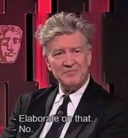

[Source](https://publicdomainreview.org/essay/woodcuts-and-witches/)

Recently I’ve been thinking about the ineffability of art.

Which is a fancy way of saying “hey, some stories are really weird and hard to explain what the artist was thinking, right?” And many of those are among my _favorite_ stories, even though I can’t quite explain what the stories “mean”.

A few months back I talked about [_Twin Peaks: The Return_](https://rwblickhan.org/newsletters/welcome-to-season-8/) (which you will certainly hear about again from me...), and David Lynch is definitely the poster child of this:

Or another example is _The Rime of the Ancient Mariner_, which I revisited recently (due to a stray reference in _Frankenstein_).

> Read the Martin Gardner annotated edition if you can get your hands on it. SFPL helpfully has one (1) copy that I am currently hoarding.

_Ancient Mariner_ has a pretty simple-on-the-surface plot: mariner goes on a trip to the South Pole, shoots a friendly albatross, his ship is marooned and the rest of the crew dies of thirst, leaving only him alive (... forever) to spread the good word that you should respect all God’s creatures, big and small. Which, in fairness, is already a somewhat strange poem to write, but makes some sense in a (ahem) capital-R Romantic context.

But what really gives this bizarre ineffable feeling is a scene in the middle; as the rest of the crew lays dying, they come upon a ghost ship in which Death and a woman called Nightmare Life-in-Death are playing dice for the souls of the crew. Which, just... what? What?? The rest of the poem is fantastical (angels moving the boat, slimy things with legs on the sea, etc) but feels downright normal in comparison.

This then led me to revisit Lewis Carroll’s _Hunting of the Snark_ (again, get the Martin Gardner edition) as well as some of Edward Gorey’s comics like _The Insect God_ or _The Curious Sofa_, which similarly have a “haha what???” vibe that really leaves you wondering what could have possibly inspired the story.

---

I was thinking about this because I finally (finally!) played _The Stanley Parable_...

> I _enjoyed_ _The Stanley Parable_, but I didn’t quite love it. It raises a lot of interesting questions about free will and the meaning of life and all that... but, at the end of the day, it’s mostly a gag. A very funny gag! When the Narrator throws you into _Minecraft_ and the first level of _Portal_, I laughed out loud, because that’s a joke targeted _very specifically_ to someone of not just my generation but, I think, my exact birth year. But ultimately I found _The Beginner’s Guide_ more thought provoking.

... and that reminded me of Davey Wreden’s later game, _The Beginner’s Guide_. (Spoilers now abound to the end of this section. I would just play _The Beginner’s Guide_ because it’s about an hour and a half long and requires no video game skills! It’s a masterpiece of the form!)

_The Beginner’s Guide_ walks the player through a number of incomplete video game levels made by Davey’s friend Coda. (The narrator Davey is fictionalized, but of course you don’t know that at the start.) As you explore, Davey helpfully edits the levels to skip, say, a mysterious, purposeless labyrinth, and he waxes lyrical on the possible meaning of the street lamp that appears at the end of each level.

Except, as the player eventually finds out, Davey stole the levels from Coda and posted them publicly against his wishes, and even added the street lamps — because Davey-the-narrator _interpreted_ the recurring motifs of labyrinths and prisons and locked doors as an alarming sign of Coda’s deteriorating mental health. But, as Coda points out in his final communication, Davey has no right to edit his art in an attempt to impose meaning, which was, after all, made for completely personal reasons. But then you’re left with the question: why _do_ all the levels have labyrinths and prisons and locked doors? The human mind can’t help but interpret.

Which of course makes it amusing that _The Beginner’s Guide_ [Wikipedia page](https://en.wikipedia.org/wiki/The_Beginner%27s_Guide#Interpretations) has a lengthy interpretations section.

---

Who _does_ have the right to impose meanings on art, to exhibit art, to decide what it means, especially when it’s clearly for personal therapeutic reasons? I think about that sometimes with outsider artists like, say, [Henry Darger](https://en.wikipedia.org/wiki/Henry_Darger), though an even better example might be posthumous art-world darling Hilma af Klint, whose story has [recently been complicated](https://www.newyorker.com/magazine/2025/11/24/the-strange-afterlife-of-hilma-af-klint-paintings-posthumous-star).

---

I was thinking more about _Frankenstein_ and _Dracula_ (prompted by a reply to [last week’s letter](https://rwblickhan.org/newsletters/capital-r-romantic-melodrama/)) and I realized they’re partly interesting because they’re epistolary — and there’s just not that many epistolary novels these days.

Certainly, there’s some great surreal, formally-inventive work out there — conveniently, Lincoln Michel published a list of [“Short Little Difficult Books”](https://countercraft.substack.com/p/short-little-difficult-books) this week. But most of those aren’t _epistolary_ or, as I might otherwise describe it, _bricolage_ — they may have frame-narratives-in-frame-narratives or use of the second person or whatnot, but they’re not told as collections of in-world documents. _This Is How You Lose The Time War_ does the letter-writing thing to great effect, and _House of Leaves_ is ostensibly a film studies dissertation (again, to great effect), but otherwise I can’t really think of other major modern novels with that kind of bricolage structure. Am I just missing something? Or probably there’s an English dissertation out there that has the answer that I’m too lazy to look up right now.

---

[“You need to listen to this compilation of ‘80s Spanish ambient and electronic music”](https://www.theverge.com/column/817417/la-ola-interior-compilation-80s-spanish-ambient-and-electronic-music), says _The Verge_, and I have to agree. _La Ola Interior_ has been playing nonstop this week, particularly the skin-crawlingly surreal “La Contorsion de Pollo” by Camino al desván and “Malagueñas 2” by Javier Segura. I can’t quite put my finger on what makes them so compelling, even compared to other ambient music — something something [writing about music is like dancing about architecture](https://en.wikipedia.org/wiki/Writing_about_music_is_like_dancing_about_architecture) — but something about those two pieces in particular touches my soul like very few other songs have.

---

I never realized that “writing about music is like dancing about architecture” has such a complicated history! For some reason, I always assumed it was a famous line from a famous essay by a famous rock critic in the 1960s, but instead nobody quite seems to know who exactly originated it (which is usually the answer to “who made this thing”). Also, [this lovely quote](http://collapseboard.com/where-the-metaphor-fails-writing-about-music-is-like-dancing-about-architecture/) on the Wikipedia page:

> Robert Christgau has two good witty answers for “Writing about music is like dancing about architecture”. \[...\] “One of the many foolish things about the fools who compare writing about music to dancing about architecture is that dancing usually is about architecture. When bodies move in relation to a designed space, be it stage or ballroom or living room or gymnasium or agora or Congo Square, they comment on that space whether they mean to or not”.

---

I am officially an Old™️ — I don’t understand the 6/7 meme, I don’t know how to perform it, and I don’t find it uproariously funny when somebody accidentally says “6/7”. Or, rather, I _do_, but only a solid six months late, when the actual kids have moved on, and then only really on an intellectual level — as one of those strange shibboleths for children that doesn’t really _mean_ anything, but intentionally exercises us Olds attempting to find out what it _really means_.

Curiously, I _didn’t_ have this reaction to Skibidi Toilet, because I actually have the full context there! Skibidi Toilet, in case you didn’t know, is machinima made in [_Garry’s Mod_](https://store.steampowered.com/app/4000/Garrys_Mod/), a circus of Source Engine ragdoll physics with a long history of inspiring nonsensical, absurdist humor. In fact, following on from [the discussion of arts criticism](https://rwblickhan.org/newsletters/vulgar-poptimism-is-real-in-2025/) a few weeks ago, I’m surprised there’s not _more_ literary criticism explaining this history — 99 Percent Invisible and Endless Thread ran a [solid episode on machinima](https://99percentinvisible.org/episode/hl-04-machinima/transcript/) recently that explained Skibidi Toilet without mentioning _Garry’s Mod_ at all!

(And, of course, _The Stanley Parable_ also fits into that absurdist Source Engine-based tradition, which brings this all full circle.)

---

Happy American Thanksgiving to the Americans in the audience. May the sudden onslaught of the Christmas Season not find you unprepared.
