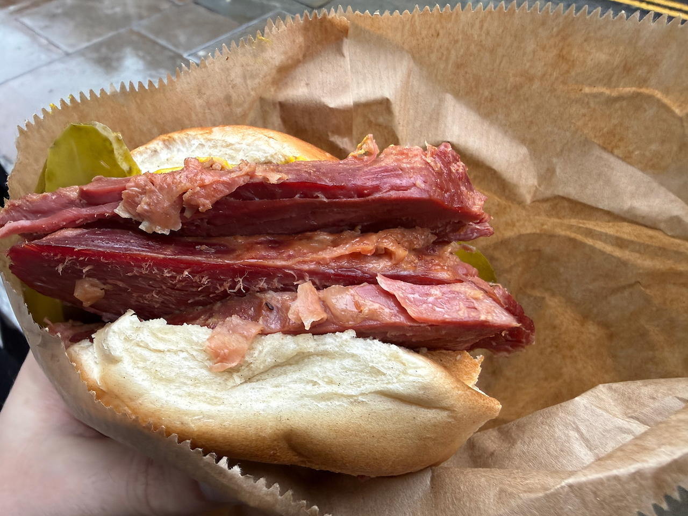
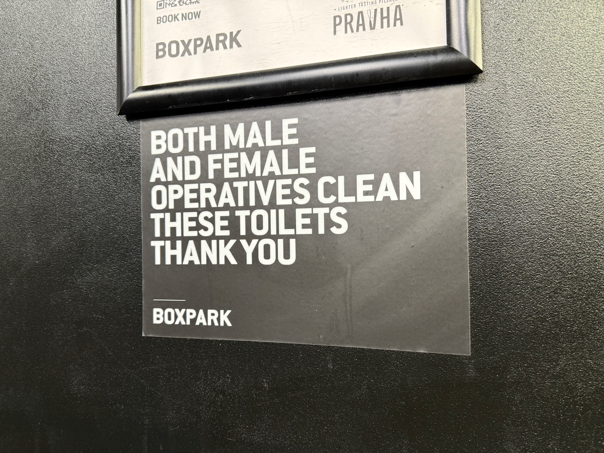
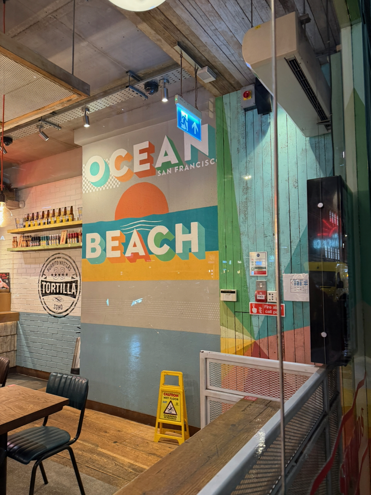
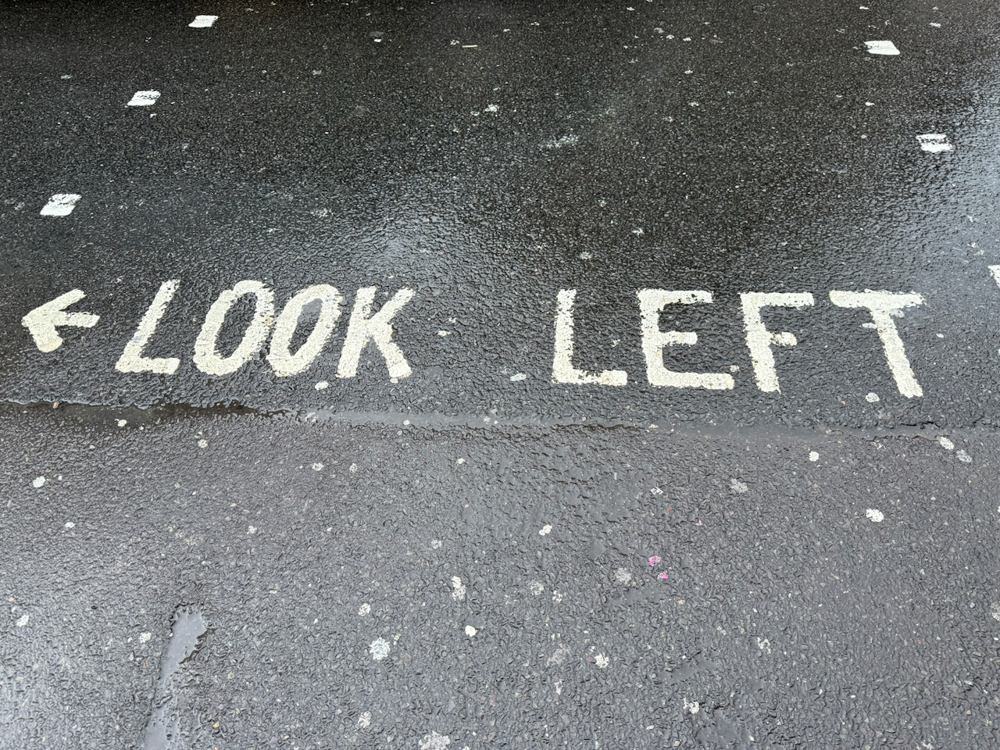
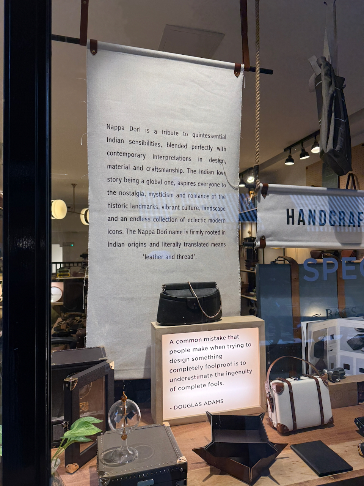

Travel, like the discipline of anthropology, tends to “make the strange familiar and the familiar strange.” So, [just like last time](https://rwblickhan.org/essays/strange-things-about-melbourne/), here’s some strange things I noticed about London during a recent week-long trip there.

## Beigels

Everybody knows about New York bagels. Everybody who loves bagels knows about Montreal bagels and the decades-long rivalry between Fairmount and St Viateur. What even bagel lovers do not know (speaking for myself) is the existence of London bagels, or “beigels” (the original English spelling), complete with a rivalry between two neighboring shops, [Beigel Bake](https://www.beigelbake.co.uk/) and Beigel Shop (now joined by the [B Bagel chain](https://www.bbagel.co.uk/)).

London’s bagels hew closer to Montreal’s bagels, with a sweet, bread-y consistency and a less pronounced shell, as well as a preference for sesame or poppy seed as toppings. But the most important difference is the filling. Smoked-salmon-and-cream-cheese is still common, but the most popular filling is [salted beef, pickle, and mustard](https://www.sandwichtribunal.com/2018/12/londons-salt-beef-beigel/), providing a decidedly sandwich-y flair.

## No One Knows Which Way To Walk

In North America, China, and most of continental Europe, there’s a fairly strong norm of walking on the right. If you’re walking down the street towards someone, you’ll typically duck right while they do the same, thereby passing on your left. Most walkways and elevators support this, with the “correct” direction invariably on the right. That all makes sense — all those countries drive on the right as well, which probably encourages the norm.

But in London, nobody knows which way to walk! In a left-driving country, one might presume a walk-on-the-left norm prevails. But, in practice, there’s a negotiation _every single time_ — which, in a city of 9 million people, means you’re constantly attempting to work out which way to go to avoid running into people.

Some of this is simply diversity — London is only a ~2 hour train ride from right-driving Paris, and obviously receives massive amounts of Asian and American tourism as well. But the city itself encourages confusion. Most escalators run on the left, as expected, but I went up at least three that actually ran on the right. Most pedestrian traffic keeps to the left in the winding London Underground tunnels, usually with signage to that effect, but once I saw a sign saying the opposite!

I now wish I paid more attention in Melbourne and Tokyo, which are both left-driving. I recall walking on the right in both places, though my memory is infamously faulty, but in any case I _don’t_ have memories of needing to negotiate every pedestrian interaction.

## Male and Female Attendants Attend These Toilets

The majority of bathrooms I saw in London had a sign similar to the above, saying something like “male and female attendants clean these toilets,” without any other explanation.

I can’t remember seeing similar signs in any other countries, and I can’t quite think of a reason for posting them. Is it for the benefit of the attendants, in a “hey don’t make a mess” kind of way? Or is it for the comfort of toilet users, who might be surprised by an opposite-gender attendant? Is that really worth pointing out? It’s so natural to see opposite-gender attendants in North America or continental Europe that these signs really stuck out.

## Red Cords in Toilets

Virtually every washroom in London had a red cord reaching down to the ground, intended to [allow a disabled person who falls to call for help](https://youtube.com/watch?v=svX53m1dIKM). Apparently they were originally pushed by the UK-based disability reviews site [Euan’s Guide](https://www.euansguide.com/news/world-toilet-day-new-red-cord-cards), which probably explains why I’ve never seen them anywhere else.

## Burritos Are Strongly Associated With California

There were a number of burrito shops in London, and curiously they all seemed to be California-themed, though I didn’t catch whether they were all the same chain. In any case, I caught this pic of a very unrealistic “Ocean Beach, San Francisco” mural at one of them.

## Shop Doors Open Inward

The first few days in London, my friends and I constantly slammed to a stop at every single shop, completely failing to open the door on the first try.

Eventually, one of my friends proposed a theory: in North America, most shop doors open _outwards_, towards the street, while in London, most shop doors open _inwards_, towards the store. In other words, we kept pulling instead of pushing. He then elaborated this theory by pointing out that most doors in North America have a stoop, allowing the door to swing open towards the street without hitting pedestrians, while in London, most storefronts are flat. The reason for _that_ difference is, I suppose, left as an exercise for the reader.

## Clocks Rarely Work

Most of the big public clocks (other than the clock-sometimes-incorrectly-referred-to-as-Big Ben) were non-functional and showed completely the wrong time. Ironically, the one clock that actually _was_ functional was this decorative coffee clock at the Fenchurch Street Rosslyn Coffee.

## Considerate Constructors Scheme

Almost every construction site I passed had a sign similar to the above, pointing out that they’re registered with the [Considerate Constructors Scheme](https://www.considerateconstructors.com/), which seems to be an industry consortium promoting higher standards in community relations and environmental impact in construction. I’m absolutely sure similar programs exist in the notoriously litigious United States, particularly in California, particularly particularly in the Bay Area, but it was amusing how prominently CCS was advertised.

## Look Left

Most streets are helpfully labeled with which direction to look when crossing as a pedestrian. You’d think this was obvious, even accounting for the left-driving traffic. But the streets in London, particularly in Soho, are so convoluted and un-grid-like that I deeply appreciated the reminder of which direction traffic would be coming from.

## Taxis Don’t Stop

As a frequent pedestrian of San Francisco, I’m constantly annoyed by drivers that take “yield when making a turn at crosswalks” as a suggestion, ducking and weaving between groups of pedestrians attempting to cross. But at least most drivers in the US _try_ to stop for pedestrians. In London, drivers — and _particularly_ taxi drivers — just... don’t? Over literally dozens of occasions during my week there, I saw pedestrians draw up short as a taxi driver pulled into the lane three inches in front of them without even making an attempt to slow down. The pedestrians were never fazed in the least, which makes me think this is normal.

## Douglas Adams Is Not Popular

It’s no secret that I love Douglas Adams — I reread _The Hitchhiker’s Guide to the Galaxy_ every year for [Towel Day](https://towelday.org/). Adams always struck me as a particularly English author — lots of jokes about Marks & Spencer bath towels and flats in Islington and so forth — so imagine my surprise that he simply doesn’t seem all that popular in England, or at least in downtown London. I checked out five or six book stores in London, including the massive Waterstones at Piccadilly, and in every case a paperback copy of _Hitchhiker’s_ was reclusively tucked away in the science fiction section, not a special edition in sight; I don’t think any of the stores even had the full series.

In comparison, _every single_ book store had an entire section dedicated just to Agatha Christie (who is, in fairness, the [second-highest-selling single author of any language of all time](https://en.wikipedia.org/wiki/List_of_best-selling_fiction_authors), after only Shakespeare), and most had ample shelf space dedicated to P.G. Wodehouse (Adams’ chief influence) and Terry Pratchett, both of whom are fairly niche in the States.

In fact, the only reference to Douglas Adams that I saw in the entirety of London is pictured above, in the window of a [Nappa Dori](https://global.nappadori.com/) store. They’re apparently Indian leather specialists, an oxymoron that my Tamil friend found deeply amusing.

My conclusion is that Adams is, in fact, much more deeply beloved on the West Coast that he loved so much, and perhaps particularly in the Bay Area.
