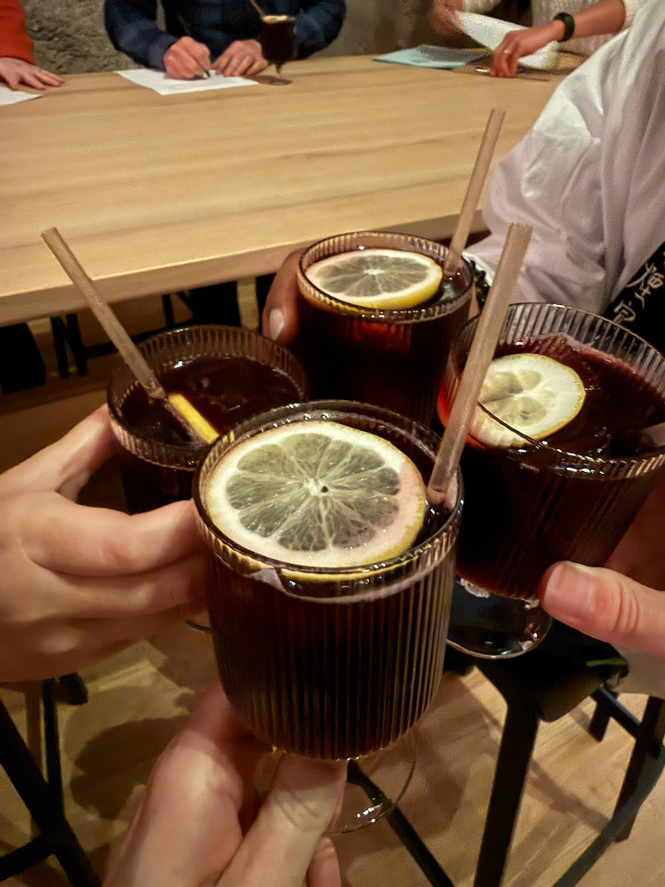

This week I did my Civic Duty™️ and reported for jury duty.

An oddity about the jury selection process is that the pool of potential jurors — in this case, almost 80 — is much larger than the number of jurors required — the colloquial [*12 Angry Men*](https://letterboxd.com/film/12-angry-men/) and three alternates. Batches of jurors are subjected to [*voir dire* questioning](https://en.wikipedia.org/wiki/Voir_dire), then both sides can dismiss a certain number of questioned jurors (in this case, 10 each), which are then replaced from the pool of potential jurors listening on the sidelines. But they’re replaced in a pre-selected random order, so if you’re at the end of that list, it’s more or less mathematically impossible that you’re actually called up for questioning, let alone serve — but you’re legally required to sit and watch all the questioning, just in case. I’m curious about the deliberations that resulted in such a large number of potential jurors being asked to take multiple days (!) out of their lives for *every single case*.

:::aside{.note}
I’ve read somewhere — though no longer have the source — that despite being a timeless cinematic masterpiece and one of the greatest representations of American legal *values*, *12 Angry Men* is actually a fairly poor representation of the jury experience; the jury deliberations presented are legally invalid and would result in a mistrial in a real case. Similarly, Gregory Peck’s Atticus Finch in [*To Kill A Mockingbird*](https://letterboxd.com/film/to-kill-a-mockingbird/) is more of an ideal than a reality. “Every lawyer’s favorite movie” is actually [*My Cousin Vinny*](https://letterboxd.com/film/my-cousin-vinny/), which, despite being a comedy, supposedly has a close adherence to actual court procedure.
:::

Another oddity: I’ve heard through the grapevine that lawyers strongly prefer to dismiss jurors with any kind of analytical training — software engineers, academics, other lawyers — so they have more flexibility in guiding the jurors. Sure enough: every single software engineer was dismissed, regardless of how many questions they answered during *voir dire*.

---

I’ve been reading [*Free Food For Millionaires*](https://app.thestorygraph.com/books/3e2fd746-31a6-44bf-8e9f-a87c1be3c952) for a book club and realized: “book club books” really is a genre all its own, isn’t it? There’s a particular brand of popular literary fiction, critically well-regarded but not necessarily award-winning, generally slice-of-life, sometimes quite lengthy, usually (but not always) written by women, which all have somewhat similar styles — Min Jin Lee and Celine Ng and *Tomorrow, and Tomorrow, and Tomorrow* and, arguably, Hanya Yanagihara. I’m sure this isn’t a novel observation, but I can’t remember much discussion of it. Perhaps it’s a contemporary extension of the [mid-century middlebrow genre](https://www.woman-of-letters.com/p/positive-depictions-of-middle-class), as described by Naomi Kanakia? (I am almost certain Kanakia has written about “book club books” in similar terms before, but I can’t find it!)

---

Yesterday I checked out [Brucato Spirits’](https://brucatospirits.com/pages/brucato-amaro-distillery) distillery tour-and-tasting in the Mission District — highly recommended if you, like myself, are a fan of amaro or gin.

It turns out their entire operation is still largely run by the cofounders and their head distiller, and their recently-opened distillery is basically a [2000-liter still](https://en.wikipedia.org/wiki/Still), a dozen thousand-liter stainless-steel drums, and a bottling machine, all operated out of an industrial garage that’s maybe three times the size of my apartment, tops. Something about that description — the combination of scrappiness and quality — is charmingly Bay Area; the idea that you can just [start making chocolate](https://www.dandelionchocolate.com/pages/shop) or [start making olive oil](https://fat.gold/) or [start a community space](https://www.thelocaleconomy.com/). But it also makes one wish commercial rents in San Francisco and the Bay Area were cheaper; one suspects Brucato’s operation is heavily subsidized by the price of the bottles and the [trendy bar-slash-restaurant](https://brucatospirits.com/pages/bar-brucato) on site, and, of course, one quietly assumes the cofounders had Tech Money™️ to start with (though, to be clear, I don’t know their background).

Also neat: they’re named for [John Brucato](https://brucatospirits.com/pages/john-brucato), a San Francisco transplant that founded California’s first farmer’s market, the  direct ancestor of today’s [Alemany Farmer’s Market](https://www.sf.gov/location--alemany-farmers-market).
