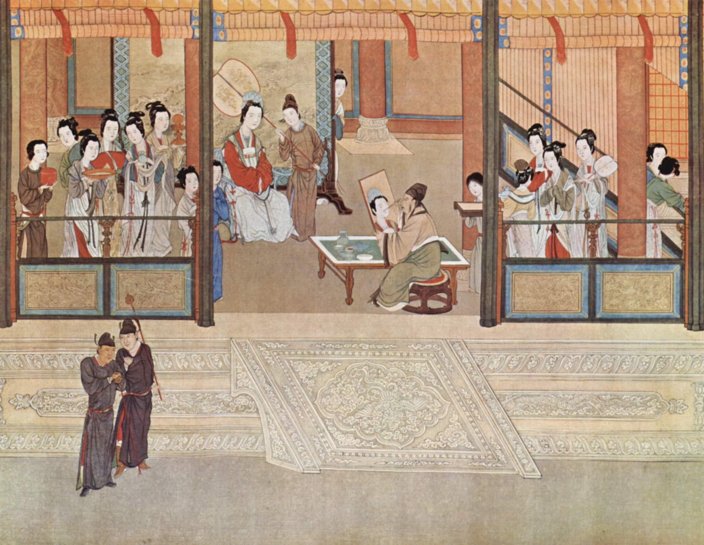
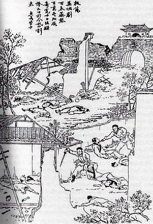
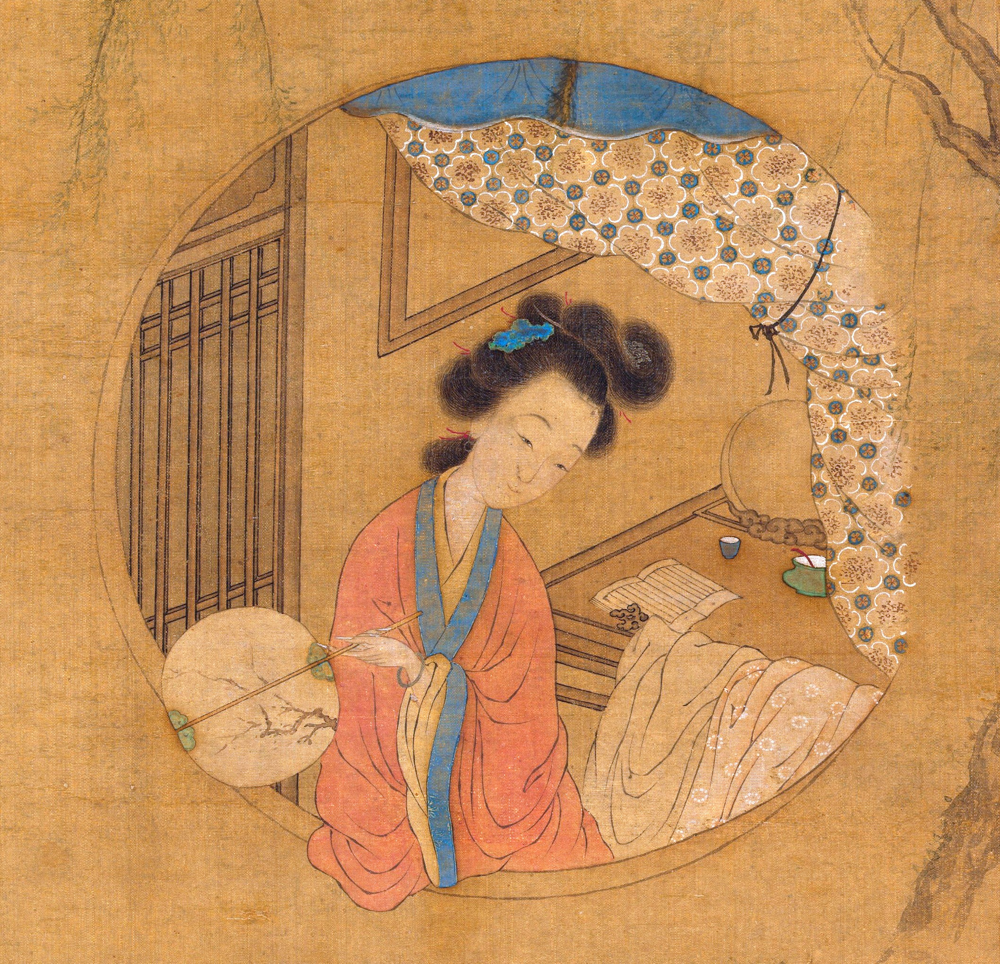
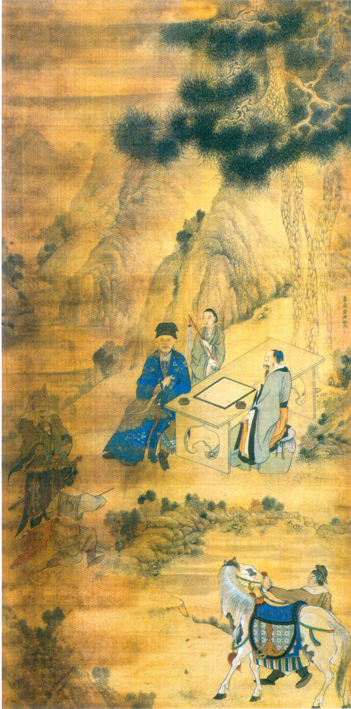

You ever had one of those weeks that was just… *rough*. Not even bad, mind, but just *rough*. Well, these past two weeks were some of those weeks—I can’t even quite put my finger on why, but I guess long workdays and a lonely dog contributed.[^1]

In any case, I think I can be apologized if this is a somewhat short and lukewarm—maybe even slightly incoherent—edition—I guess it was lucky I relaunched last issue instead of this one. In any case, life goes on and I count myself lucky for all the smooth pearls of life I *do* enjoy, roughness notwithstanding.

[“Spring Morning in the Han Palace”, Qiu Ying, 1530-1550](https://commons.wikimedia.org/wiki/File:Ch%27iu_Ying_001.jpg)

## “Dreams of revival fall to earth/In shreds with the peach blossom fan.” *The Peach Blossom Fan* and Nostalgia

The bulk of my time in the past week was taken up in reading the (only) English translation of the Chinese drama *The Peach Blossom Fan*, in which two lovers are tragically separated as the Southern Ming Dynasty resists the Qing invasion from the north. Yet the play ends (spoiler alert) with Nanjing, the southern capital, falling to the Qing invasion, and the two lovers are temporarily reunited at at Daoist temple, only for the chief priest to snatch the peach blossom fan that served as an emblem of their love and tearing it to shreds, declaring that “White bones are laid in the dust/The southern realm concludes its span./Dreams of revival fall to earth/In shreds with the peach blossom fan.” The two lovers, newly enlightened, leave to practice Daoism with nary a backwards glance.

The author, Kong Shangren[^2], was born a few years too late to witness the actual fall of the Ming Dynasty, but, having just missed it, was apparently fascinated by it throughout the rest of his life, interviewing a number of survivors and basing his play on real historical figures. The play is thus suffused with a deep sense of nostalgia for the past, while also recognizing its ugliness in the venality of the southern court and the puppet emperor they put up, a sentiment that is apparently found in many an early Qing memoir. Few of the characters in the play ever quite seem to accept that the world they knew has ended, despite the vastly different situation they find themselves by the end of the play.

The Ming-Qing dynastic transition is a long-term interest for me.  The reason I keep coming back to it, I think, has to do with that sense of bittersweet nostalgia at the end of a world—that sense that everything is falling apart and most people are willfully ignorant and there’s nothing to be done. A similar feeling obtains when thinking about the late Bronze Age collapse, which for the beginner is probably best narrated by the [Fall of Civilizations podcast](https://fallofcivilizationspodcast.com/2019/01/21/episode-2-is-now-live/).

It’s hard not to apply those periods to the world today—great civilizations bent under their own corruption, a peaceful yet fragile international system under stress from a rapidly-changing world, climactic shifts we can’t see changing the very air we breathe[^3].

But, of course, we must remember that neither the fall of the Ming Dynasty nor the late Bronze Age collapse was the end of the world—the Qing Dynasty would go on to be arguably the most powerful Chinese dynasty, and the late Bronze Age collapse would usher in the early Iron Age and the works of Homer and the ancient Israelites that are still a foundation of Western culture today. Humans are highly adaptable—that’s how we spread across the world, after all—and while dark days may be ahead, the sun always rises again n a new day. Or, as Dr Manhattan puts it in the poignant finale of *Watchmen*, “‘In the end’? *Nothing* ends, Adrian. Nothing *ever* ends.”

[Yangzhou Massacre, Late Qing (pre-1911)](https://en.wikipedia.org/wiki/File:Yangzhou_massacre.jpg)

## What’s the value of classics? Or, Why In The World Have I Read *The Odyssey* Three Times?

I’m not sure I have a good answer for this question, but let’s try.

One value is, of course, that classics have been beloved (or at least tolerated) by generations and generations, and thus meet a bare minimum of quality. But that doesn’t seem quite right—after all, my “year of classics” started because I didn’t like a few critically-acclaimed books I read from last year, and some classics (*cough* *The Scarlet Letter*) are so bad one does wonder why people tolerate them.

Another possibility is the allusive value. It’s valuable to read the *Odyssey* because other authors, like James Joyce, allude to it, and it’s valuable to understand those allusions. That’s not something to scoff at—but then James Joyce is allegedly a classic as well, so it’s really just infinite recursion of classics, and I’m not necessarily able to assume readers have rock-solid knowledge of the *Iliad* today, and anyway, that’s what footnotes are for.

Then maybe it has something to do with experiencing the roots of storytelling. Notwithstanding the fact that even the very earliest writing we have (quite possibly from [Enheduanna](https://en.wikipedia.org/wiki/Enheduanna), a Sumerian/Akkadian high priestess) is itself likely the result of generations of accumulation, there is something special about seeing stories that are thousands of years old, especially when it’s surprisingly modern, like in the *Odyssey*, where we flash-cut from Telemachus on his journey to the suitors back at home, playing lawn games, a transition that wouldn’t be totally out of place in a high school comedy today. But that doesn’t seem quite right.

I think the best answer might be revealed by the essay above—that the value of reading “the classics” is the value of all the humanities—namely, discovering that all people are different, but also basically the same. The *Odyssey* might be a 2700-year-old tale of [*xenia*](https://en.wikipedia.org/wiki/Xenia_(Greek))-gone-wrong, a concept we don’t even have an English term for, but who hasn’t felt that bone weary feeling of having been gone from home too long? That is, after all, where we get the word "nostalgia”—from [nostos](https://en.wikipedia.org/wiki/Nostos), the long-awaited homecoming—but then maybe, like the heroes of *The Peach Blossom Fan*, it is never truly possible to go back—we inevitably find "suitors" waiting for us and a changed home.

[Li Xiangjun, Cui He, 1817](https://commons.wikimedia.org/wiki/File:%E6%B8%85_%E6%9D%8E%E9%A6%99%E5%90%9B%E5%B0%8F%E5%BD%B1_%E8%BB%B8-Portrait_of_Li_Xiangjun_MET_DP146994.jpg)

## Miscellanea

After relistening to [“The Queen of Tarot”](https://www.imaginaryworldspodcast.org/queen-of-tarot.html), an Imaginary Worlds podcast episode Pamela Colman Smith, the artist behind the famous Rider-Waite-Smith deck of tarot cards (i.e. what you are probably thinking of when you think of tarot), I decided to go spend some time reading up on the design of tarot cards on Wikipedia. Which is when I discovered that they’re *chock* full of detail and symbolism—like the [Wheel of Fortune](https://en.wikipedia.org/wiki/Wheel_of_Fortune_(Tarot_card)) card which, depending on how you read the lettering on the wheel, gets you “taro(t)”, [“tora(h)”](https://en.wikipedia.org/wiki/Torah), or “rota” (Latin for “wheel”), which seems pretty clever to me! Anyway, the upshot of all this is that I went and ordered a pack of (surprisingly reasonably priced) Rider-Waite-Smith tarot cards. Now, I’m not planning to use these for divination (although, to be fair, divination can be a useful way to break yourself out of a mental rut and/or provide randomization to a process that would break with deterministic choice[^4]), but instead I want to use them for… storytelling! Basically, apply the symbolism (and perhaps even divinatory meanings) to characters in a story and see where it goes. I’ll let you all know how it goes.

I tried to watch the critically-acclaimed documentary [*Ex Libris: New York Public Library*](https://www.imdb.com/title/tt6209282/), but after about twenty minutes of its more-than-three-hour runtime, I got the sinking feeling the film was for snobs that never actually attend the library. True, the first few scenes displayed a vivid panorama of people using the library’s services, which feels strangely nostalgic and meditative in these After Times, but *I’ve been in a library before*. I don’t need a documentary filmmaker to silently present a montage of New Yorkers asking the help desk for help with genealogical research when I can do that just fine at my own local library (minus the New Yorkers, of course). Needless to say, I shut it off not long after.

Also, continuing to explore Kanopy’s Criterion collection, I watched *Le Samourai*, an acclaimed 1967 French neo-noir film about the world’s smoothest assassin and his beloved fedora[^5], which has no samurai.[^6] I have little to say on the film other than to make a comparison to *The Shining*, which is similarly an immaculately edited, heart-poundiogly tense thriller that, on its surface, doesn’t really seem to say much about the world. In any case, I gave it five stars and a little heart [on Letterboxd](https://letterboxd.com/film/le-samourai/), so I guess that means I liked it?[^7]

Solar Sands, a video essayist [I’ve mentioned before](https://buttondown.email/rwblickhan/archive/an-imitation-of-the-eternal-forms-aid-s1e25/), had a new video called [”Liminal Spaces (Exploring an Altered Reality)”](https://youtu.be/N63pQGhvK4M), which explores the world of uncanny images like those in the Twitter account [Images with Elegiac Auras](https://twitter.com/elegiac_images). Hey, if I sat here long enough I might compare this to *The Shining* as well, or maybe The Caretaker’s *An empty bliss beyond this world*! Which is to say, I like this video essay as well, not least for introducing me to this world of uncanny, yet undoubtedly American, images, which you’ve (I hope) been enjoying throughout this issue.

And one last note: doesn’t the long fall of the Ming Dynasty just call out for *Game of Thrones*-or-*Three Kingdoms*-ification?

[Zheng Chenggong (Koxinga), Huang Zi, Mid-17th Century](https://en.wikipedia.org/wiki/File:Portrait_of_Zheng_Chenggong.jpg)

And I think that’s enough for tonight! Good night!

[^1]: Make sure to check out the bottom of the newsletter for a Rooibos update. Up there ^

[^2]: Who, fun fact, was a direct descendent of Confucius.

[^3]: Climactic shifts were likely involved in both the collapse of the Ming Dynasty and the late Bronze Age collapse.

[^4]: For more on how seemingly irrational behaviors can actually be quite rational, see Peter Leeson’s *WTF?! An Economic Tour of the Weird*, which is an enjoyable-albeit-mildly-annoying introduction to economic perspectives on topics like divination, medieval trial by ordeal, and Early Modern English “wife-selling”.

[^5]: Seriously, get yourself somebody that touches you the man this man touches his fedora.

[^6]: Well, besides a metaphorical one.

[^7]: In any case it’s unclear, the comparison to *The Shining* (which is in my personal top five) means I really, *really* liked it.