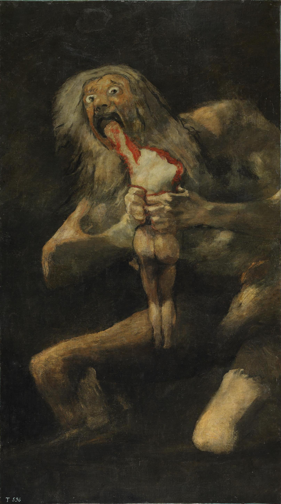

48,000 words. Just 2,000 left to go before the rough draft is done! Two essays this week, no miscellanea (didn’t you have enough miscellanea the last two newsletters? 🙂).

- [“The Nightmare”, Henry Fuseli, 1781](https://commons.wikimedia.org/wiki/File:John_Henry_Fuseli_-_The_Nightmare.JPG#mw-jump-to-license)

## Table of Contents

## How many programmers does it take to fix a lightbulb? Fermi estimation in computer science interviews as discipline error

I sat down across from my interviewer, pleasantries already exchanged, and prepared myself for the barrage of questioning — either about my background as a programmer (limited, given this would be my first internship) or the inner workings of a linked list. He looked down at the sheet of interview questions in front of him and carefully spoke. “Approximately how many gas stations are there in Vancouver?”

Wait, *what*?

Luckily, I knew (as many readers likely do) that this was an example of [Fermi estimation](https://en.wikipedia.org/wiki/Fermi_problem). For those not in the know, Fermi estimation is a problem-solving approach where you consider only orders of magnitude to estimate the answer. Are there more than 10 gas stations in Vancouver? Sure, I’ve probably been to at least 10. Are there more than 100? Now it’s getting tricky, but we can work the other way as well. Are there more than a million? Of course not. 100,000? If we happen to know the population of Vancouver proper (somewhere in the ballpark of 600,000), we can likely intuit that we don’t need one gas station per resident. We could also consider geography; Vancouver has maybe 100 streets running east to west, and somewhere around the same number running north to south, for a total of at most 10,000 city blocks. There’s definitely not one gas station per block, so let’s crank the estimate down to 10,000; in fact, I’m not sure there’s even one per ten city blocks, so let’s make that 1,000. So we can guess there’s somewhere between 100 and 1,000 gas stations in Vancouver; and, sure enough, Yellow Pages [lists 406](https://www.yellowpages.ca/search/si/1/Gas+Stations/Vancouver+BC).

Anecdotally, there was once a fad for these kinds of questions in software engineering interviews, although thankfully it seems to be dying out, at least with the leaders of the industry. I think the reason it’s so surprising in the context of a software engineering interview has to do with *discipline*. I find it’s rare (outside of some parts of academia, at least) to think of them this way, but academic disciplines are not just bodies of knowledge, but also *ways of thinking*, which sounds obvious, but really take a moment to think about it.[^1]

As a counterexample, there was a [widely-mocked call for Progress Studies as a discipline](https://www.theatlantic.com/science/archive/2019/07/we-need-new-science-progress/594946/). I think the most cogent argument I saw against Progress Studies involved discipline; after all, there is a clear body of knowledge it would surround, and there would be clear benefits to doing so (or clear, at least, to those doing Progress Studies), but what *tools* and *ways of thinking* would distinguish it as a discipline?

Compare computer science (and its subfield, software engineering), which, despite its sometime fuzziness as a discipline, does have defining ways of thinking. I’m thinking here of concepts like “abstraction”, which is shared with many other disciplines, but the exact focus is slightly different. Most disciplines have some level of abstraction, of course, but few, save perhaps mathematics, seem to engage with abstraction *as a concept* in the way that programmers are often forced to. And even mathematics focuses on a very different aspect of abstraction; in mathematics, abstraction is used to illuminate the connections between disparate concepts, where in computer science abstraction is an answer to overwhelming complexity.

Notably, I *don’t* think orders-of-magnitude estimation is a part of the “computer scientist’s toolbox” in the disciplinary sense, although it is part of other disciplines, notably physics. That’s not to say that estimation is not ever important, or that no programmers ever use orders-of-magnitude reasoning, but I’d argue it’s not part of the *core* skillset that defines computer science as a discipline. Thus, it is surprising, and maybe even unfair, when a question about Fermi estimation comes up during a software engineering interview.

- [“Dance of Death: Death the Strangler”, Alfred Rethel, 1850](https://www.clevelandart.org/art/1939.620)

## "But truthfully, from now on my words/Will be naked": Thematic cohesion in the *Divine Comedy* and *Watchmen*

I’ve been reading Dante’s *Divine Comedy* lately which, aside from the occasional dips into hardcore scholastic philosophy that doesn’t make much sense outside the context of Thomas Aquinas’ 13th century classroom, is a masterpiece. In particular, it has this alluring kind of allegorical storytelling that ties into a concept I’ve been meaning to talk about here that I call *thematic cohesion*.

I use the term “thematic cohesion” to refer to the sense that the story, themes, *and* symbology of a narrative work all flow together to make a single artistic statement. That is, admittedly, pretty vague, hence why I’m happy to have an example to explicate it.

*The Divine Comedy* is, on the surface, a story about Dante being taken on a tour of Hell and Purgatory by Virgil and then of Paradise by his first love Beatrice. Along the way, he talks to the virtuous or vicious[^2] souls and learns about their ironic punishments or rewards.

I think the point where it shows thematic cohesion the *best*, however, is at the end of *Purgatorio*, where his first guide, Virgil, trades him off to Beatrice. This works in the context of the surface narrative, as Virgil, though a noble pagan, was not a Christian and thus is not allowed into the Christian heaven (and probably wouldn’t be a very guide as a result!), and Beatrice is the one who called for Virgil to guide Dante through Hell in the first place. However, Dante is in for a surprise — when Beatrice reveals herself to him, she instead excoriates him for “forgetting” her; when she died at the age of 23, he simply went on with his life and, despite using her as a character in his romantic poetry, never truly thought about her. Dante breaks down in tears and begs forgiveness, which is granted.

However! This is also operating on an entirely different allegorical level. In the allegory (which Dante points to at various points in the story), Virgil represents the power of reason and Beatrice is a reflection of divine wisdom and revelation. Virgil happily explains the logic of hell, but he becomes more and more useless the closer they get to Paradise — in much the same way religious truths in Dante’s late medieval European worldview must be *felt* and not just reasoned about. Beatrice’s criticism of Dante’s forgetfulness, then, represents his turning away from revelation and focusing on worldly concerns, ending up lost in a metaphorical dark forest of sin — which is, of course, where the *Divine Comedy* picks up, with Dante trapped in a literal dark forest hunted by beasts. This even works on a further allegorical level, since Dante could be considered a stand-in for *all* humans, who, in Dante’s worldview, strive for the divine, aided by reason, yet all too often end up lost.

An example that is a bit less straightforwardly allegorical (and thus probably more to the taste of we moderns) is *Watchmen* (warning: spoilers ahead. Go read *Watchmen*!). I would argue the main theme of *Watchmen* is summed up in the tagline “who watches the watchmen?” — what are the responsibilities of those with power? The main plotline is a tragedy of hubris, as supposed genius Ozymandias decides to single-handedly end the Cold War and the threat of nuclear annihilation by… killing millions of people. Except when he asks the godlike Dr Manhattan whether he “did the right thing” and if it “all worked out in the end”, he is told that “*nothing* ends, Adrian. Nothing *ever* ends.”[^3] We shouldn’t be surprised, of course — his very name is a reference to [Shelley’s “Ozymandias”](https://en.wikipedia.org/wiki/Ozymandias), in which the narrator finds an ancient inscription that says to “Look on my works, ye Mighty, and despair!,” besides which there is only miles of flat sand. Compare to Dr Manhattan, the son of a watchmaker who becomes a sort of [divine watchmaker](https://en.wikipedia.org/wiki/Watchmaker_analogy) by removing himself to Mars and refusing to intervene for the entirety of the story. Also compare the story of Rorschach, a violent vigilante who doesn’t let little things like “legality” stop him. He repeatedly breaks locks when acting as a vigilante, which then have to be fixed by the “Gordian Knot Lock Company”. The [Gordian knot](https://en.wikipedia.org/wiki/Gordian_Knot) is a legend involving an impossibly tangled knot that nobody could untangle — until Alexander the Great strolls up and slashes it in half with his sword. The usual interpretation of this legend involves creative thinking, but of course there is another interpretation — that Alexander the Great (whose statuary seems to be an inspiration for Ozymandias) violently disrupted the puzzle instead of actually solving it. Who, after all, watches the watchmen?

See? Isn’t this fun?

There’s definitely stories I adore that don’t have a strong sense of thematic cohesion — I would defend *The Hitchhiker’s Guide to the Galaxy*, but that would just be apologetics — but I like to have this concept handy. A strong sense of thematic cohesion is basically catnip for me and tend to be stories that I happily revisit again and again — probably because a strong sense of thematic cohesion is exactly the hook you need to analyze a story a la English class.

- [“Saturn Devouring His Son”, Francisco Goya, 1819-1823](https://en.wikipedia.org/wiki/File:Francisco_de_Goya,_Saturno_devorando_a_su_hijo_(1819-1823).jpg)

[^1]: I may write more about this, at some point. I’ve often found (as with my study of mathematics) that what I find interesting about other academic disciplines is not so much the content (the “what”) but rather the culture (the “how”).

[^2]: [Etymonline confirms](https://www.etymonline.com/search?q=vicious) “vicious” comes from “vice” and thus, at least at some point, was parallel to “virtuous.” TIL!

[^3]: I’m pretty sure I’ve quoted this before. It honestly might be one of my favorite quotes in any story ever.