In 2024, I [watched](https://rwblickhan.org/logs/films-2024/) 68 movies and 20 seasons of television. Here are some of the standouts. Imagine that each one gets a little statue of me saluting them 🫡

## Special Awards

### Serial Experiments Award: Andor Season 1

> I didn't do anything! I'm just a tourist!

I watched a surprising amount of television this year. Some of it was good (most of *The Curse*, the flashback arc of *Jujutsu Kaisen*, *Baby Reindeer*, *Atlanta*), most of it was honestly really bad (the last episode of *The Curse*, *3 Body Problem*, *House of the Dragon*, *Scavengers Reign*, and yes *Arcane* season 2 sorry not sorry).

But the standout was...

Okay, the standout was *Atlanta* season 3 episode 1 "Three Slaps", but conveniently I haven't finished *Atlanta*, so that gets to be my top TV show for 2025 😉

No, the standout was, to my complete and utter surprise, a Star Wars tie-in show on Disney+. Like, seriously, I cannot stop going around telling people that they're sleeping on this masterpiece of a show. I wasn't even that big a fan of *Rogue One*!

But you honestly don't need to know *anything* about *Star Wars* to appreciate this show. Okay, maybe you need to know that there's an evil Empire, but that's about it. What you do need to know is that it's a slow-burn political thriller with some of the best pacing I've ever seen and worldbuilding that always Just Works™️ without ever becoming twee, which quietly spells out the themes of James C. Scott's *Seeing Like A State* like it's a graduate political science seminar. Plus, Diego Luna. (I swear I'm not a Diego Luna fanboy.) It's just really, really enjoyable and all-around great.

Plus, it has a soundtrack by Nicolas Britell, the *Succession* and *Moonlight* composer. So, you know, a soundtrack full of bops.

### Be Kind Rewind Award: Gentlemen Prefer Blondes

> Don't you know that a man being rich is like a girl being pretty? You wouldn't marry a girl just because she's pretty, but my goodness, doesn't it help?

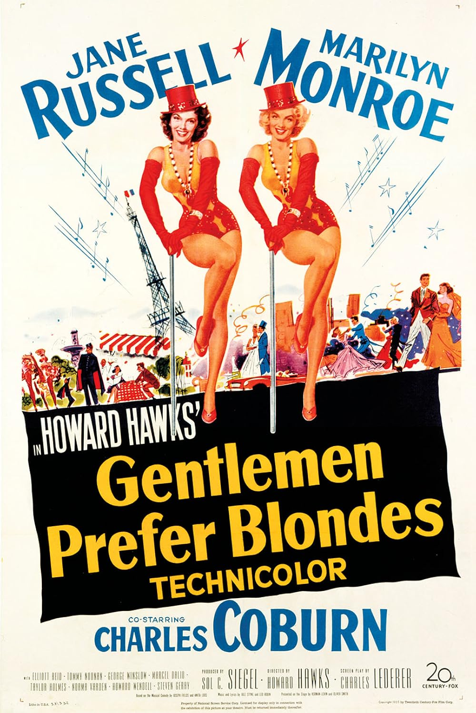

This year, I rewatched *Gentlemen Prefer Blondes*.

I *liked* it the first time I saw it a year or two ago, but I'm not sure I *loved* it. But this time I fell head over heels.

*Gentlemen Prefer Blondes* is the perfect comfort food movie. It's low stakes but takes its drama seriously, it's funny (like, really funny), it has great musical numbers, and Marilyn Monroe and Jane Russell play off each other better than pretty much any actors have ever played off each other before. Plus, for a film released in 1953, it's refreshingly feminist — it's really just a story about two gals being pals, and what could be better than that?

### King of Trash Mountain Award: Megalopolis

> I reserve my time for people who can think. About science. And literature, and... architecture and art. You find me cruel, selfish and unfeeling? I am. I work without caring what happens to either of us. So go back to the cluuuub, bare it all, and stalk the kind of people that you enjoy.

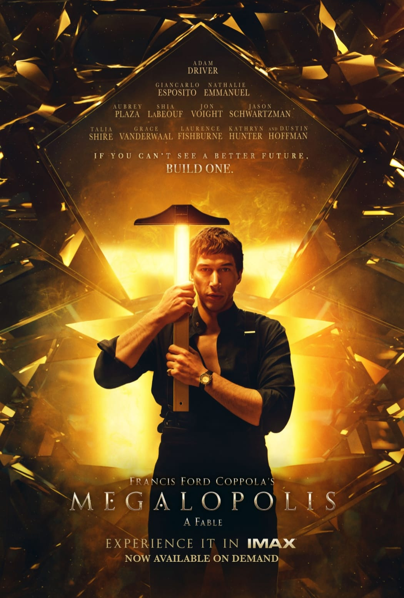

I am probably the world's second biggest fan of *Francis Ford Coppola's Megalopolis: A Fable* after Francis Ford Coppola. I love this big, dumb, goofy, brash, dumb, *goofy* film that takes itself *so goddamn seriously*. I love that Aubrey Plaza plays a character named Platinum Wow the Money Bunny. I love that Adam Driver is acting his heart out for a script that definitely does not deserve it. I love that there's this bizarre formalist interlude when Adam Driver's character takes one (1) drugs. I like that he can *stop time* and this *isn't even a major plot point* — he just randomly yells STOP TIME. I love that Francis Ford Coppola clearly thinks about the Roman Empire even more than I do. I love that the film has intertitles that attempt to spell out the (incoherent) themes. I love that Natalie Emanuel looks like she wandered in out of another film and looks very confused about what's going on.

But most of all I love that Francis Ford Coppola clearly loves this incredibly dumb film. He took the massive budget he was given (or, more correctly, mortgaged his winery for) and made exactly the film he wanted to make.

*Megalopolis* has heard of good taste and wants nothing to do with it. *Megalopolis* simply is.

## Honorable Mentions

### The Master

> If you figure a way to live without serving a master, any master, then let the rest of us know, will you? For you'd be the first person in the history of the world.

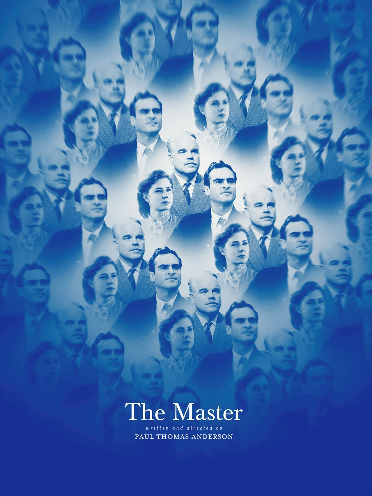

*The Master* was my first Paul Thomas Anderson film. (I'm trying to catch up on all the great directors I missed, you see.) And boy, was it a good choice. It's such a strange, idiosyncratic little film — the tale of a wayward man glomming onto a Scientology-esque cult in the aftermath of World War II, or perhaps the tale of an L. Ron Hubbard-type glomming onto a man he can't quite fix.

It's a film that says a lot — about cults, about power, about finding a meaning in life — without seeming to say very much at all, anchored by a transcendently bizarre performance from Joaquin Phoenix and perhaps the best performance of Philip Seymour Hoffman.[^adams]  (Sorry, I don't like *Synecdoche, New York* that much.)

Also, it features one of the greatest scenes of transparently homoerotic wrestling in the history of film. So.

### Frances Ha

> She's my best friend.

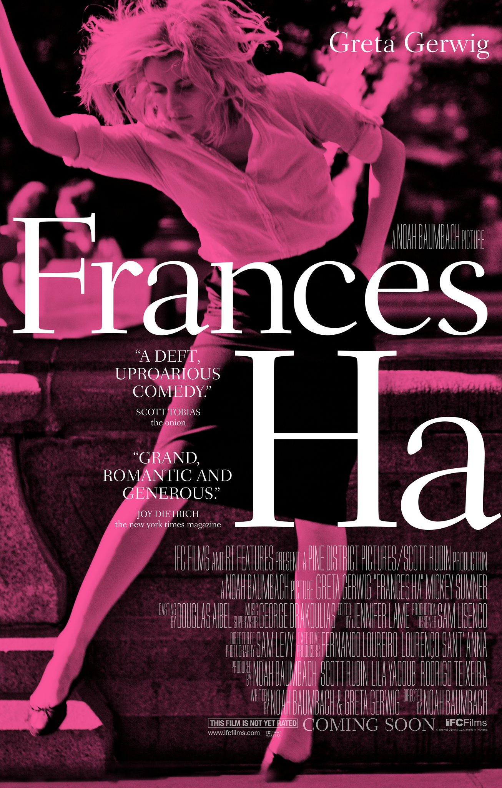

*Frances Ha* shouldn't work, especially not for me. It's a slice-of-life low-stakes comedy-drama about a spoiled 20-something New Yorker that can't get her life together, with a pretentious black-and-white color grade and ~ stylized ~ dialogue that's just a little too clever.

But somehow it just *clicks*. Maybe it's because the audience is both laughing at Frances *and* laughing with her. Maybe it's because Greta Gerwig plays Frances as *just* on the right side of annoying. (It makes one *almost* — not quite, but almost — regret that she gave up acting to focus on directing.) Maybe it's because, for all the trying-to-make-it-in-New-York stylings, it's really a story about two friends growing apart and back together.

In any case, *Frances Ha* was unexpectedly poignant and an easy choice for a future double feature with *Gentlemen Prefer Blondes*.

Also, unexpectedly seeing a young Adam Driver in one of his breakout roles made me laugh harder than almost anything else I saw this year.[^portman]

### Look Back

> Then I'll get better at drawing too! Like you!

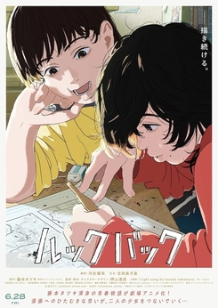

*Look Back* is a charming one-shot manga from Tatsuki Fujimoto (the *Chainsaw Man* author... really) about the competitive friendship between two young women who just really, really want to draw. It's a poignant story that takes less than an hour to read and comes highly recommended.

This year, it was lovingly adapted into a film, resulting in one of the all-time-great adaptations from page to screen. Although it carefully replicates every frame of the manga, it adds a few flourishes that only work in animation; especially impressive is   a scene of one of the girls skipping across the countryside, celebrating her recognition as a great artist by the other girl.

The only real criticism I have is about the length — the manga's size doesn't translate nicely into a feature-length film. But that's a minor quibble about a beautiful, touching film.

I saw this at a special AMC screening that also included behind-the-scenes interviews with the creators. Seek those out if you can — the care and craft is evident in how they talk about every  shot.

### The Sacrifice

> If every single day, at exactly the same stroke of the clock, one were to perform the same single act, like a ritual, unchanging, systematic, every day at the same time, the world would be changed. Yes, something would change. It would have to. One could wake up in the morning, let's say. Get up at exactly seven, go to the bathroom, pour a glass of water from the tap and flush it down the toilet. Only that!

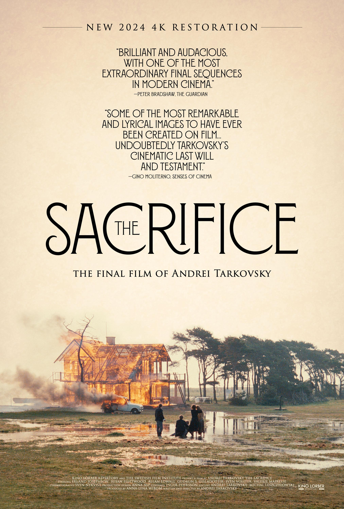

It must have been a good year for film, because Tarkovsky didn't make it onto my top 5. In any case, his final film *The Sacrifice* is his attempt at making an Ingmar Bergman film — he even hired some of the same crew! — and I have yet to see a Bergman film I truly love.

Still, this fable of nuclear annihilation and contracts with God is well worth watching for anyone that can stomach Tarkovsky's runtimes. The partygoers' philosophical dialogue suddenly interrupted by screaming fighter jets is one of the few hair-standing-up-on-end scenes I saw this year.

### Get Out

> You were one of my favorites.

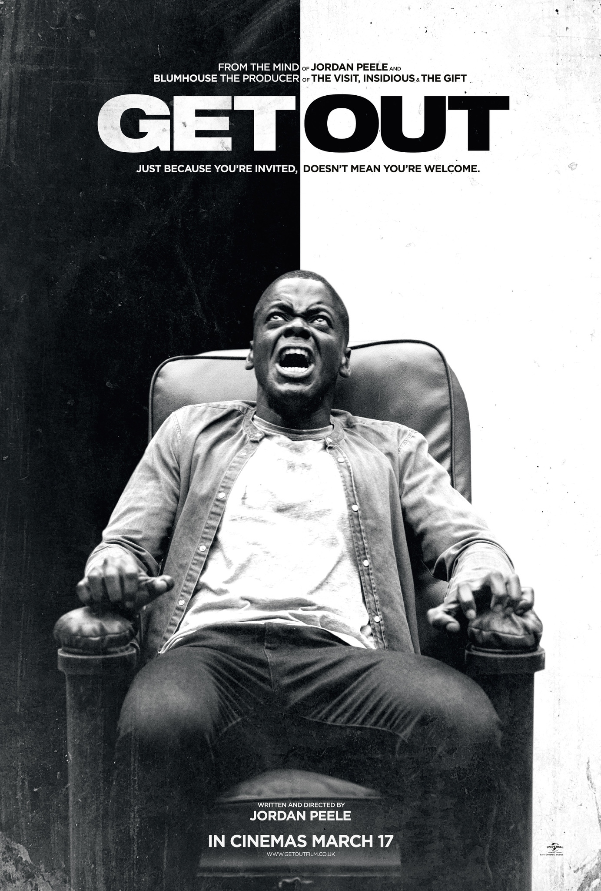

You know *Get Out* is good. You don't need me to tell you that. But if, somehow, it has taken you eight years, like it did myself, to watch the debut of one of the most interesting artists working in film today... drop everything and watch it.

### 5. The Zone of Interest

> To tell you the truth I wasn't really paying attention. I was too busy thinking how I'd gas everyone in the room. Very difficult, logistically, because of its high ceiling.

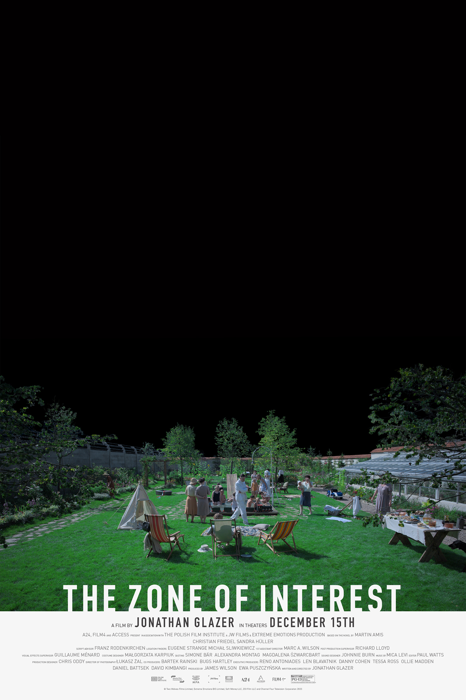

*The Zone of Interest* is the worst film on this list, by a wide  margin. It's just *too clever* for its own good. Why is there a formalist subplot shot in anachronistic night vision in an otherwise obsessively grounded film? Why is the ending an unexplained postmodern time skip? Why are there attempts to juice the plot with family drama that's not actually resolved?

Fundamentally, *The Zone of Interest* should have been a 20 minute art film playing on a loop in an art exhibit, not a feature film playing in theaters.

But *The Zone of Interest* deserves its place on this list because I *cannot stop thinking about it*.

On a field trip in high school, I had the... well, I hesitate to call it good fortune, so let's say that I had the honor of meeting a Holocaust survivor.[^illinois] She was not yet a teenager at the time of the Holocaust, so she was probably nearing 80 when she talked to my class. I wouldn't be surprised to find that she's passed away in the past decade since then. The point I'm making is that the Holocaust is passing out of living memory. Children today are unlikely to ever hear, firsthand, from a survivor.

So how media represents the Holocaust is *important*, because it will shape how future generations think about, relate to, *visualize* the Holocaust. And that is why *Zone of Interest* is important.

Because it makes the horror real, and immediate, and *relatable.* The perpetrators of the Holocaust were not comic-book villains. They were basically normal people, who obsessed over their gardens, and fought with their wives about whether their family would move when they got a promotion, and found meaning in their lives by claiming they were doing Great, Meaningful Work. But, of course, *The Zone of Interest* never lets you forget exactly what Great, Meaningful Work is going on offscreen.

I am curious how actual Holocaust survivors feel about the film, if any saw it. But, regardless, despite its flaws, *The Zone of Interest* entered my head and never left.

### 4. Rosemary's Baby

> But there *are* plots against people, aren't there?

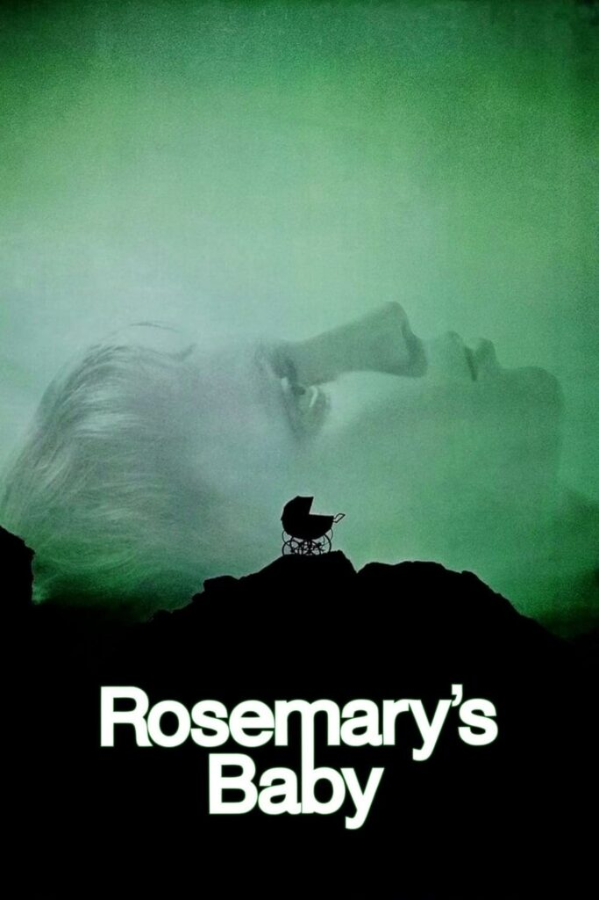

It feels strange, in 2024, to be praising a film directed by Roman Polanski, and especially praising a film that is literally about (not) believing women.

But *goddamn* this movie is fantastic.

There are parts that have aged a little strangely — the acting, for instance, is right on the transition point between the more theatrical acting styles of early Hollywood and the more naturalistic acting of modern film. But even those parts end up *just working*, because they lend an even deeper air of uncanniness to a film that is already deeply unnerving.

I don't want to say anything more, because this film is one of the very very few that deserves not to be spoiled. Pray for Rosemary's baby.

### 3. Barton Fink

> You think you're the only writer who can give me that Barton Fink feeling?!  I got twenty writers under contract that I can ask for a Fink type thing from.

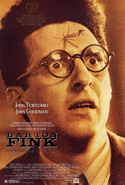

This year, I finally started to catch up on the Coen Brothers — previously I had only seen (most of) *The Big Lebowski*, but this year I caught up on their masterpieces *Fargo* and *No Country for Old Men*. Those films are great, sure, but something about them left me a little cold. They just weren't, y'know, Russellcore.

*Barton Fink*, on the other hand, is one of the most Russellcore films of all time.

A spooky hotel. A writer having nightmares due to writer's block. A nebulously supernatural not-quite-antagonist. A surreal, coincidence-filled plot. A 1940s, noir-ish setting. A black comic tone. A sense of nostalgia for someone you never knew.

I could continue, but instead I'll just say that some scenes in *Barton Fink* were so similar to scenes I wrote in one of my horror novellas that I had deja vu. I've never seen *Barton Fink* before... have I?

So *Barton Fink* was definitely going to make it on the list, but luckily it's also easy to recommend — hilarious and chilling in equal measure, endlessly rewatchable and analyzable. *Fargo* and *No Country for Old Men* are also recommended, but *Barton Fink* will always be *my* Coen Brothers film.

### 2. Tár

> If you tell another adult about this conversation, they will not believe you. Because I am an adult.

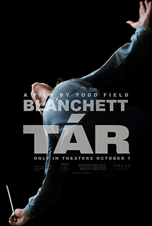

I watched *Tár* at the very beginning of the year. Until a few weeks ago, when I saw the number one pick, I was *certain* that *Tár* would be film of the year. It's *just that good*.

The only way I can describe it is that *Tár* feels *literary*. It largely consists of dense dialogue between sharply-drawn characters broken up by plot-moving set pieces. Yet, like all great literature, that deceptively simple description disguises a great deal of depth, as *Tár* explores power, art, and all those other great abstractions. *Tár* is the film on this list that would most reward rewatch and reanalysis.

But to call it "literary" also sells it short. *Tár* could work as a book, sure, but then it wouldn't quite be *Tár*. It's not as flashy about its filmic techniques as some of the other films on this list (*cough* *Zone of Interest*), but it could only really exist as a film — not least because of Cate Blanchett's barnstormer of a performance. That *Tár* follows a *conductor* — the most visual part of an auditory experience — means that it works best in the only medium that combines visuals and audio.[^games]

But, let it be said: as much as I love this film, I'm still glad *Everything Everywhere All At Once* swept the Oscars instead. But *Tár* doesn't *need* your accolades. *Tár* simply is. Immutably great.

### 1. Y Tu Mamá También

> I don't expect a happy farewell, but let it be affectionate, at least.

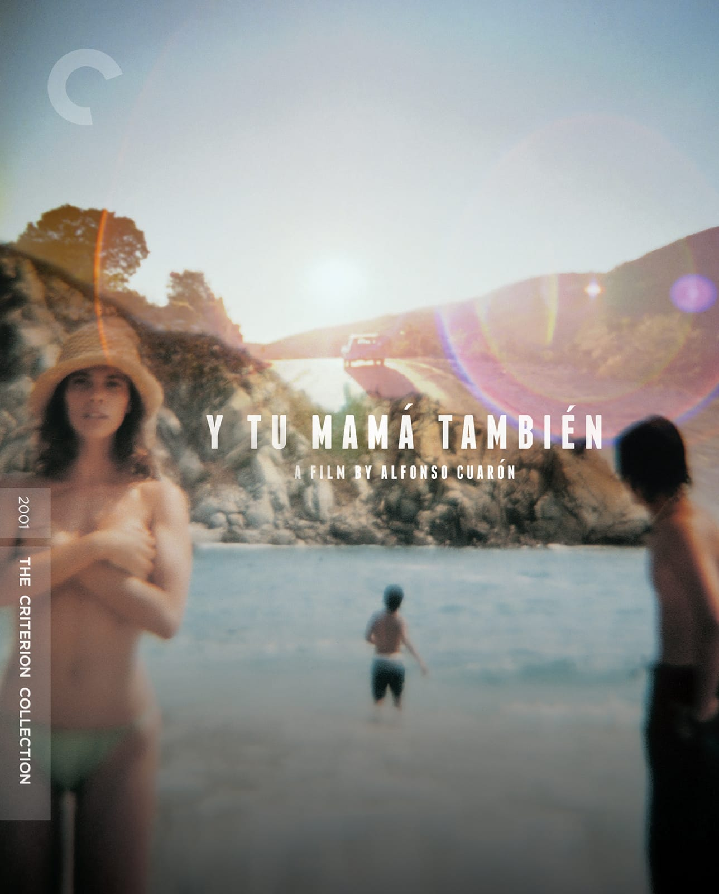

*Y Tu Mamá También* opens with a sex scene. Then, in case you didn't get the point that it was a raunchy sex comedy, it follows this up with *another* sex scene.

But as we follow two lads from different social classes as they drive across Mexico in an attempt to woo an older woman (remember: raunchy sex comedy), the music suddenly drops away and the narrator somberly informs us: if they had been driving down this highway a year earlier, they would have seen a truck crashed off the side of the road, engine on fire, produce and chickens scattered across the highway, dead bodies sticking out at odd angles.

*Y Tu Mamá También* is not a raunchy sex comedy. It is, in fact, one of the most poignant films I've ever seen and an immediate inductee into my top ten films of all time. I could say more, but the simple truth is that I have nothing to add: you just have to watch this film.

And not just because I'm a Diego Luna / Gael García Bernal fanboy, but my goodness, doesn't it help? 😅

[^adams]: Also, the cult leader's wife is played by Amy Adams. Whatever happened to her? She was everywhere a decade ago.
[^portman]: The other time this happened was in Michael Mann's *Heat* (which was enjoyable, but didn't quite make it on the list for an honorable mention). A teenage Natalie Portman has a very brief speaking role in one of her earliest film roles.
[^illinois]: This would have been at the [Illinois Holocaust Musem](https://www.ilholocaustmuseum.org) in Skokie. What I only learned today was that its foundation was a response to the aborted [Skokie Neo-Nazi march](https://abcnews.go.com/US/skokie-legacy-nazi-march-town-holocaust-survivors/story?id=56026742) of 1978, in which the Neo-Nazis were (in)famously defended by the ACLU.
[^games]: Well, besides video games. But we're discussing my favorite video games in a future newsletter.
