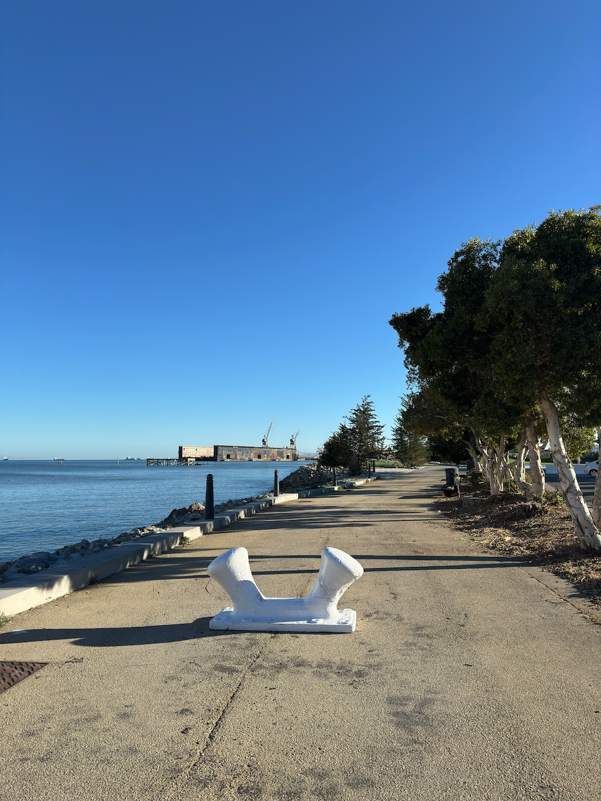
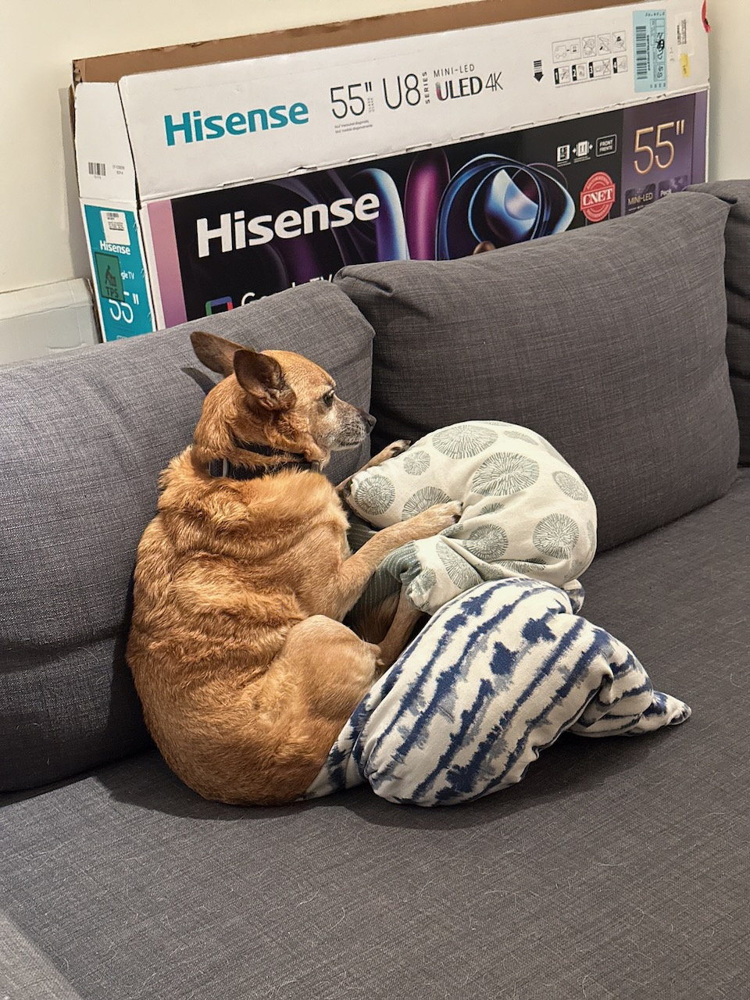

<!-- markdownlint-disable no-inline-html -->

Mission Bay's new Bayfront Park is now open!

::hr

Apropos of nothing, here are event or icebreaker ideas I want to pursue:

- Write all the attendees’ names on cards and put them in a hat.  Everyone takes a random name that they don’t know. They have to find the person and ask the strangest question they can think of. The attendees with the strangest question/answer pair (judged by the host) win a small prize.
- Cocktail party where each attendee gives a toast to the group. The last attendee has to sing their toast. (Inspired by *The Art of Gathering*, which I found surprisingly insightful.)
- Dinner party where attendees are paired up and walked through the [“36 questions to fall in love”](https://www.futilitycloset.com/2020/11/19/the-love-list/).
- Bar crawl mixer, where random groups are formed at each bar and attendees have to answer a spicy question thematically related to the bar or neighborhood.
- Cocktail party where each person is handed a unique tarot card without context. The host watches what happens next.
- [Wrapped book exchange](https://x.com/m1shti/status/1562891601008947200), where everyone brings a book wrapped in a brown paper bag with a brief sales pitch; everyone picks a book white elephant-style.
- [Letter circle](https://lostgarden.com/2023/02/26/the-letter-circle/), where all the members send each other long-form letters on a particular topic. Bonus points if it’s physical mail!

::hr

New essay week! I finally finished [“Russell’s Brief, Opinionated Guide to Home Cooking”](https://rwblickhan.org/essays/rbog-cooking/) collating everything I’ve learned about cooking in the past ~2 years. I also wrote a brief technical post on [“Building rwblickhan.org in 2024”](https://rwblickhan.org/technical/2024-site/), which updates [my two-and-a-half-year-old article](https://rwblickhan.org/technical/2022-site/) about how my site is built.

::hr

In other website news, I made my [quotes page](https://rwblickhan.org/misc/quotes/) much prettier.

The inspiration was [Heydon Pickering’s article on `<blockquote>`](https://heydonworks.com/article/the-blockquote-element/). I’ve always used blockquotes heavily, but I never found a good way to represent the citations. Heydon recommends wrapping `<blockquote>`s in a `<figure>` with a `<figcaption>` for the citation, which works nicely and allows for clean styling.

But that’s not trivial when writing in Markdown. I didn’t want to manually add `<figure>`s all over my `quotes.md`. So instead I built a parser plugin!

Or, more precisely, I got Claude to write most of a [Rehype plugin](https://github.com/rehypejs/rehype/blob/main/doc/plugins.md), which is what Astro uses to render Markdown to HTML. The [actual code](https://github.com/rwblickhan/rehype-blockquote-figures) is pretty simple — it just walks the HTML tree provided by Rehype and wraps `<blockquote>`s in `<figure>`s, moving the last `
` in the `<blockquote>` into a `<figcaption>`. I then [published to npm](https://www.npmjs.com/package/rehype-blockquote-figures) so that I could install it to my site. Tada! My blockquotes are now all automagically wrapped in `<figure>` tags.

Why does Rooibos sit funny sometimes?