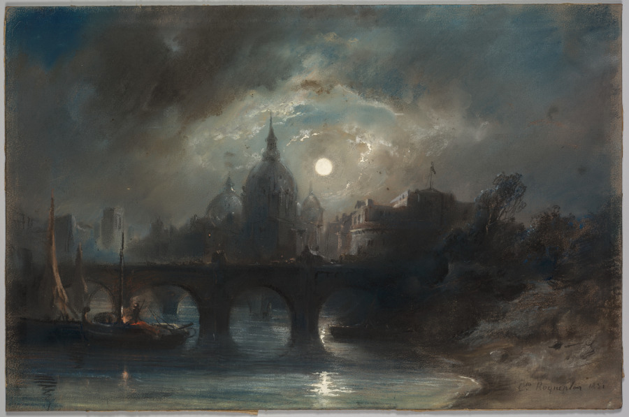
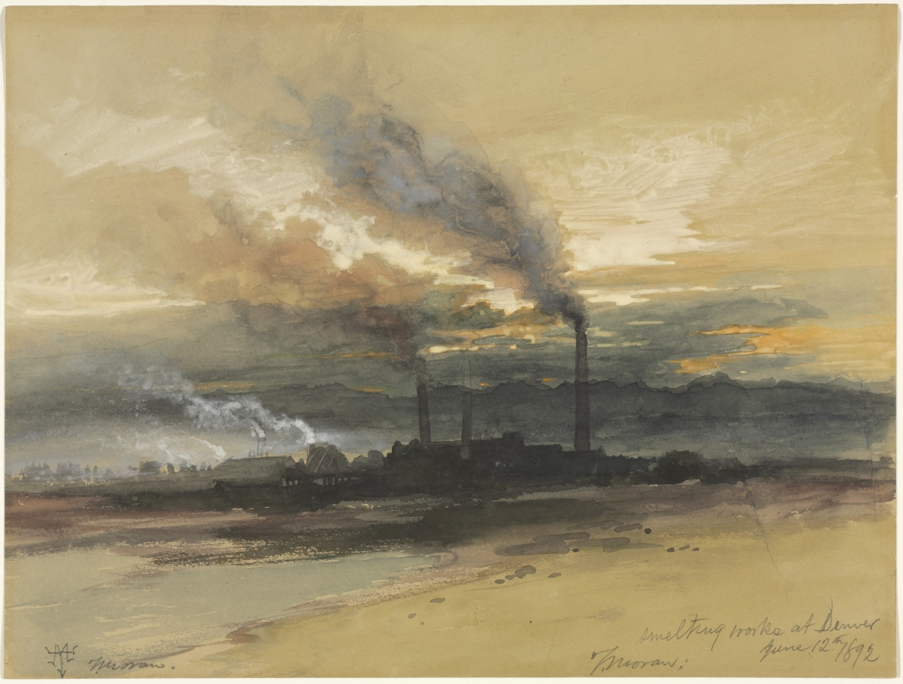
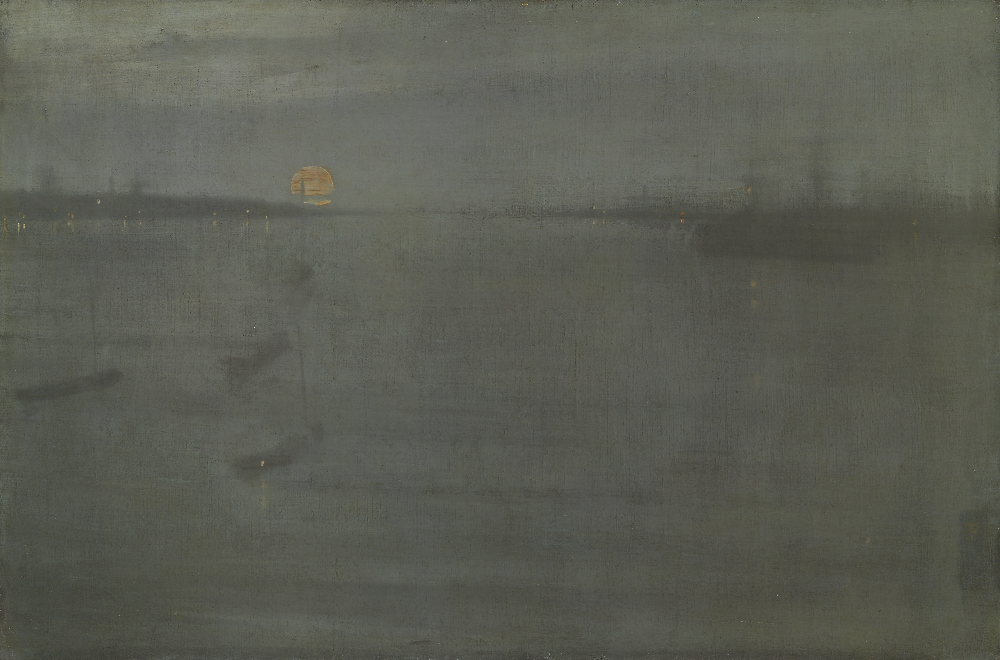
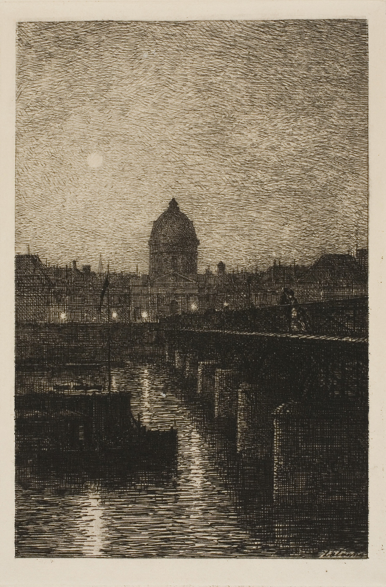

Hello, one and all, from the latter half of a delightful four day weekend (that nevertheless feels just a little too short to be entirely satisfying). I started mentoring an intern _and_ interview training at the same time this week, so needless to say I did need some time for rest and recuperation.

[_View of a City at Night_, Camille Roqueplan, 1831](https://www.clevelandart.org/art/2015.586)

## What I’m Working On

I _finally_ returned to [buttonup](https://github.com/rwblickhan/buttonup), my Buttondown iOS client. Sherry’s [Android version](https://github.com/frostyshadows/buttonup) has gotten along much farther than mine. If you’re subscribed to the [buttonup dev diary](https://buttondown.email/buttonup), you may have noticed a sad lack of updates these last two weeks; that will hopefully be rectified tomorrow, though admittedly I haven’t gotten that much more done 🙂

As alluded to last time, I felt dissatisfied with the Charlemagne’s-grandkids-inspired fantasy and I’ve decided to shelve it (for now). I did accomplish a bit more on [_Miranda_](https://docs.google.com/document/d/1TmH905DxOE6CoICGsAWs2Vf0lvK24EopY844dX7FgIY/edit?usp=sharing), as I’m tentatively calling my take on _The Tempest_; that link will take you to the in-progress rough draft (_rough_ draft).[^1] Since I was a bit… _overwhelmed_ this week, some of my 500-words-per-day writing ended up being purely “exploratory” wind-down writing, which has morphed into something I’m tentatively calling [_Bear_](https://docs.google.com/document/d/1QhAAaMwF7SKrr6RNl_ST6r6op8sxnoQzPL61F0c4w-M/edit?usp=sharing) which is _very roughly_ inspired by 14th century Novgorod and 18th century Quebecois fur trappers. I haven’t the slightest clue where it’s going or whether I’ll continue it, although I’m fairly happy with it so far, so there’s a good chance you’ll hear more about it.

For some reason, I’ve suddenly started to be tempted by game design, for the first time in a long time, likely because of my newfound fondness for _Runeterra_ (below). Perhaps I’ll be cracking open Unity soon…

[_Smelting Works at Denver_, Thomas Moran, 1892](https://www.clevelandart.org/art/1938.56)

## What I’m Watching

Nobody told me _Kiki’s Delivery Service_ had a talking cat! (I have a serious soft spot for the Cheshire Cat, Behemoth, Salem, and friends.) So, of course, I think _Kiki’s_ is a lovely film that everybody should watch—I don’t think I can add too much to Patrick H Willem’s [analysis of artistic burnout in _Kiki’s_](https://youtu.be/KfB69eDCbOI). That said, I do want to point out one thing that’s starting to bother me about Miyazaki’s films, which is the _pacing_. _Kiki’s_ definitely does not suffer the narrative missteps and lack of closure of, say, _Howl’s Moving Castle_[^2], but the pacing did leave me unsatisfied; the central conflict, of Kiki’s burnout/depression, only really becomes a focus in the last half hour or so, and seems to take place after just three or so deliveries (none of which fail). It almost feels like a montage in the middle is missing, although perhaps that’s more of an American filmmaking concept. But this is something I’ve noticed in basically all of his films that I’ve watched; even _Princess Mononoke_ (one of my favorite films, mind) feels a _little_ too rushed or too slow at some points.

What _does_ have good (fantastic, _impeccable_) timing is _Avatar: The Last Airbender_, which I got about halfway through before abandoning due to piracy site woes a few months ago. But now it’s miraculously back on Netflix, so I’m rewatching from the beginning. I don’t really have anything to add here other than a.) it’s really quite good and b.) you could honestly write an entire video essay series about the clockwork precision of its storytelling. 🤔

[”The Miracle Sudoku”](https://www.youtube.com/watch?time_continue=467&v=yKf9aUIxdb4&feature=emb_title) has been recommended by just about everyone, with a general theme of “you didn’t think you’d spend 25 minutes watching somebody solve a sudoku, but you will”, and, well, yeah, add my voice to that pile. After about a minute (“oh, this is definitely impossible”) I was hooked. I think the special sauce is not so much the puzzle itself (which is a very special puzzle, but still “just” a puzzle) but rather the solver’s disbelieving narration as he solves it.

From the maker of [“hangman is a weird game”](https://youtu.be/le5uGqHKll8) comes this (apparently serious?) examination of [”the original Mario Bros.”](https://www.youtube.com/watch?v=NYZOngyZvaI), which is to say the Game & Watch game. It’s hard to tell whether it’s satire or sincere[^3] which I think is why I found it so engaging.

[_Nocturne: Blue and Gold—Southampton Water_, James McNeill Whistler, 1872](https://www.artic.edu/artworks/56905/nocturne-blue-and-gold-southampton-water)

## What I’m Listening To

I’m not the biggest fan of the narration on [Dig: A History Podcast](https://digpodcast.org), a history podcast with an explicitly feminist lens, which is a shame, because they usually cover fascinating topics that more “mainstream” history podcasts[^4] neglect. But, catching up on their backlog, I did find an exception: [“Dancing Toward Wounded Knee: The Hope and Tragedy of the Ghost Dance Religion”](https://digpodcast.org/2019/10/13/ghost-dance-religion/) is a beautiful and painful overview of the millenarian ghost dance religion that emerged in American Indian communities in the latter part of the 19th century and how it ties into the infamous Wounded Knee massacre.

## What I’m Playing

Mainly, _Legends of Runeterra_, which to my mind is exactly what _Hearthstone_ _should_ have been; the deluge of free cards, which makes it reasonable to build non-trivial decks without shelling out cash or grinding for months, does indeed make it easy to get started, and the more complicated, _Magic_-esque mechanics keep it from going stale. In any case, if you want to add me, just reply to this email 😉

Mikey Neumann’s beautiful [tribute to _Breath of the Wild_](https://youtu.be/suiVi4kjvbI) encouraged me to finally start it up again, after having not touched it basically since moving to San Francisco. It’s nice! It’s nice. Especially for our newly-quarantined world.

[_Le Pont des Arts_, Maxime Lalanne, 1869](https://www.artic.edu/artworks/61557/le-pont-des-arts)

## What I’m Reading

I’ve been a bit behind on my 52-books-per-year goal, so I powered through the copy of William Dever’s _Did God Have A Wife?: Archaeology and Folk Religion in Ancient Israel_, which is recommended by [r/AskHistorians’ booklist](https://www.reddit.com/r/AskHistorians/wiki/books/middleeast#wiki_ancient_israel) and oft cited on the relevant Wikipedia pages. His main arguments, based on archeological evidence, are that:

- Ancient Israelite folk religion was much more varied than “Book religion” (i.e. the Torah) would have you believe.
- Asherah, descended from the Canaanite goddess of the same name, was most likely popularly conceived of as Yahweh’s consort and worshipped as a “mother goddess.”

But, though I personally found value in the text, I can’t really recommend it to anybody else; Dever comes across as, well, a tremendous asshole, and spends many many precious pages ranting about how other scholars fail to consider archeology and misinterpret the evidence they do consider, not to mention taking potshots at postmodernism and “doctrinaire” feminism. Now, I feel like I agree with him more than I disagree, but it does make this a pretty annoying read.

And, of course, I did my yearly reread of _Hitchhiker’s Guide to the Galaxy_, which for me sits somewhere between “modern classic” and “holy scripture”. Happy early [Towel Day](http://towelday.org), everyone!

[^1]: Protip: Go to View -\> “Show section breaks” to… show the section breaks. I haven’t the slightest clue why Google Docs would include the option to include sections breaks that you _can’t even see by default_, but there you go 🤷‍♀️

[^2]: Which, I know, some people love with their whole hearts, but unfortunately I just don’t like very much.

[^3]: I lean towards the latter, though he _does_ at one point claim Donkey Kong Jr. is an unreliable narrator.

[^4]: Is a “mainstream” history podcast an oxymoron?
