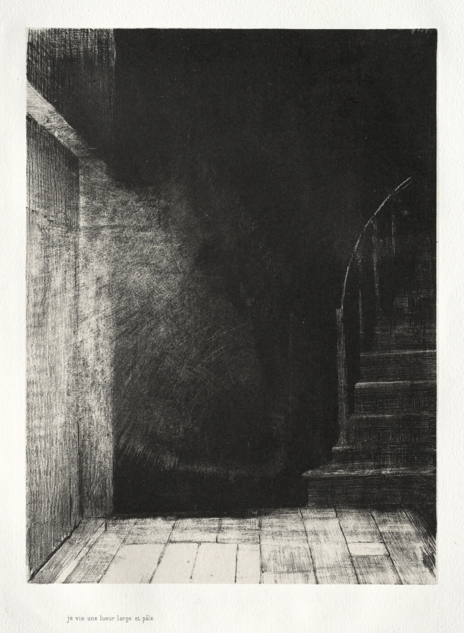

In case you missed it, you can find [part I here](https://buttondown.email/rwblickhan/archive/the-house-part-i-s3e1/).

[*The Haunted House: We Both Saw a Large Pale Light*, Odilon Redon, 1896](https://www.clevelandart.org/art/1966.413.3)

## The House, Part II

It was a cloudless day when I took possession of the House.

Much of the furniture was included in the sale price — the estate of the elderly gentleman, such as it was, did not care to stoop to a yard sale to get rid of it — and I had few possessions of my own, so the move-in day came and went without much ado. Instead, I spent my first weekend in my new home exploring the House.

I found to my surprise that my recollection of the House during the tour was faulty. Had the chandelier really hung *just so* in the front atrium? Were there really only 20 steps to the second floor, rather than the 21 I had so carefully counted? Was the walk-in closet connected to the master bedroom so cavernous when we peered into it during the tour? Had there always been an attic? (On this last point, my assumption is that the relator intentionally neglected to inform me, seeing as how the attic was filled with uncomfortably life-like dolls — perhaps another reason the estate was no eager to sell the elderly gentleman’s belongings.)

None of these inconsistencies bothered me in the slightest at the time, mind. They did not alter the essential character of the House, which is what I had fallen in love with, and anyway, what do we love that fails to change with time? I had no doubt that, by the time I was myself an elderly gentleman quietly slipping into the great void from the master bedroom, the House would have changed in myriad subtle ways to accommodate me — or, perhaps, I would change to accommodate it.

In the evenings, now that I no longer had the hunt for the perfect home to occupy my time, I read about the House and its history. As mentioned before, the story of John Gatz was a local legend, and so a few local journalists had turned their skills to an examination of the man. What I found curious is that the description of the House contained in those pages had only the slightest resemblance to the House I now sat in. The first book I read on the topic was very insistent, for instance, that the basement was only accessible from the back yard, totally ignoring the door underneath the main staircase. Similarly, another book — otherwise rather dull and serious, more focused on petty local politics than the actual story of John Gatz — claimed, very earnestly, that there were secret murder hallways and acid baths and other such features that the realtor had very carefully emphasized were not present. I would not have given such tall tales much credence — journalists are often mistaken, as I know from personal experience — had it not cited the police report from those two officers who had arrived at the House to apprehend Gatz.

Intrigued, I took it upon myself to read this police report myself. That took some wrangling with the police department — finally, I had to misrepresent myself as a journalist hoping to write yet another book on the topic — but I did finally get my hands on the yellowed old piece of parchment, in the officers’ own hand. This revealed that, indeed, many of those journalists had erred over the years in constructing the myth of Gatz and his House. The killing floor was not in the basement but rather the attic (the very same attic now filled with unsettling dolls), and in fact the relentless creaking coming from the attic in the middle of the night was the first clue for the poor victim that something was amiss. Some of the walk-in closets really had been used as makeshift gas chambers, though a note appended to the report mentioned that these rooms were later disassembled by the department, which at least solved one mystery.

But, sure enough, some of the mysterious details were proven by the report. It very clearly stated that the officers had to exit the House to check the basement (which, ironically, only had garden tools), implying the inner staircase had not yet been built. Still, it was possible that was added by a later inhabitant. What was not so easy to explain away were the murder tunnels, as the report referred to them. Apparently, there had been various secret hallways built into the House, so Gatz could sneak up on his victims in bed as they slept. The realtor had insisted these were just a myth, and I had, in my first days in the House, thoroughly investigated and turned up no evidence of any secret hallways. Yet here was the police report, claiming flatly that they existed. Moreover, the configuration listed in the report did not make any sense in the context of the existing layout of the House. Supposedly, one of the hallways had an exit in the walk-in closet in the guest bedroom, but that closet backed up against the outer wall of the house, implying the hallway went through the open air. Another hallway opened up underneath the stairs, where the basement stairs now are, and exited in the kitchen — even though, entering the basement steps, you would find the kitchen by looking over your shoulder.

I also noted with interest the testimony of the victim. I had read between the lines of the various books I had read and surmised that the victim never did regain coherency, and the report proved this out. Indeed, about all she said is that there was a “monster in the labyrinth,” a phrase that would later become so associated with Gatz it provided the title of one of the books I had read. But in reading the report I came to feel this was no metaphor — she seemed to be genuinely afraid of a monster in a labyrinth, and only with careful prompting could the officers get the grievously wounded woman to explain where she had come from or who she had been with, and thus piece together what must have happened. The woman herself seemed on the verge of panic the entire time she was in the police office and, indeed, repeatedly tried to run back out onto the street. After the officers left to apprehend Gatz, she was herded by one of the remaining officers to the town doctor, who promptly diagnosed her with extreme claustrophobia. He attempted to dress her wounds, but she resisted violently and sprinted into the evening. A manhunt later that night would find her body in a field not far from town.

Needless to say, I found all of this rather chilling and more than a little confusing. I returned home that evening slightly worse for the wear and had a late dinner. As I sat in the kitchen, eating soggy cereal from a bowl, I looked up at the basement door sitting across from me and had a sudden compulsion to fling it open and go down into the dark. I got up. I walked over. I turned the knob.

To my surprise, the door was locked. Had it always had a lock? I must have been misremembering when I opened it that first day and peered down into the basement. I would have to ask the realtor if he knew about a key, or perhaps call a locksmith.

I sat down and finished eating my cereal. After, I felt especially tired and decided to prepare for bed. But as I crept up the stairs, I decided I wanted to look for the murder tunnel in the guest bedroom, which I had converted into an office.

I walked in the guest bedroom and looked to my left, expecting to find the walk-in closet. But, to my surprise, I saw only a window, looking out on the front yard. Instead, I looked to my right, finding the walk-in closet there instead. I thought I must have been more tired than I thought, to think that the walk-in closet was against the outer wall — clearly, that was where the window was! I walked over to the walk-in closet and carefully opened the door.

The walk-in closet was much deeper and darker than I remembered. Distantly, like at the far end of a tunnel, I could see another room, which looked like the master bedroom.

I stepped into the walk-in closet and the door shut behind me.