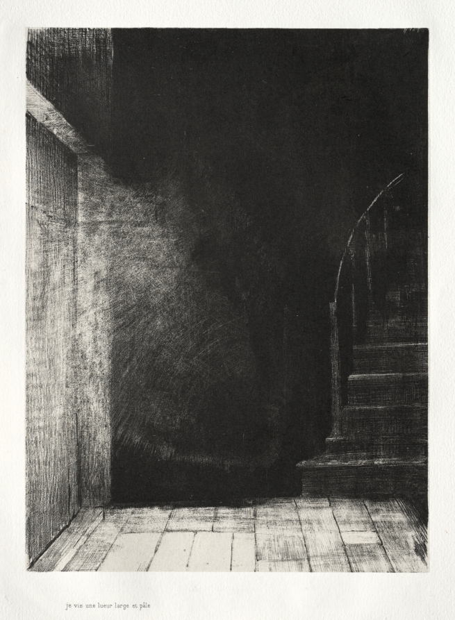

You can find the entirety of [*The House*](https://rwblickhan.org/stories/thehouse/), lightly edited, on my website.

[*The Haunted House: We Both Saw a Large Pale Light*, Odilon Redon, 1896](https://www.clevelandart.org/art/1966.413.3)

## The House, Part III

I stepped through the long, dark tunnel and found myself in a room that looked exactly like my master bedroom, but the master bedroom should have been on my left, across the hall, and this room was curiously empty — it had the same old bed I slept in every night, but no glass of water like I kept by my nightstand.

I exited the lookalike master bedroom through the main doors to find myself facing another tunnel, as if this master bedroom now lay at the end of the long upstairs hallway, instead of to the side. I walked down the hallway, peeking in the guest bedroom, which was identical in layout to mine but lacking any of the office paraphernalia I had introduced. There was no hallway in the closet. I closed the door behind me and crept down the stairs.

I thought about trying the front door, but first I wanted to check the kitchen. I stepped in and flipped the switch by the door, flooding the room with harsh fluorescent light. There was something clinical, like an abandoned hospital, about the empty shelves and the cracked linoleum tile. This lookalike kitchen, whatever it was, had not been used in a long time.

I thought I heard a low humming coming from above me. For a moment I thought there might be someone with me, but it was only the humming of the lights. I turned back out of the kitchen with another flip of the light switch.

I found myself face-to-face with the basement stairs, not a murder tunnel I expected — in fact, they looked identical to my own basement stairs. I thought I should find out what the basement looked like in the lookalike, hoping beyond hope that the lights still worked — annoyingly, the only light switch was at the bottom of the stairs, in both my basement and the lookalike, and I had not brought a flashlight. I gripped the railing and descended into the chthonic depths.

When, with a sigh of relief, I flipped the light switch, I found myself in a room that appeared identical to my attic, albeit thankfully free of the dolls that I had not yet managed to clear out. Indeed, all that was present in the attic was a small handsaw — red with rust or with blood, I could not tell.

I walked over to the other corner and found wooden stairs already let down to the floor below. I crept down the stairs, feeling each creak like it was in my bones. I found myself in the long upper hallway again, passing another copy of my bedrooms, this time darkened as if in mourning. I peered out the window in the guest bedroom and saw that it was pitch black out — not even the moon was visible. I shivered and decided to keep going.

As I took my first step on the main staircase, however, I heard a creak behind me. I turned in a blind panic, but there was nothing on the stairs — in fact, the attic stairs were not even open at all. Alarmed, but with no better option, i continued down the stairs.

The hallway downstairs appeared as if mirrored. Where in my House the kitchen was, from the perspective of the front door, to the left, here it was on the right and the basement door was on the left. I walked into the kitchen.

My breath caught in my throat. Sprawled across the small kitchen table was a skeleton. I dared to walk closer and examine it. The bones were pure white, preserved, as if they had laid here, undisturbed, for millennia, picked clean by whatever carrion birds resided in these dark halls. I swallowed hard and backed away.

I returned to the main hall, when I had the sure suspicion that someone — some *thing* — was walking down the main staircase. Creak, creak, creak. I could feel panic rising in my chest. I did the only thing I could think. I swung open the front doors and dove through.

And found myself standing in the atrium of the House.

Curious, I walked into the kitchen, only to find a bed against the wall. I turned behind me and, where the basement door usually was, there was instead a guest bedroom. I walked into the guest bedroom. I walked into the closet. There was a tunnel there. I stepped through, and found myself in a dark basement.

I could suddenly feel breath on the back of my throat, as if something was waiting for me in the dark. I turned around to go back the way I came, but I couldn’t feel my way back to the hallway — there was only cold, cement walls, and the feeling of being watched.

Finally, miraculously, I stumbled on a staircase and ran up them as fast as I could, my breath lost somewhere on the basement floor. I could feel it following me as I scrambled, slamming the door shut behind me.

I found myself in the atrium, again, but this time there was no kitchen, only wall. The hallway was dark and gloomy, as if covered in mist. With nothing better to try, I went upstairs. There were no rooms upstairs, only a long, dark hallway. I began to walk down the hallway, sure that I heard footsteps coming up the stairs behind me.

The darkened hallway felt like a maze, one corner following after another. I peered behind my shoulder again and again, convinced I was being followed. *Was this the monster in the labyrinth?* I thought to myself numbly. But every time I saw nothing there.

I can’t say how long I spent wandering those darkened hallways, or, after the hallways suddenly ended in another upstairs hallway, how long I spent exploring lookalike room after lookalike room. All I knew was that I began to grow tired, hungry, and cold. I passed another skeleton, calmly laying in bed, then another skeleton sitting on a solitary chair in the basement. All looked like they had laid there, undisturbed, for millennia. Every lookalike kitchen I visited had nothing in the way of food, every bedroom had nothing in the drawers, every bathroom was simply a bathroom, the mirror reflecting my every-more-haggard face. Every so often the hairs on the back of my neck would stand up, as if someone, or something, was right behind me, but every time I looked back there was nothing there. Every so often I would hear steps creaking and I would flee, instinctively knowing I did not wish to meet whoever made those sounds.

I began to fear I would wander these impossible, purgatorial halls forever.

But then, after what felt already like an eternity, a new sound was introduced. There was a series of sharp knocks, clearly emanating from the front door but shaking the entire house, inside and out. I caught my breath after my heart had jumped into my throat and waited.

The knocking occurred again.

And again.

I swallowed hard. I walked to the front door and slowly turned the knob, opening the door before me.

My insurance agent stood before me, on a calm, if somewhat balmy, summer night. I walked out the door, greedily gulping fresh breaths of air.

“Are you alright?” he said, with a look of genuine concern on his face. I realized I must look very strange, gulping down air like a recently drowned man, haggard like a castaway.

“I’m fine, sorry. I just wasn’t expecting a visitor, is all.”

“Ah, well, my apologies. Your phone seems to be disconnected. Do you mind if I come in?”

“I’d rather we talk out here.”

“I just need you to go over some papers related to your parents’ life insurance. If you’re not well at the moment, you can swing by the office when you get a chance.”

“You drove all the way out here just to say that?”

He looked at me strangely, even suspiciously. “You didn’t reply to our repeated letters and, as I said, your phone has been disconnected. These are… important papers, and it’s really best that you come talk to us as soon as possible.”

I promised I would the next weekend. We said our goodbyes and I watched him drive off.

Needless to say, I did not go back into the house. Luckily, I still had my keys and my wallet, so there was little enough of value still in the house. I drove my car into town and bought an appropriate amount of gasoline. I poured it all around the outside of the house and then, finally, lit a match and carefully lowered it. The flames licked the gasoline before catching, and the whole House was soon ablaze.

I cried a little as I saw the House, the House I had always dreamed of, fall apart, piece by piece, the creaking timbers making a sound like screaming. A part of me still loved the House.

Of course, I had already decided to tell the insurance company that it was an accident. That left one final step. With the flames now overtaking the House, I gingerly opened the front door and stepped inside. I was afraid of becoming trapped again, but with the flames crackling all around, I did not think there was much chance of that.

I waited until I inhaled just enough smoke and ran back through the front door.

And found myself in the atrium.

## About This Story

I wanted to talk a bit about the inspiration for this story. Perhaps the most direct inspiration is Jacob Geller’s brilliant video essay [”Control, Anatomy, and the Legacy of the Haunted House”](https://youtu.be/mexs39y0Imw), which I urge you to watch if you haven’t already, as well as two of the pieces of media mentioned within, namely Kitty Horrorshow’s [*Anatomy*](https://kittyhorrorshow.itch.io/anatomy) and Mark Z. Danielewski’s [*House of Leaves*](https://kittyhorrorshow.itch.io/anatomy). As Geller argues in the essay, both of those stories are essentially haunted houses stories where the house *itself* is doing the haunting, a concept I find intoxicating. Additionally, I pulled direct inspiration from both — *Anatomy* inspired the layout of the House and *House of Leaves* inspired the concept of a “monster in a labyrinth”. The infinite, repeating architecture also owes something to both Borges’ [“The Library of Babel”](https://en.wikipedia.org/wiki/The_Library_of_Babel) and Susanna Clarke’s [*Piranesi*](https://en.wikipedia.org/wiki/Piranesi_(novel)) (and, what do you know, there’s a relevant Jacob Geller video essay: [“The Shape of Infinity”](https://youtu.be/Zm5Ogh_c0Ig)). The actual writing style apes the great nineteenth-century American horror writers, notably Edgar Allen Poe and Ambrose Bierce, whose [“The Spook House”](http://www.ambrosebierce.org/house.htm) is also an influence on this story. Finally, this story was written while listening to Deathprod’s [*OCCULTING DISK*](https://deathprod.bandcamp.com/album/occulting-disk), perhaps the most horrifying album of all time.

P.S. did you pick up on the “story behind the story”? Let me know if you think you did 🙂