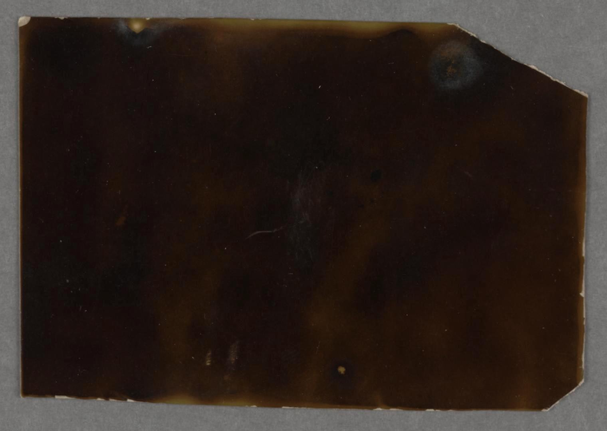

Part I can be found [here](https://buttondown.email/rwblickhan/archive/the-structure-part-i-s3e4/). Part II can be found [here](https://buttondown.email/rwblickhan/archive/the-structure-part-ii-s3e5/). Part III can be found [here](https://buttondown.email/rwblickhan/archive/the-structure-part-iii-s3e6/).

[Celestograph by August Strindberg](https://publicdomainreview.org/collection/august-strindberg-s-celestographs-1893-4)

## The Structure, Part IV

Tamblyn saw the burning ship through bleary eyes.

She tried to sit up, her head pounding the entire time. She looked around. The ship was there in front of her, quietly burning. Blurry figures were moving around it. “She's up!” she heard, and the figure — which slowly resolved as Razin — came towards her.

She looked around. They seemed to be in a tremendous hallway, the roof a mile or more before them, the hallway curving slightly as it ran a mile or more until curving out of sight. They must have crashed through the outer wall of the structure, but there didn't appear to be a hole through which they had come, only a smooth, black wall. The hallway was cloaked in gloom, a faint amount of ambient light the only illumination aside from the burning ship. A few pieces of the ship pinged off into the darkness, where they were snuffed out like a candle at dawn.

Razin, with the help of Thoman, picked her up and propped her up. Razin looked the worse for the west, a long, bloody gash cutting across his forehead. Thoman was luckier, looking only slightly bruised.

“We're trying to get Alia out of the cockpit,” Razin said, turning back to his task. Thoman stayed there with her and explained more.

“There's something about the atmosphere. The flame isn't burning as hot as it should.”

“Where are the others?”

“Raxton’s working on the cockpit from the inside, Pedra and Liz are recovering over there.” He indicated two other darkened figures, sitting on a couple smashed up supply boxes.

Tamblyn walked over to join them as Thoman rejoined Razin. They nodded at her. Father Pedra was clutching the spark of the divine, as if it might suddenly start spewing out secrets about this place. For all Tamblyn knew about them, it actually might.

They heard a loud moan. Raxton had gotten the cockpit open — Tamblyn would later find out her had to override an automatic safety disengage, whatever that meant — and had smashed open the viewport from the inside, scattering glass around the floor of the hallway, where they seemed to melt away. He pulled out a small knife and cut away the straps binding Alia to the cockpit, then Razin and Thoman clambered in and carried her out. They set her down gently atop another crate, before heading back into the ship to save more of their supplies.

Tamblyn ran to Alia’s side, checking her pulse. She was cold and clammy to the touch. Thoman wasn’t kidding about the air here. After a few seconds, Alia began to shiver, finally bolting upright.

“What happened?”

Tamblyn waved a hand around panoramically. “You landed the shuttle, more or less.”

Alia smiled, but only for a moment. “Any casualties?”

“Most of our supplies, looks like, but no major injuries.” Father Pedra started limping over towards them, aided by Liz. “Actually, it looks like the good father hurt his leg.”

“Something’s not right,” Alia suddenly said, staring at Tamblyn with scared eyes. “When I was knocked out, I had… dreams. Strange dreams.”

Tamblyn tried to remember if she had dreamed anything herself, but it was lost to the darkness. “Can you remember them?”

Alia concentrated, but then shook her head. “No, I just… I know they were strange.”

Pedra and Liz finally made it over to them. “I find it curious there’s no signs or symbols,” Liz said. “We won’t know where to go.”

Pedra held up the spark of the divine. “We’ll ask Him.” He didn’t see Liz roll her eyes.

Tamblyn marched over to help Thoman, Razin, and Raxton pull out the rest of the supplies. She looked it over — most of the crates had been completely destroyed. “That leaves us with maybe a day or two of rations,” Razin said, looking it over. He glanced at Tamblyn, the added drily, “And I notice our ship is destroyed.”

“Can we still get a message out, Raxton?”

Raxton shook his head. “It’s best to consider the lander a total loss. Radio’s dead, even if it could penetrate this hull.”

Tamblyn nodded. “We’ll just have to press onward and hope to find another way off, then.” She started biting her fingernail, an anxious tic she had had since childhood, and suddenly stopped. She still wasn’t wearing her helmet.

“It’s breathable,” Razin said, tapping the portable monitor strapped to his wrist. “Actually, it’s closer to the hypothesized atmosphere of Terra than our own generation ship.”

Alia, apparently no worse for the wear, appeared beside her. “At least some of the weapons survived.” She picked up a pistol and handed it to Tamblyn, then grabbed an assault rifle for herself. Raxton pulled up a large revolver that was as good as a rifle for himself. Alia looked around, holding out a pistol, but there were no takers. “I see why you brought me,” she said to Tamblyn quietly.

The spark of the divine carried by Father Pedra lit up in the gloom and quietly started prognosticating. There were no doorways nearby, only the long, dark hallway, so it was merely a choice of whether to go one way or the other. The spark of the divine told them to keep the apparent outer hull to their right.

They walked slowly at first, on account of the priest’s leg. After a few steps, however, he began to visibly improve, and after no more than a dozen feet he was walking normally again. Razin, Liz, and Thoman pulled the few intact crates along with them. Every so often, Razin would insist they stop so he could take another measurement with his monitor, but the air was remarkably consistent each time, as if controlled down to the molecule. Liz kept an eye out for any markings or indications, but the hallway was completely smooth, and she soon started chatting quietly, if not a little anxiously, with Thoman. Alia continually swept around her field of view with her rifle, but there was little to aim it at.

After a few hundred feet, Tamblyn glanced behind them. She thought she could see the ship melting, slowly, into the floor, just like the shards of glass from the cockpit had, the fire guttering out like the last embers of a hearth.