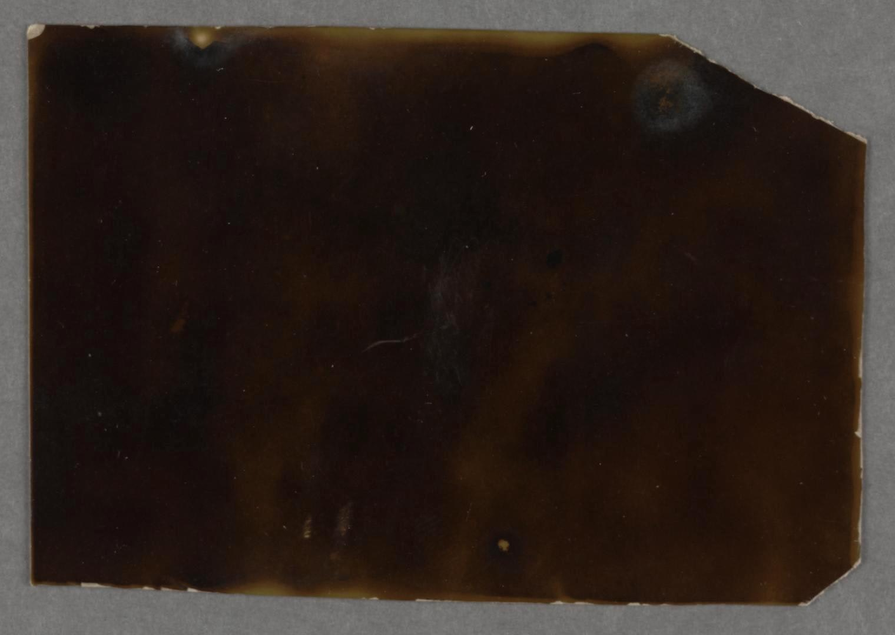

The complete story can be found [here](https://rwblickhan.org/stories/thestructure/).

[Celestograph by August Strindberg](https://publicdomainreview.org/collection/august-strindberg-s-celestographs-1893-4)

## The Structure, Part VII

Tamblyn and Thoman stepped towards the center of the large, circular chamber — maybe 40 feet across and 20 feet tall. A large podium sat in the middle of the chamber. All around them — walls, ceiling, floor — the black obsidian melted away as if translucent to show the stars. Distantly, they could see the lights that they knew came from the waiting generation ship.

They walked towards the podium, their feet still feeling the floor even if their eyes didn’t see it. The podium descended, revealing a small chamber inside, like a booth of the VIP lounge in one of the many clubs of Starboardside. They walked inside, sitting across from each other.

Thoman waved his hands, experimentally, in the air between them, and the stars around them shimmered and went out. They reappeared a moment later, showing different constellations. He waved again and the stars shifted again.

“Do you think we’ve moved at all?” he asked. “Like a… teleporter or something.”

Tamblyn shook her head. “I don’t think it’s scientifically possible.”

“Yes, but if it’s non-Terran…” He flipped his hands a few more times and the stars reset to the ones they recognized. The generation ship still hung out in space, slowly drifting towards past Andromeda.

They sat uncomfortably in silence for a few moments, before Thoman pulled out his camera — the only thing they had managed to bring, alongside Tamblyn’s pistol — and started to take pictures. Tamblyn couldn’t imagine they would turn out well, given the chamber was pitch-black as space, but she said nothing. Suddenly, he stopped. “Look, past the ship.”

“What?”

“There’s something following the ship.”

Tamblyn turned her head, in shock, but she couldn’t see anything, only the distant stars. She said so.

“No, there’s definitely something there. I want to get closer.”

“Twenty feet won’t make it any clearer. Besides, there’s nothing out there.”

“It’s worth a try.”

He slid out of the chamber to take a closer look. As soon as he did so, the podium began to slide up. He turned back to jump back on, but he was too slow — it accelerated even faster than Tamblyn could move. Soon, it was surrounded on all sides by darkness — when Tamblyn reached out, it was cold to the touch.

The podium stopped in another chamber, though she could tell only by her sense of acceleration, for her surroundings showed no change — this chamber was completely pitch black. She got out of the podium. She began to walk.

She walked.

She walked.

She walked.

She did not get tired.

She walked.

After a while she could not tell whether the floor was still there or whether she had begun to float.

She felt she was being absorbed into the dark.

She opened her eyes. She could see the universe.

All the tiny pinpricks of light, each a possible home for a million billion sentient lifeforms. She swept her hands over them, feeling the vast distance from one to the other. She looked around and saw them extending out as far as she could tell — not infinitely, but close enough.

She could see the structure, distantly, as if in a dream. If she focused she could just barely pinpoint it in the field of stars, but it was hard to focus, like she was trying to stay awake in class before falling asleep.

Distantly, she could hear — or feel, really — other awarenesses, other consciousnesses. She felt some distant kinship to them — perhaps they had built the structure, once? Perhaps she had known them, once? Perhaps she was one of them?

She dimly felt an explosion rock her, but it was just so hard to focus, now. So hard.

She closed her eyes and absorbed into the universe.