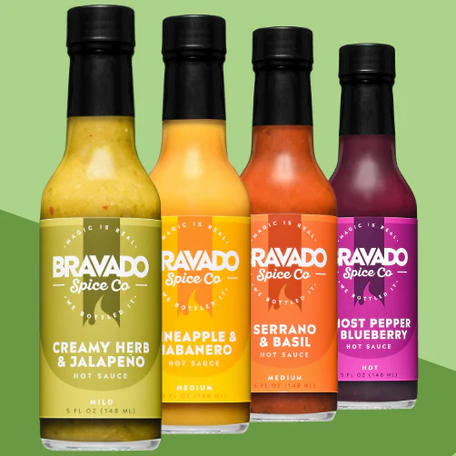
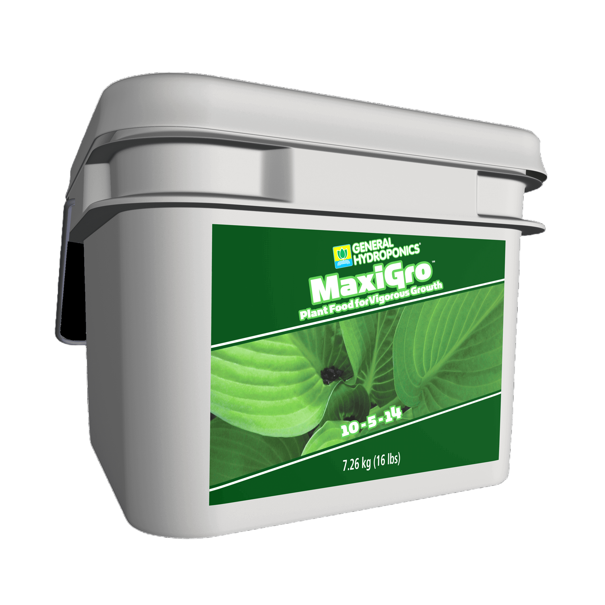
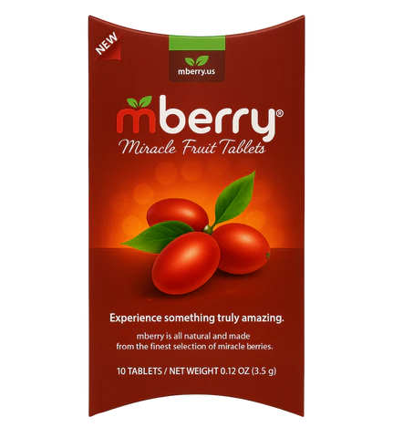
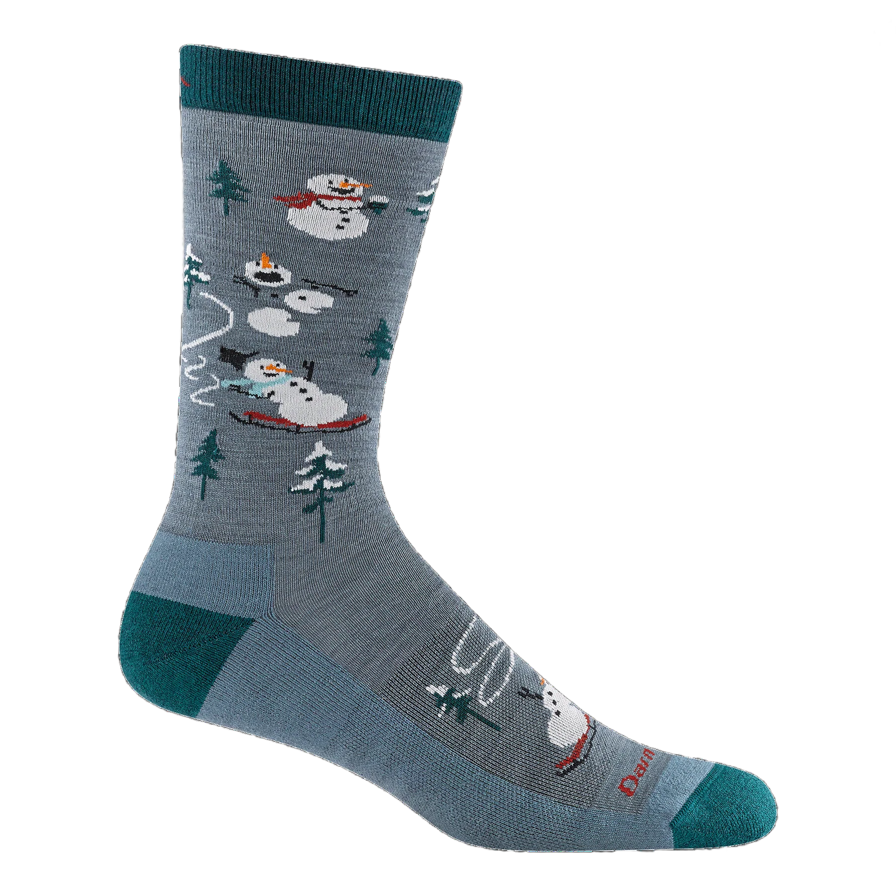
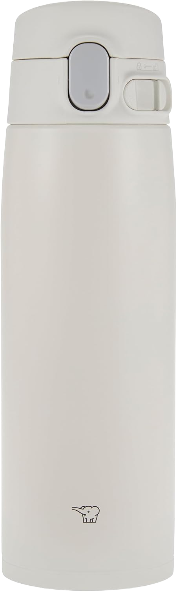
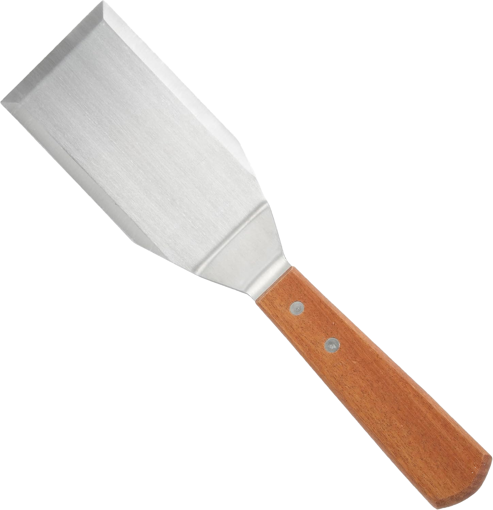
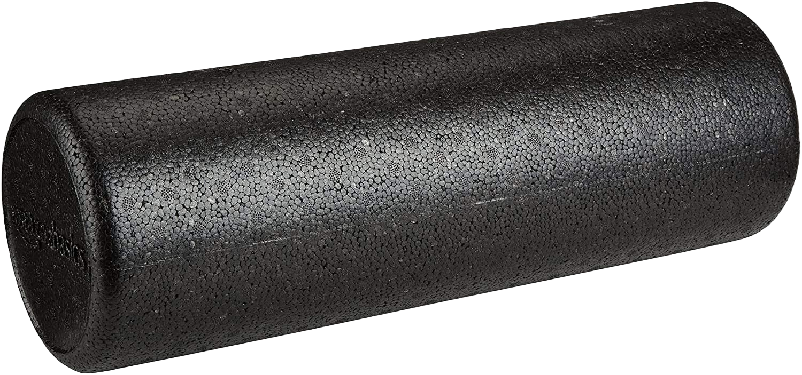

What is the point of a holiday gift guide? For most of the major publishers, it’s all for affiliate-link-sales; for the more thoughtful newsletters, it’s a chance to share love with smaller, craft-focused producers, or show a bit of the writer’s personality, or just make a series of jokes.

But, in my case, it’s an easy topic for a weekly newsletter: I can just look and name things I like that you might like too!

Is it too late for a holiday gift list? Perhaps! But perhaps you can still buy a New Years’ gift for yourself. So here’s some things I like:

## Bravado Spice Co

I like hot sauce! Most people underrate hot sauce! A touch of high-quality hot sauce adds so much flavor to a dish.

I learned about [Bravado Spice Co](https://bravadospice.com/) from a [podcast](https://youtube.com/watch?v=Lg8wRwJlRRk) introducing hot sauce as a hobby. I picked the [four pack](https://bravadospice.com/collections/sets/products/4-pack-hot-sauce-set) because it includes ghost pepper-blueberry (!), though my actual favorite from the set is the creamy herb-jalapeno, which has a nice chunky salsa-y consistency.

## Aerogarden

I don’t think I can call myself a _gardener_ per se, but I have enjoyed my [Aerogarden](https://scottsmiraclegro.com/en-us/aerogarden.html), which is supposedly the best hydroponic light and was recently saved from cancellation as a product line. You can have all the fresh basil, mint, and oregano you want!

For best results, avoid the Aerogarden-branded plant food and seeds. You can buy cheap “Aerogarden-compatible” pod kits from Chinese supplies on Amazon and fill them with normal garden-store (or even grocery-store) seeds. Then, every two weeks, drain and replace the water in the tank and put in a flat teaspoon of [Maxigro](https://generalhydroponics.com/products/maxi-series/maxigro/). Also, make sure to trim the plants regularly to avoid outgrowing the Aerogarden; you can keep the trimmings in a bowl of water if you can’t use it regularly.

## Miracle Berry

Miracle berry is a bizarre fruit that doesn’t taste like much, but _does_ invert your sense of sourness to sweetness for about 15 minutes. You can power through lemons like they’re candy! [mberry](https://mberry.us/?srsltid=AfmBOoruEhPWci_CQ_hOvbVpPW3tlyKZK1FDBf7PRmHOqnOmbumv2Tjx) makes a line of concentrated tablets that are perfect for a holiday “flavor tripping” party.

## Darn Tough

[Darn Tough](https://darntough.com/) are the best socks. They’re mostly Merino wool, which keeps your socks toasty warm _or_ nice and cool. Don’t your feet deserve the best socks?

## Zojirushi Water Bottle

I recommended the [Zojirushi SM-VA60](https://www.zojirushi.com/app/product/smva) just a [few weeks ago](https://rwblickhan.org/newsletters/with-all-that-consumerism-out-of-the-way/), and I still stand by the recommendation. Stay hydrated!

Also, in case you hadn’t noticed, it has Zojirushi’s adorable little elephant logo.

## Winco Flat Spatula

Do you need to smash hamburgers or grilled cheeses? Do you want to feel like a master of the grill? Then buy [this Winco spatula](https://www.amazon.com/dp/B001VZAKGM) — it’s perfectly fit for purpose and it’s only $10.

## Amazon Basics Foam Roller

At the start of this year, I had so much arch pain while running that I had to give up on one of my favorite hobbies. After a round of physical therapy, I learned that my posterior chain was badly ill-conditioned, and the solution to my arch pain was a combination of leg curls and rolling out my hamstrings with this cheap-but-wonderful [Amazon Basics foam roller](https://amazon.com/dp/B00XM2MXK8).
