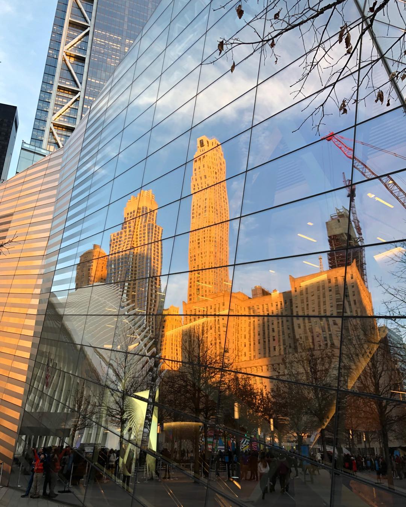
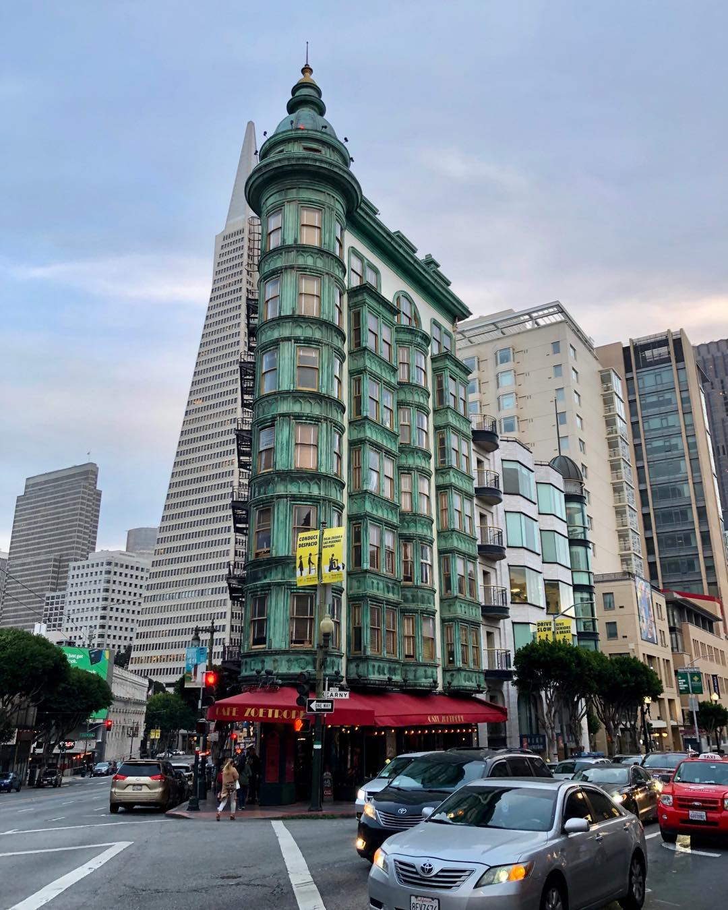

Hello all from a world that looks considerably scarier than my last missive two weeks ago. San Francisco finally seemed to panic this weekend, although happily I can report Sherry and Rooibos and I are fine. Hopefully you’re all taking care of yourselves on this otherwise beautiful Sunday night. Stay inside and wash your hands! 😷

## What I’m Reading

The main book this week was Stephan Guyenet’s _The Hungry Brain: Outsmarting the Instincts That Make Us Overeat_. Despite the title, this is more _Thinking, Fast and Slow_ than Malcolm Gladwell; Guyenet is a prominent obesity researcher and indeed cites his own work on occasion. Luckily, it’s really, _really_ well written; he slings technical vocabulary like leptin and NPY neurons without ever losing the reader. But, much like [Slate Star Codex's review](https://slatestarcodex.com/2017/04/25/book-review-the-hungry-brain/) (which doubles as a quick summary, if you’re interested but don’t want to risk reading a whole book), I feel like it ends up in a weird, wishy-washy place; basically, Americans are overweight because they overeat, and they overeat because Postwar American Capitalism™️ has made super-rewarding food that hacks the brain into overeating, so the solution is to… change all of American culture to be more European, I guess? That’s partly unfair; he does have some practical advice, like pointing out that sleep actually has a _huge_ effect on how you eat (one more reason to get good sleep) or introducing the concept of the satiety index, which measures how filling a food is per unit calorie (which is why whole wheat bread is actually better than white bread—nutritionally they’re actually quite similar, but whole wheat bread is more filling and thus harder to binge on). But ultimately, it feels like a little cultural evolution (a la _Secret of Our Success_) is needed here, which Guyenet only briefly touches on. Still, you’ll learn more about nutrition _and_ neuroscience than you will from any other similarly-easy-to-read book, so this comes highly recommended.

I’ve also been powering through _A Hero Born_, the English translation of the first part of _Legend of the Condor Heroes_, the classic wuxia novel by Jin Yong (aka Louis Cha), who, fun fact, cofounded Ming Pao (the newspaper). Two thoughts:

- It’s _bonkers_ that _Legend of the Condor Heroes_ has never been translated to English before.
- This story is _bonkers_ and has no chill, in the best way. It’s just action action action. Basically, wuxia is great and more people should read it.

The only other thing I wanted to note is how _Star Wars_ is “wuxia for white people.” I sometimes think of this in a slightly joking way, but it’s also, well, totally true—it’s a modern mythology where martial artists (most of whom follow a Taoist-tinged religion) fight injustice against a backdrop of imperial politics. See? Basically the same. Of course, the differences are interesting too; slavery (of droids and humans) is a core part of _Star Wars_, whereas a sense of history, however muddled, is core to wuxia. Anyway, I don’t really have a point here—I just keep pointing it out to Sherry and I think she’s getting annoyed.

One reading I don’t have much of a comment on: [Was Jeanne Calment the Oldest Person Who Ever Lived—or a Fraud?](https://www.newyorker.com/magazine/2020/02/17/was-jeanne-calment-the-oldest-person-who-ever-lived-or-a-fraud) It’s a nice overview—it’s interesting that most people involved seem (including her actual neighbors!) side with the “she was totally legit” side, and this article largely writes off the “she was a fraud” side as Russian and Silicon Valley cranks, which might be fair, but it’s interesting because it barely touches on the fact that she’s a huge, _huge_ outlier in human mortality, and yet it seems like there’s nothing all that different about her.

## What I’m Watching

On a whim (which is to say a Netflix recommendation), I rewatched _Inception_, a film I liked but didn’t think particularly highly of. I appreciated it slightly more on a (long delayed) second viewing, although my original view is mostly unchanged—it’s a clever concept that’s mostly slickly executed, but it is often weirdly janky and unsatisfying. One of my main complaints after my first viewing was that, after almost two hours of exposition about paradoxical architecture, the final stage of the dream is… a random James Bond alpine fortress. I thought that make more sense now, but… nope, still feels like it comes out of nowhere and throws out all the set up of the film. And the characters are mostly flat cardboard cutouts. But, on the other hand, the emotional core of the film (even though it’s an arguably-problematic dead wife) was more affecting than I remembered. If nothing else, it was an entertaining way to while away a few hours of s o c i a l d i s t a n c i n g.

I also watched an episode Vox’s Missing Chapter series called [How San Francisco erased a neighborhood](https://youtu.be/tcsdglJFT0M). It’s about the systematic dismantling of Manilatown (the Filipino neighborhood bordering Chinatown) in the ‘70s, and in particular the 1977 eviction of elders of the Manong generation (single Filipino men who came to San Francisco in the early 1900s) from a building called the I-Hotel, which led to a massive protest. Interesting because a.) not very well known (or at least, I had no idea there was a “Manilatown”, despite living in Soma, which has “Soma Pilipinas” street banners every block) and b.) because of the complications of urban planning. In particular, I didn’t know “Manhattanization” (still a slur among NIMBYs of San Francisco today) actually dated from the late ‘60s and ‘70s, when large parts of San Francisco’s downtown core were demolished to make way for what we call the Financial District today. And that’s what I mean by complications—San Francisco _needs_ new construction to house people, but at what cost? Large parts of Soma are basically two-story warehouses and could easy be converted into apartments… but Soma has _already_ lost its traditional leather culture. But on the other hand, the Financial District _is_ valuable, economically if for no other reason. It’s a tricky problem to balance honoring what came before while accepting the world as it is; it brings to mind a recent Planet Money episode on [reparations for Maori in New Zealand](https://www.npr.org/2020/02/28/810485160/episode-975-reparations-in-new-zealand), where the “protagonist”, so to speak, gets the government to rename a mountain important to her group… but then also insists on leaving the English name in place as well, since, to paraphrase her, that’s part of the history as well. It’s a tiny moment in a (really good) episode, but I did really respect that; but I also wonder if that might only work in a society like New Zealand.

## What I’m Listening To

Comfort listening: lots of The Beatles. I’m quite fond of them, but I also… barely know their discography! Unfortunately, this has meant “Norwegian Wood (This Bird Has Flown)” (which is a really good song???) has been stuck in my head for the entire week.

## What I’m Working On

I’m toying with a cover of _The Tempest_ focused more explicitly on Miranda. (Sidenote: why aren’t “covers”, or retellings maybe, more of a thing in modern writing? I get that writing is supposed to be creative and all, but there’s so much room for good “covers” of stories—and, after all, my favorite book of last year, _Circe_, is basically a “cover” of a bunch of Greek mythology.) Anyway, I’m just _toying_ with it, so it probably won’t go anywhere… but hey, _The Tempest_ is great and toying with it is great too!

I’ve slowly continued work on the new site. Things are sorta-kinda working now? If I stop being lazy I might even finish it by the time the pandemic is over 🙂

I’m also toying with building a Buttondown client for iOS. I even went so far as to create a new project in Xcode. And… that’s about it 🙂

Alright, bye for now. Stay safe!
