As promised [last time](https://rwblickhan.org/newsletters/time-to-read-the-western-classics/): more classics! To keep this one manageable, I’ve kept it to just East Asian classics, which makes up the bulk of the non-western classics I’ve read. Next week I will be back to shorter essays!

## Analects

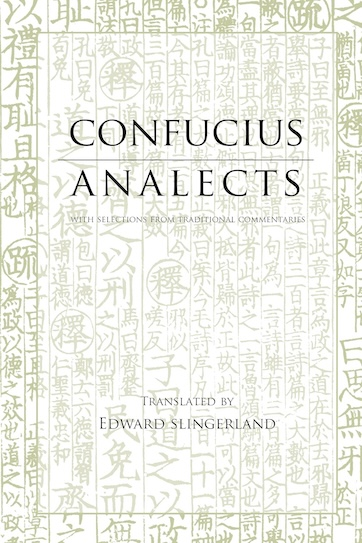

We start with the great-granddaddy of them all — the *Analects*, aka the *Lunyu*, aka the sayings of Confucius. Yes, this is the source of all those “Confucius says” memes.

The *Analects* is surprisingly fun for a text on philosophy and political theory. That’s partly because the book is mostly written in short anecdotes, describing a quip Confucius made or a story he told, which keeps the book moving along. But it’s *mostly* because you get a very strong sense of Confucius as a character, for lack of a better term. The *Analects* paints a very clear portrait of a slightly grumpy old man who’s annoyed that nobody will listen to him even though he knows all the answers, surrounded by tryhard students who all *almost* get it... but not quite. It’s really quite charming!

I read [Edward Slingerland’s translation for Hackett](https://hackettpublishing.com/analects), which I especially recommend because it provides context for nearly every paragraph. (In general Hackett is a good source for translations of ancient Chinese philosophy.) As a companion volume, I highly recommend [Hackett’s *Introduction to Classical Chinese Philosophy*](https://www.hackettpublishing.com/introduction-to-classical-chinese-philosophy), which accessibly walks through early Confucianism, Moism, and Daoism.

## Mengzi

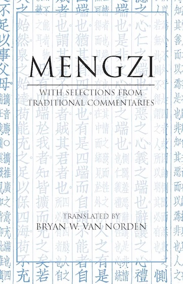

So if you read the *Analects*, you really have to read the *Mengzi* as well. That’s because Mengzi “won”, in some sense — his interpretation of Confucianism is how Confucianism has been traditionally understood for two thousand years, and Neo-Confucianism *qua* Zhu Xi raised him to almost the same level as Confucius himself.

But Mengzi is just not as interesting a character as Confucius. He’s a little *too* goody-two-shoes, a little *too* clever. And, ultimately, he’s saying a lot of the same things, with subtle (though important) differences. So it’s hard to recommend the *Mengzi* unless you’re really interested in Confucianism — I’m glad I read it, but it’s not exactly *fun*.

I read the [Bryan W. Van Norden translation from Hackett](https://hackettpublishing.com/mengzi), which is very readable and comes with extensive footnotes (which often cite Zhu Xi, natch). Conveniently, that’s the same Van Norden that wrote the *Introduction to Classical Chinese Philosophy* above; his chapter on the *Mengzi* echoes a lot of what he says in the introduction.

## Dao De Jing

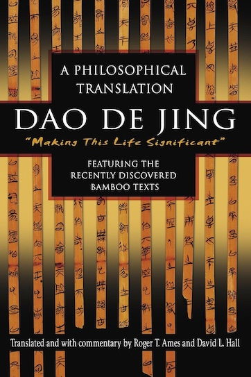

The *Dao De Jing*: the misinterpreted classic beloved by mystics and anarchists everywhere.

But look: fundamentally, we can’t really make sense of what the *Dao De Jing* is “really” saying. Even Han Dynasty commentators couldn’t make sense of what the *Dao De Jing* is really saying, either! We only realized like 30 years ago that the canonical text might be accidentally reversed (??). We kinda just have to accept that any translation is going to import a lot of assumptions.

So I read the [Ames and Hall “philosophical translation”](https://www.amazon.com/Dao-Jing-Philosophical-Translation-Mandarin/dp/0345444191), which I gather is somewhat idiosyncratic, but relatively thoughtful. I also read a few chapters from [Brook Zipporyn’s more recent translation](https://wwnorton.com/books/9781324092476), which felt somewhat more readable.

But in either case, the *Dao De Jing* is basically the ancient Chinese equivalent of ancient Mediterranean Wisdom literature — lots of short, gnomic pronouncements that are either blindingly obvious or very profound (depending on the verse and your viewpoint) — which is of interest but difficult to tackle from a modern standpoint.

## Zhuangzi

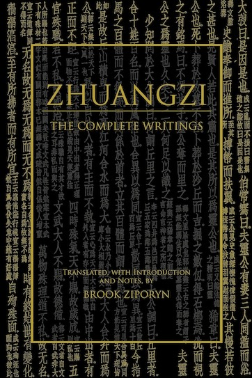

The *Zhuangzi* *sounds* like a philosophical work I’d appreciate, but frankly, every time I’ve tried to read it I’ve gotten so confused two chapters in that I just gave up. So I really don’t have much to say about it!

I have the [Brook Zipporyn translation for Hackett](https://hackettpublishing.com/zhuangzi-the-complete-writings), which I understand is the best English-language scholarly translation. But it’s almost *too* scholarly — even if I understand the introduction, I can’t really make heads or tails of what Zhuangzi is supposedly saying 😅 Oh well, maybe this year is the year I’ll power through it...

## The Lotus Sutra

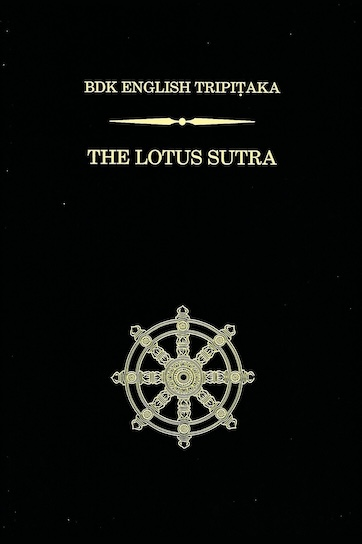

The *Lotus Sutra* is one of the *big* texts of Mahayana Buddhism, and in particular it’s the main text of Nichiren Buddhism. (You might know Nichiren Buddhism because Sōka Gakkai is, more or less, a Nichiren sect.) It’s also maybe the only Buddhist text I’ve read cover-to-cover (besides, like, the *Heart Sutra*).

Now the *Lotus Sutra* is a very important, influential religious text, but you should not read it cover-to-cover for that reason. You are *probably* better served by something like [Donald S. Lopez Jr’s *The Lotus Sutra: A Biography*](https://press.princeton.edu/books/hardcover/9780691152202/the-lotus-sutra?srsltid=AfmBOooE3d5SyFWSa-lccX-GtPr6gnMXknNnl2EC_U67WDenJJAvfPWg), which explains its teachings in a historical context as well as the history of the book itself.

That said, the *Lotus Sutra* does have a lot of famous parables and (more importantly for my purposes) a lot of very neat cosmic imagery (Buddhist stupas flying through the sky and the Buddha shooting a ray of light through millions of worlds and so on) which you will miss in most summaries. Also prevalent (and perhaps especially interesting) is the *Lotus Sutra*’s absolute obsession with its own authenticity and authority. It repeatedly states that if you disparage the *Lotus Sutra*, you will be reborn in hell for billions of years (!).

I read the translation from [BDK America](https://www.bdk.or.jp/document/dgtl-dl/dBET_T0262_LotusSutra_2007.pdf) which I saw recommended many years ago as a particularly attentive translation (being produced by a religious group and all).

## Three Kingdoms

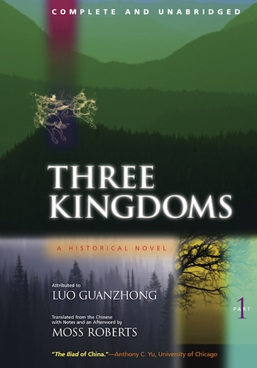

So obviously *Three Kingdoms* is one of the [Four Great Chinese Novels™️](https://en.wikipedia.org/wiki/Classic_Chinese_Novels) and almost certainly the most culturally influential of the four (*maybe* tied with *Journey to the West*). It’s one of those stories that a significant fraction of the world’s population *just knows*.

Luckily there is a complete, unabridged, fairly idiomatic [translation by Moss Roberts](https://www.ucpress.edu/books/three-kingdoms-a-historical-novel/paper)[^roberts] — my understanding is that this is the de facto standard English translation. It clocks in at around a thousand dense pages, so it’s definitely not a beach read.

Parts of *Three Kingdoms* are really fun! There’s a reason characters like Cao Cao and Zhuge Liang and Guan Yu are household names, and why stories like the Peach Garden Oath are literally proverbial, and why *Three Kingdoms* is readapted every three years. Some of the most fun parts are not things you’d pick up from a summary (Zhao Zilong’s *ahem* devotion to Liu Bei...). It has the kind of continent-and-generation-spanning scope you’d otherwise only see in long Western fantasy series like *A Song of Ice & Fire*.[^asoiaf]

But... if you have the opportunity, learn *Three Kingdoms* through cultural osmosis. (I get the sense that *most* Chinese folks “just know” the stories from various adaptations and haven’t actually read the original.) It is very much a medieval romance[^romance], not a modern literary novel, and that means there’s little interiority or characterization and most of the action is described in a detached, nondescript style. Most of the novel is closer to a historical (albeit heavily fictionalized) chronicle than what we moderns would consider literature. *Some* of that has to do with Chinese storytelling conventions, but *Three Kingdoms* feels noticeably less “modern” than, say, *Jin Ping Mei* or *Hong Lou Meng*. That’s not necessarily an issue — we read the classics, in part, to experience other storytelling styles — but maintained over more than a thousand pages... yeah, it’s *rough* to get through.

Also... *Three Kingdoms* basically refuses to acknowledge the existence of women. Like, over the course of something like a thousand pages and hundreds of named characters, there’s only 4 or so named women, only two of whom matter to the plot (although one of those is a badass, so), and one of whom is introduced just to be cannibalized by her husband (!). Now a *lot* of these classics are uhh *not progressive*, and again I think there’s a lot of value in reading books not exactly in line with our modern values — but at some point it starts to feel strange just how much *Three Kingdoms* goes out of its way to avoid mentioning the gender that makes up half the population, even incidentally.

## Investiture of the Gods, aka Fengshen Yanyi

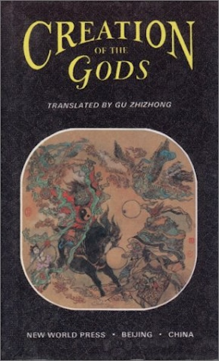

*Fengshen Yanyi*, usually translated as *Investiture of the Gods* or *Creation of the Gods*, is not typically listed among the important Chinese classics — it’s not considered one of the Four Great Chinese Novels™️, for instance. However, it *is* fairly important. A lot of famous scenes — King Zhou insulting Nüwa, Daji the fox spirit, Jiang Ziya fishing with a straight hook, Bi Gan making a fox-skin coat and losing his heart, and Nezha killing Ao Bing — are “canonically” from *Fengshen Yanyi*. In particular, *Ne Zha* and its sequels / spinoffs are all (very loosely) based on *Fengshen Yanyi*.

So, obviously, I wanted to read it. Surprisingly, though, there is only one (1) English-language translation, published around 2000 (helpfully, [this site has a link to the PDF](https://journeytothewestresearch.com/2020/05/05/archive-16-creation-of-the-gods-library-of-chinese-classics-chinese-english-bilingual-edition-vol-1-4/)). It is, uh, rough — it is very much a product of late-90s China, with nothing sounding quite idiomatic, and it’s quietly abridged without comment.

But, frankly, translation notwithstanding, I cannot recommend *Fengshen Yanyi*. It is (like *Three Kingdoms*) very much a medieval romance, and it is (like *Three Kingdoms*) very, very long. Unlike *Three Kingdoms* — which at least follows a consistent-ish set of characters and has at least a *few* truly engaging scenes — *Fengshen Yanyi* jumps between characters and plotlines with abandon, with very little to show for it. For instance, there’s also a rivalry between different schools of Daoism that is never introduced or explained — even the translator’s introduction basically shrugs and says “yeah this is probably a veiled reference to a real Daoist political struggle in the late Ming Dynasty”. The whole thing feels like the final scene of an MCU movie — all the characters lining up to beat the snot out of each other — without any of the preceding character development.

Just read decent summaries of the bits you’re interested in or, better yet, just watch *Ne Zha* and its sequels.

## Monkey King

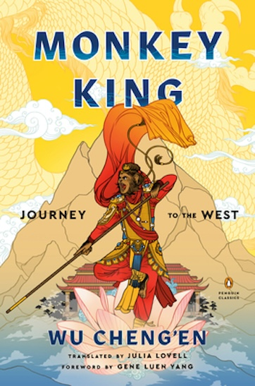

“Don’t you mean *Journey to the West*?” I do, somewhat, but specifically I read [Julia Lovell’s heavily-abridged translation for Penguin Classics](https://www.penguinrandomhouse.com/books/312866/monkey-king-by-wu-chengen-edited-and-translated-with-an-introduction-and-notes-by-julia-lovell-foreword-by-gene-luen-yang/). She closely translates the beginning and end of the novel, but *heavily* truncates the middle, picking a few key plotlines to follow so that it falls around standard Western novel length.

*Monkey King* works pretty well as a breezy, superhero-ish adventure story, so if you’re not looking for scholarly accuracy I can recommend this volume. (Note that I’ve read good reviews overall, but Van Norden [see above] once gave an interview where he got a little snippy about Lovell’s translations, so... take that as you will 😉) But I definitely can’t say I’ve read *Journey to the West* — for that, I would probably need to go to the canonical [Anthony C. Yu unabridged translation](https://press.uchicago.edu/ucp/books/book/chicago/J/bo12079590.html).

## The Peach Blossom Fan

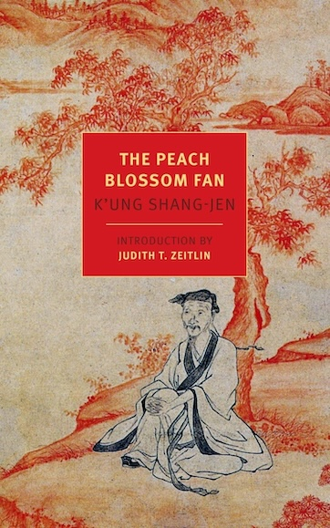

*The Peach Blossom Fan* is very, very good!

A long play dramatizing a doomed romance against the backdrop of the fall of the Ming Dynasty written by a direct descendent of Confucius (doesn’t that description alone make you want to read it?), I don’t think *The Peach Blossom Fan* is particularly well-known among the English reading public. Which is a shame, because, as I said, it is *very*, *very*, good! It’s easily my favorite of everything listed here.

Until a few months ago, the one warning I would have is that the [only English translation](https://www.nyrb.com/products/the-peach-blossom-fan) is rather aged and in particular uses Wade-Giles romanization, which I personally find very distracting.

However, OUP *just* published [a new translation](https://global.oup.com/academic/product/the-peach-blossom-fan-9780197668689?cc=us&lang=en&), to which the [*Complete Review*](https://www.complete-review.com/reviews/hsu_tang/kong_shangren.htm) gave a glowing review. So perhaps I will pick that one up at some point.

## The Nine Cloud Dream

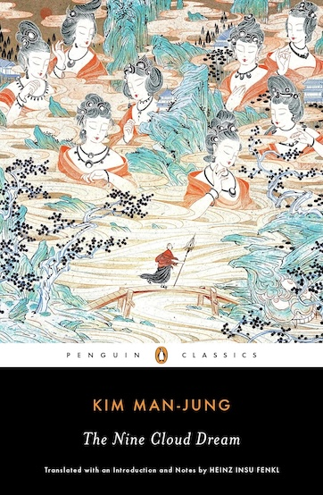

I only read this because it’s [one of the most recent releases from Penguin Classics](https://www.penguinrandomhouse.com/books/553113/the-nine-cloud-dream-by-kim-man-jung-translated-with-an-introduction-and-notes-by-heinz-insu-fenkl/). Allegedly it’s a major Korean classic although personally I had never heard of it before.

It opens with a Buddhist monk in the Tang dynasty who accidentally breaks his vows by flirting with nine fairies. His master, annoyed, bonks him on the head and he passes out.

... whereupon he wakes up in a harem anime, in which he is the perfect Confucian gentleman who passes the imperial examinations with top marks, becomes the emperor’s personal bestie, and defeats the marauding barbarians on the battlefield, before retiring to collect concubines (the reincarnated fairies, natch).

Then in the last chapter (spoiler alert?) he dies and wakes up as a Buddhist monk again, and realizes that life is impermanent. The end.

One Goodreads review[^goodreads] called it a “Confucian male power fantasy hastily disguised as a Buddhist fable” and I cannot disagree. I wish I liked it, but frankly unless you are *looking* for a Confucian male power fantasy (which, in fairness, is a pretty interesting cultural object!), I’m not sure I can recommend it.

Also, the translation is a bit... odd. It’s pretty solid, but the introduction does point out that there’s a lot of wordplay and symbology in the original that’s difficult-or-impossible to translate, so most of that is missing. Also, they made the... interesting... choice to use old-timey Wade-Giles transliterations of all the Chinese names, apparently to make it feel archaic, just the way Classical Chinese would have felt in the Joseon dynasty. Personally I found that incredibly distracting.

## The Song of Kieu

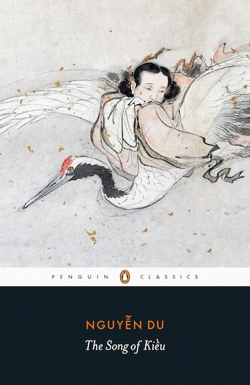

*The Song of Kieu* (also sometimes translated *The Tale of Kieu*) is a (the?) great classic of Vietnam — it’s referenced in both Trinh T. Minh-ha’s [*Surname Viet Given Name Nam*](https://www.wmm.com/catalog/film/surname-viet-given-name-nam/) and Viet Thanh Nguyen’s [*The Sympathizer*](https://en.wikipedia.org/wiki/The_Sympathizer)! So needless to say I was excited to read it.

*Kieu* is the story of the eponymous woman (based distantly on a real Chinese woman from the Ming dynasty) bouncing from one set of tragic circumstances to another and, basically, being sad about it. It reminded me of nothing more than Madeline Miller’s *Circe*, which is high praise.

But also: I’m not sure I really got the intended experience? The [Penguin Classics edition](https://www.penguinrandomhouse.com/books/598094/the-song-of-kieu-by-nguyen-du/) was translated by a Brit whose only apparent connection to Vietnam is that he spent a few years there with the Peace Corps (?). The introduction spends pages explaining the evolution of the story from the Ming Dynasty-era historical events that inspired it, but then barely touches on its relevance to Vietnamese culture.

So while I would recommend *Kieu*, I would like to read it again, perhaps in the [Huynh Sanh Thong translation](https://www.amazon.com/dp/0300040512).

[^roberts]: Here it is on the [Internet Archive](https://archive.org/details/luo-guanzhong-the-three-kingdoms-unabridged/mode/2up) for some reason!
[^romance]: Although, of course, if you know what a “medieval romance” is and find a comparison to the *Alexander Romance* useful, you *probably* don’t need to read this article.
[^asoiaf]: It is *definitely* not surprising that *Game of Thrones* is probably the most popular Western television show in China.
[^goodreads]: That, alas, I cannot find a reference to anymore.