_No more LLMs this week! Back to my usual beat... whatever that is._

During the pandemic — a time that even now takes on the tinge of the historical — I decided to read the classics.[^inspiration] I focused mainly on the Western classics — Homer and the Bible and so on — with a smattering of other works.

I highly recommend this experience. These books are (mostly) classics for a reason; reading them was often highly enriching. You get to see how all the great Western classics cross-reference each other; you can get through _Paradise Lost_ without checking the footnotes if you’ve recently read Ovid’s _Metamorphoses_. There’s plenty of questions around canon formation and how well these works have “aged”[^presentism], but on net I would say most readers today would be well served by reading more of the classics.

That said, I can’t unreservedly recommend _all_ of the classics. So here’s my brief reviews of all the Western classics (that is, major pre-19th-century written works) that I’ve read over the past four or so years, in chronological order(ish).

You’ll note it’s a very idiosyncratic list — I tried to hit all the big names, but I only had so much time and interest. Also, this is very long, but still gives short shrift to each individual work — sorry about that.

## Myths from Mesopotamia (ca. very very early)

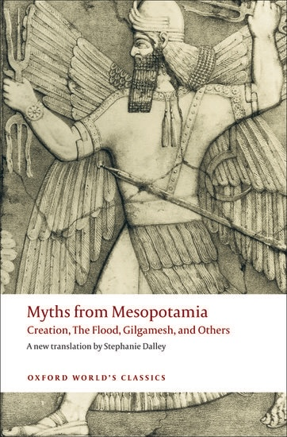

[_Myths from Mesopotamia_](https://global.oup.com/academic/product/myths-from-mesopotamia-9780199538362?cc=us&lang=en&) is a short compilation of translations of ancient Mesopotamian stories.

I don’t really remember most of these! Except Gilgamesh, which is, of course, a must-read as pretty much the earliest long-ish narrative in human history and remains fairly readable, even if the narrative is a little messy.

## Stories from Ancient Canaan (ca. very very early)

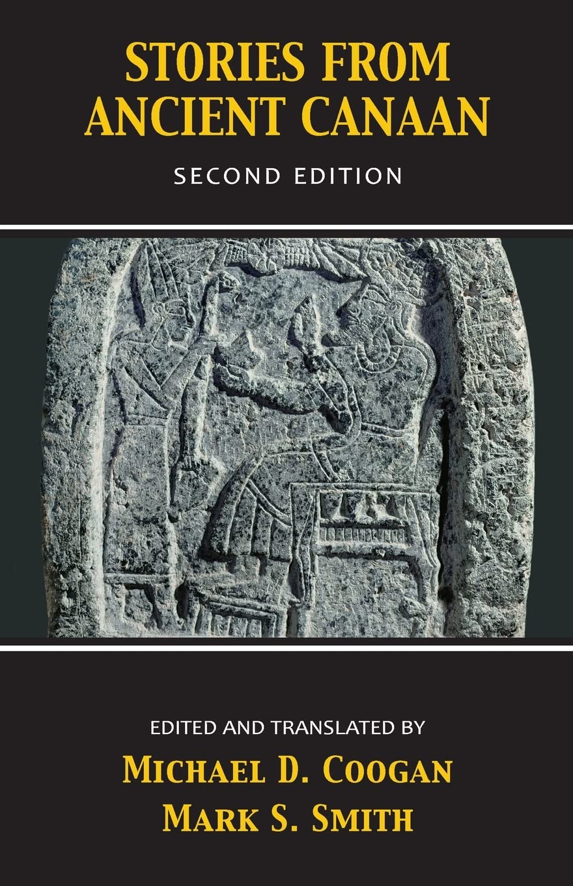

[_Stories from Ancient Canaan_](https://www.amazon.com/Stories-Ancient-Canaan-Second-Michael/dp/0664232426) is a compilation of translations of early Canaanite (aka Phoenician) myth, mostly from the city-state of Ugarit.

I don’t really remember these either! Also, I learned later that a lot of the reconstructions are _very_ tentative and other translators take some of the stories in very different directions. Still, if you’re going to read the Hebrew Bible from a non-religious / classics perspective, you should probably read the myths from the surrounding area — they lend quite a bit of richness and background. Job, at least, makes _much_ more sense if you’re already familiar with Ba’al fighting sea monsters.

## The Hebrew Bible (ca. I’m not getting involved in the chronology debate)

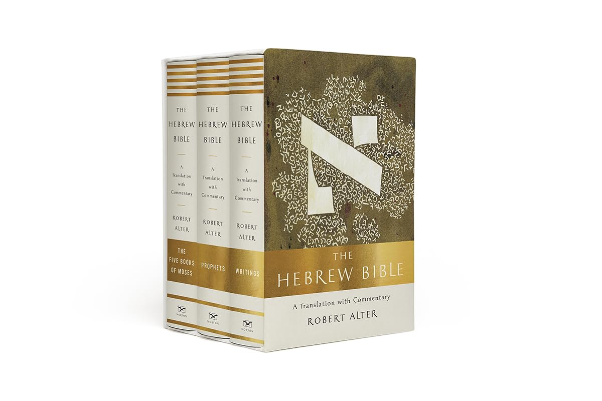

Sorry, if you’re going to read _the Western classics_, then you just have to read the Hebrew Bible. Maybe not the whole thing, but _at least_ Genesis and Exodus. Personally I have a soft spot for Ecclesiastes and Job, too, as some of the more... psychologically honest... books of the Bible.

The Hebrew Bible (maybe alongside what the Christians call the New Testament) just _is_ one of the most influential stories ever told. It’s up there with, like, the _Ramayana_ and _Journey to the West_ as these massive, cross-culturally-influential stories that are absolute bedrocks of culture. Luckily lots of it is actually very readable! (Although some parts are, yes, really boring — looking at you, Leviticus 👀)

If you’re going to read the Hebrew Bible in English, it basically has to be [Robert Alter’s translation](<https://en.wikipedia.org/wiki/The_Hebrew_Bible_(Alter)>). He gets much more of the poetry than most translations, and his footnotes often successfully argue that what _seems_ like a patchwork, contradictory text is in fact highly cohesive.

## The Iliad (ca. 8th-7th century BCE)

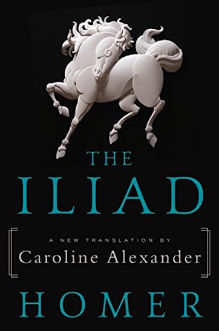

The _Iliad_ is from a very, very alien culture. It’s really hard to get around the fact that Achilles and Agamemnon are feuding over, er, a sex slave — I wouldn’t blame anybody that’s more comfortable reading, say, [_The Song of Achilles_](https://en.wikipedia.org/wiki/The_Song_of_Achilles) (which is, y’know, excellent). And beyond that, the _Iliad_ is just structured really weirdly — there’s the random chariot races that completely derail the climax, and the tossed-in chapters about Odysseus that were clearly added later, and and and...

But... if you can get past all that, it's an enriching experience. For one thing, there’s a surprising degree of psychological realism — fundamentally, it’s a story about a smug, complacent boss screwing over his star employee, which is, y’know, still relatable. It balances the Greek and Trojan perspectives very well, and there’s more women in it than you'd expected (Hector’s wife Andromache is one of my faves). So I can’t unreservedly recommend it, but there are parts of it that I still think about regularly (that ending!).

I read [Caroline Alexander’s translation](https://www.amazon.com/Iliad-New-Translation-Caroline-Alexander/dp/0062046276), which was very solid — readable without losing too much of the strangeness or poetry.

## The Odyssey (ca. 8th-7th century BCE)

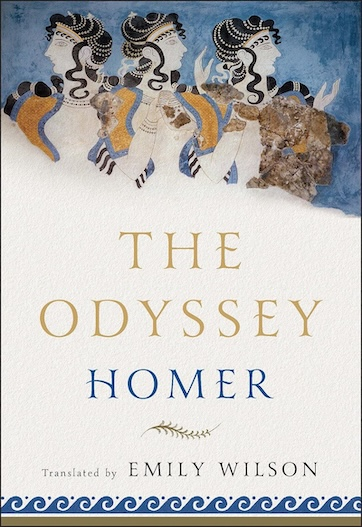

Like many young Americans, I read the Robert Fagles translation in high school and... hated it! So luckily today we have [Emily Wilson’s translation](https://www.emilyrcwilson.com/the-odyssey), which is much more readable.

But that doesn’t really take away from the fact that, even compared to the _Iliad_, the _Odyssey_ is a strange text by modern standards. Unlike the _Iliad_’s at-least-somewhat relatable emphasis on honor, the _Odyssey_ is concerned with _xenia_, an ancient Greek concept (probably ultimately derived from Proto-Indo-European culture? 🤔) of treating your guests well and/or acting honorably towards your hosts — not exactly extremely relevant today. It's also just a very meandering text — there's a lot of "get to the point already!" that was, of course, entirely intentional when it was an oral poem.

That said, rereading the Wilson translation was much more fun than I remembered. Odysseus is a very fun, very morally ambiguous (anti-)hero — you can see why he’s _the_ most popular character to come out of the Trojan War cycle — and if you accept that the story is a bit roundabout then you can have a lot of fun.

## Euripides — The Trojan Women/Helen/Bacchae/Prometheus Bound (5th century BCE)

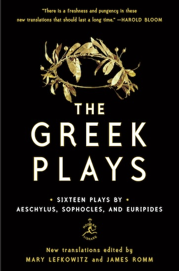

I’m not really sure why I chose to focus on Euripides out of the three major Athenian tragedians. I could have sworn I had read some Aeschylus or Sophocles, but nope, all four of these are Euripides and they’re all from the (fantastic) [_The Greek Plays_ collection](https://www.penguinrandomhouse.com/books/216216/the-greek-plays-by-new-translations-edited-by-mary-lefkowitz-and-james-romm/).

Euripides _was_ a very good playwright, although ancient Athenian drama is, as with the epics, a bit foreign to modern tastes. Also, _Prometheus Bound_ is basically fragments and big chunks of the ending of the _Bacchae_ are lost. But _The Trojan Women_ was interesting in a sort of MCU-spinoff-TV-show kind of way. (While reading anything related to the Trojan War, one thinks of the MCU often...)

Honestly, the highlight was probably _Helen_. This is a _strange_ play, in which it’s revealed the Helen at Troy was a hologram and the _real_ Helen was kidnapped to Egypt. Then the rest of the play is a series of comedic hijinks as she and Menelaus attempt to escape the Pharaoh, who would very much like to marry Ms Helen. Like I said: a very strange play — but a charmingly enjoyable one. It’s also one of the more influential works on this list, because (alongside Euripides’ other late comedic plays) it likely inspired the [long history of Hellenistic novels](https://www.ucpress.edu/books/collected-ancient-greek-novels/paper) which in turn influenced the _modern_ concept of the novel centuries later.

## Aristophanes — Lysistrata/The Birds (5th century BCE)

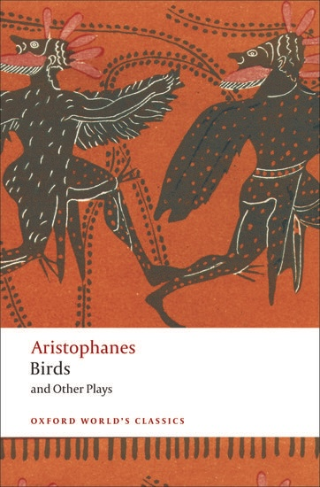

Aristophanes is pretty funny! That’s really all there is to say.

_Lysistrata_ is famous as “the sex strike play,” where the title character decides to lead women in a society-wide sex strike in an attempt to end the Peloponnesian War, while _The Birds_ is a madcap fantasy where two ne’er-do-wells lead an army of birds in a boycott of the Olympian gods.

Again, you get a sense of the foreignness of Athens as a society — for instance, the _Lysistrata_ presents _women_ as the sexually insatiable gender, which was apparently a commonplace in ancient Greek thought. But, also, these plays are just really zany and fun to read — they have something of the picaresque, punning tone of, say, Douglas Adams.

I read the [Oxford World’s Classics translation](https://global.oup.com/academic/product/birds-and-other-plays-9780199555673?q=aristophanes&lang=en&cc=us) which includes both these plays and a couple others (that I didn’t read).

## Timaeus and Critias (ca. 360 BCE)

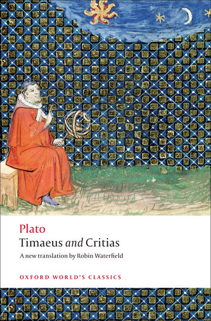

Plato’s dialogue _Timaeus_ and its (very incomplete) follow-up _Critias_ are mostly famous for introducing a.) the concept of the Demiurge, a lower, evil deity that created the material world and b.) the myth of Atlantis.

So: somewhat interesting, if those are topics you’re interested in. But _mostly_ it’s a philosophical work about metaphysics (there’s an awful lot of “here’s how the world can be built up from these four elements”), which, though important, is probably skippable.

I read the [Oxford World’s Classics](https://global.oup.com/academic/product/timaeus-and-critias-9780192807359) which... can we talk about how great the covers are on the OUP editions of classics?

## The Aeneid (19 BCE)

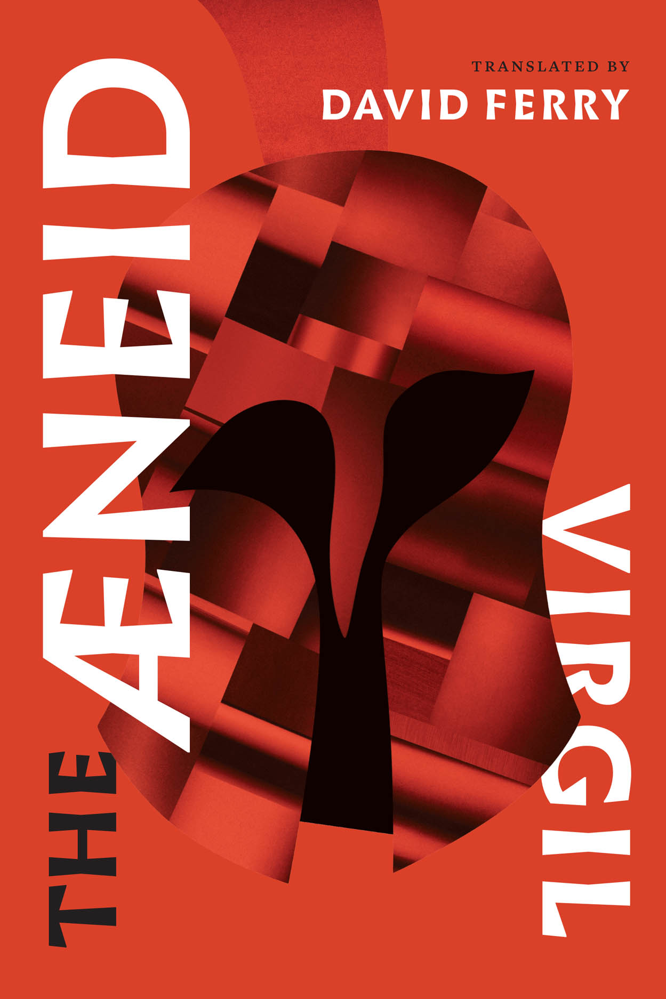

The _Aeneid_ is the Captain America of the Roman Empire. It’s both a triumphalist narrative of ooh-rah-ooh-rah, but _also_ (unintentionally) a criticism of that same narrative. Also, like Captain America, it’s (yet another) entry into the Trojan War cinematic universe, so if you’ve already read the _Iliad_ and the _Odyssey_, you’ll probably want to read the _Aeneid_ too.

I’d call the _Aeneid_ somewhat inessential, though personally I found it a lot of fun, not least because of the presence of Queen Dido of Carthage (who is definitely 100% bipolar) and a few of the scenes that _really_ work (like the fall of Troy itself). But it’s also clearly a “first draft” (Vergil died before he completed it) and it’s an epic in the mold of the _Iliad_ and the _Odyssey_, which are probably superior (at least in being more original).

I read [David Ferry’s poetic translation](https://press.uchicago.edu/ucp/books/book/chicago/A/bo25933462.html) which probably made it more enjoyable — it’s _really_ well written — although later I read that it’s not quite a perfect translation — he makes a few strange editorial decisions at certain points.

## Ovid’s Metamorphoses (8 CE)

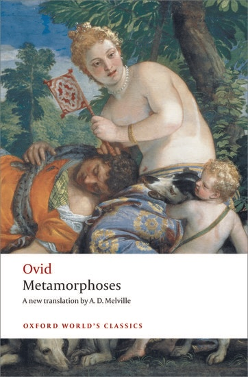

Somewhat long, but enjoyable. Ovid has this c’est-la-vie attitude towards all his many interlinked stories, even the dark ones (and some of the stories are _very_ dark). Most of the _Metamorphoses_ is really just showing off how very clever Ovid can be, and he is very clever indeed. To be honest, I almost find Ovid-the-author a more interesting character than anything actually contained in the _Metamorphoses_ — _Literature & History_’s [series on Ovid](https://literatureandhistory.com/episode-059-early-ovid/) is an excellent introduction.

I read the [Oxford World’s Classics translation](https://global.oup.com/academic/product/metamorphoses-9780199537372?cc=us&lang=en&), which was serviceable but not stunning — I wish there was a more contemporary-sounding translation a la Emily Wilson’s _Odyssey_, but I’m not familiar with one.

## The New Testament (ca. late 100s CE)

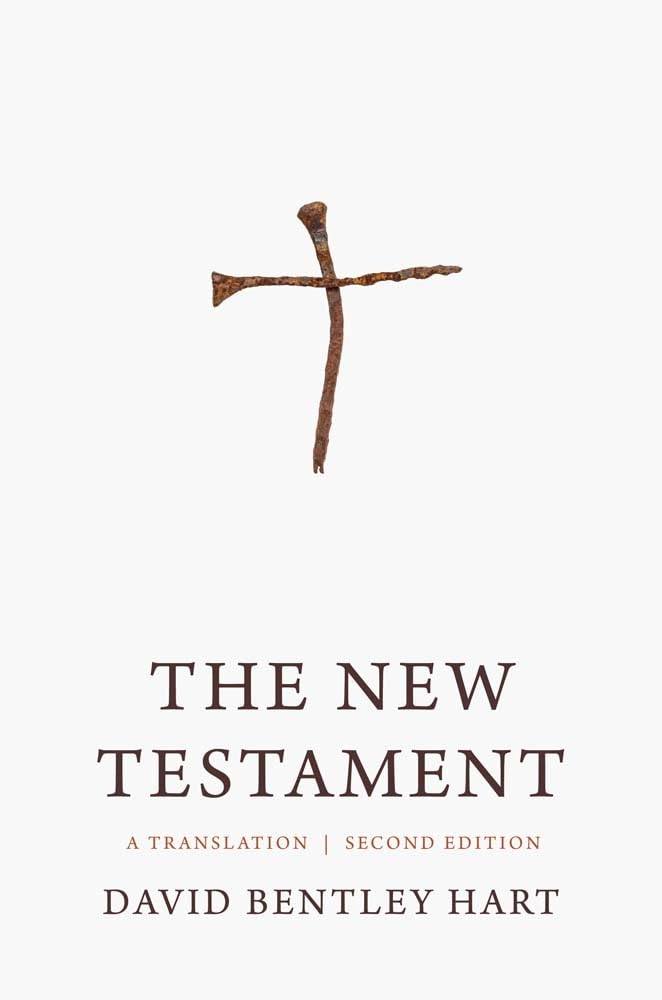

So, the thing is, part of why Christianity spread so fast is that that Gospels _are_ pretty compelling stories, so reading them as literature is pretty interesting. The Gospels often have genuine literary merit — like Jesus predicting Peter will deny him three times, Peter confidently boasting that he’ll never abandon Jesus, and then _immediately doing so_ once Jesus is arrested. (The version in Luke, where Paul suddenly realizes what he’s done when the rooster crows a third time, is choice.) Also, in a good translation, you can see how the three Gospels are _very_ different, with _very_ different prose qualities and _very_ different intended audiences.

I don’t think you have to read the _whole_ New Testament to get value from a literary-classics perspective — probably just the four Gospels (plus Acts of the Apostles, which is a direct sequel to the Gospel of Luke and is also a globe-trotting adventure story?), plus Revelation (which is just as weird as you expect), and then maybe dip your toes in the rest of it.

Recently (as in, during adulthood), I’ve read both the [Scholar’s Version](https://www.westarinstitute.org/product/the-complete-gospels) (published by the somewhat skeptical historical-Jesus folks) and I’m currently reading the [well-regarded David Bentley Hart translation](https://www.amazon.com/New-Testament-David-Bentley-Hart/dp/0300186096) (who comes from an Eastern Orthodox background).

For bonus points: some of the apocrypha is really interesting as well. If you don’t want to try to find translations, the [Apocrypals podcast](https://apocrypals.libsyn.com) has covered the apocrypha in exhaustive detail.

## The Golden Ass (ca. late 100s CE)

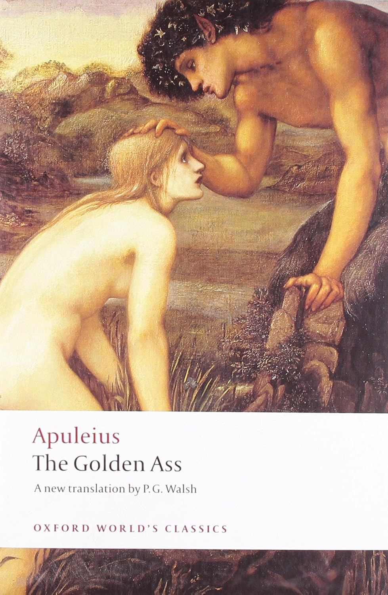

I sometimes call Apuleius' _The Golden Ass_[^apuleius] the _Hitchhiker’s Guide to the Galaxy_ of Rome. It’s a picaresque novel satirizing the Roman world from the perspective of a man accidentally magicked into a donkey, which definitely does not take itself very seriously. However, these days it’s perhaps most famous for including the “canonical” version of the folktale of Psyche & Cupid, a story which was very influential on me (if you know... you know).

Parts of the _Golden Ass_ are definitely uh _explicit_ (there’s one sex scene that’s written as a stereotypical Roman battle scene, which is actually pretty funny, but there’s also uhhh not-even-really-implied bestiality) and the main character is occasionally a bit misogynistic (though I think that’s the joke; he’s pretty consistently shown to be an idiot, which is probably why he gets turned into, y’know, a donkey). Also: it’s a picaresque, so expect more “and then the baker got cuckolded” stories and less serious plot.

So can I recommend it? Hmm. I enjoyed it a lot (not least for the completely, unexpectedly serious ending), and it’s definitely an interesting look at the Roman world, and when I say it’s the _Hitchhiker’s Guide to the Galaxy_ of Rome I mean there’s a direct line from _The Golden Ass_ to Hitchhiker’s! (There’s also a direct line to Kafka — there’s a scene where the main character, pre-donkey, is falsely accused of a crime and has to go through a bureaucratic trial, only to learn the whole thing is a practical joke.) But it’s definitely a novel that is uh _of its time_ in many ways.

I read the [Oxford World’s Classics translation](https://global.oup.com/academic/product/the-golden-ass-9780199540556?cc=us&lang=en&), though Sarah Ruden also has [a translation](https://sarahruden.com/book/the-golden-ass/) that’s well-regarded.

## Confessions (ca. 400 CE)

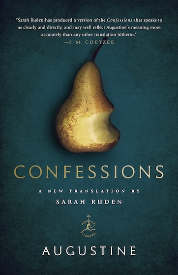

I really hesitate to call _St. Augustine_ of all people inessential. But the simple fact is, if you aren’t already Catholic, you’ll probably find most of his argumentation... not particularly interesting? This is, after all, not a novel — it's mostly a work of philosophy and theology.

That said, parts of the _Confessions_ are really interesting! He talks in surprising detail about his upbringing in the late Roman world, and also, after reading a bunch of Very Serious Impersonal Epics™️, it’s fascinating to read a very down-to-earth, introspective, frankly _modern_ prose style (the man basically invented memoir as a genre, after all). And a few scenes really do have literary merit — the part about stealing a pear just for the hell of it is justly famous. But, again: if you’re not Catholic and or a philosopher, there’s just not that much plot here!

I read [Sarah Ruden’s translations](https://www.penguinrandomhouse.com/books/239720/confessions-by-augustine/), which was fairly readable, though I will note a hesitation given that her footnotes seem to take St Augustine’s (not very correct) opinions about Manichaeism at face value, which I would have hoped a better scholar would have noted. Oh well!

## Beowulf (ca. 975-1025)

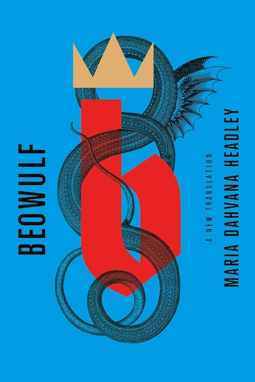

I don’t think we as a culture have enough context to truly understand _Beowulf_ anymore. Occasionally it’ll just say something like “and then Beowulf told them about the time King Hygelac fought the sea-serpents, wasn’t that cool??” and we the audience are clearly supposed to cheer like it’s an MCU after-credits scene. Really, the issue here is that _Beowulf_ is, er, not exactly a classic in the same way as many of the other books on this list. The _Iliad_, for instance, has not been out of print (in the Greek-speaking world, at least) since it was set down. But _Beowulf_ exists in one (slightly singed) manuscript that has barely survived to the modern day.

Ironic, then, that _Beowulf_ is maybe the most influential work on this list in the English-speaking world other than _the literal Bible_. Because it basically _is_ the Western fantasy genre — one of the most important scholars of _Beowulf_ is an English philologist named J.R.R. Tolkien, who spent his free time making up a fake Elven language or something? Indeed, _Beowulf_ is a little boring because today it reads like a particularly unimaginative Dungeons & Dragons campaign.

So would I recommend it? Really conflicted on that one. It’s fine on its own merits — and some of the translations are works of poetry in their own right — but... it’s just... _not that interesting_, sorry! I don’t sit around thinking about it the way I do Goethe’s _Faust_ or _Don Quixote_!

I first read [the translation by the potato poet himself, Seamus Heaney](https://en.wikipedia.org/wiki/Beowulf:_A_New_Verse_Translation), which was very solid. Then I reread when [Maria Dahvana Headley’s contemporary-English translation](https://www.newyorker.com/magazine/2020/08/31/a-beowulf-for-our-moment) came out, which is a _fascinating_ experience — it has moments of great poetic beauty and then bizarre anachronistic sentences like “he made sashimi out of sea monsters” that feel totally out of place. Not a perfect experiment but I’m very glad it exists!

## The Lais of Marie de France (mid-1100s)

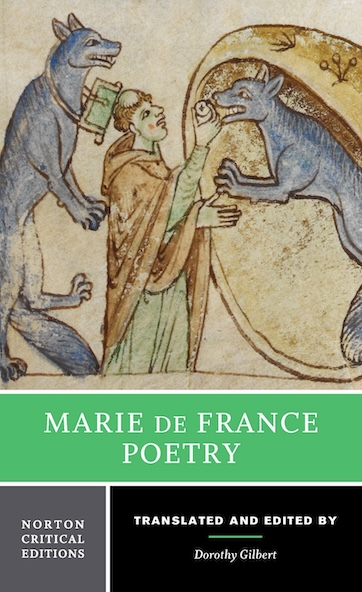

Short stories! By a medieval woman!!

None of these are my favorite short stories, but they are really really charming. There’s one about a twin daughter abandoned at birth (because twins = adultery according to medieval superstition, a belief which Marie mercilessly makes fun of) who has various adventures growing up, and a story about a werewolf who is cuckolded by his wife, and other enjoyable stories of medieval courtly love (which is to say, bangin’). Basically, if you think medieval people were religious zealots living in the dark ages and not recognizably human — which is to say a bunch of horny gossips — then this collection will correct that misperception. (Seriously, I think anybody writing “medieval” fantasy should read these stories to see how _real_ medieval people thought.) These stories are just fun.

I read the [Norton Critical Edition](https://wwnorton.com/books/Marie-de-France-Poetry) which has lots of commentary and a long excerpt from _Saint Patrick’s Purgatory_, a long story about St Patrick visiting Purgatory, which was part of the genre that eventually led to...

## The Divine Comedy (1321)

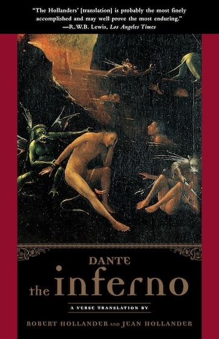

Many people just read Dante’s _Inferno_ and stop there. [That’s a very bad idea!!](https://youtu.be/KkwzYyg9NxQ)

The thing is, Dante the character is _not_ the same as Dante the author. If you just read _Inferno_ and don’t go on to the _Purgatorio_, you’ll walk away thinking that Dante (the character) is a bit of a pretentious dick. And you’d be right! But _that’s the point_. I almost hesitate to say more about it because the ending of _Purgatorio_ is one of my favorite twists in literature (really!). There’s a reason I keep naming characters Beatrice...

Anyway, other than the highlights (which, in fairness, are many), the _Divine Comedy_ is definitely on the eat-your-vegetables side of classics. A lot of it is slow, and a little meandering, and the book _does_ assume a medieval Catholic worldview where doing bad things (or being gay...) = you go to hell forever, though at least it’s more understandable than say the _Iliad_. But if you’re going to eat your vegetables, these are the vegetables you should be eating — it’s just _so influential_ on the rest of Western culture (not to mention creating the modern Italian language as we know it!) that you kinda just _have_ to read it at some point.

I read [the Oxford World’s Classics translation](https://global.oup.com/academic/product/the-divine-comedy-9780199535644?cc=us&lang=en&) which was very solid, though I eventually picked up a copy of [the Hollanders’ translation](https://www.penguinrandomhouse.com/books/225152/the-inferno-by-dante-alighieri-a-verse-translation-by-robert-hollander-and-jean-hollander/) because I’ve heard it’s the gold standard.

## Sir Gawain and the Green Knight (late 1300s)

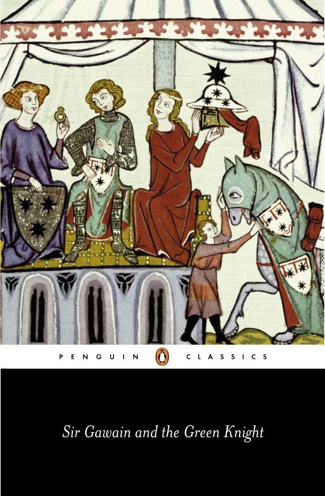

See now, _this_ is what I expected when I read _Beowulf_. I don’t have much to say — it’s really beautiful poetry (with an interesting mix of Northern European and continental influences) wrapping a simple, but elegant, Arthurian fairy tale. I don’t have much to add — it’s solidly enjoyable. No wonder [Robin Sloan has a tradition](https://lithub.com/do-yourself-a-favor-and-listen-to-robin-sloan-read-sir-gawain-and-the-green-knight/) of reading it publicly every New Years!

I think I read the [Penguin Classics translation](https://www.penguinrandomhouse.com/books/673300/sir-gawain-and-the-green-knight-by-anonymous-translated-with-an-introduction-by-brian-stone/), which was surprisingly solid.

## Don Quixote (1605/1615)

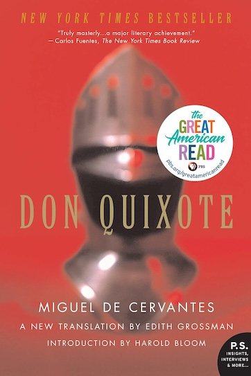

Now we’re cooking, chat (as the kids would say).

_Don Quixote_ is the only book on this list that every English speaker should read. (My understanding is that that’s already true in the Spanish-speaking world — Cervantes is basically the Spanish Shakespeare.) It’s _so funny_ and _so clever_ — it feels like a novel that could have been written in the late 20th century. It has this layer of metafictionality that feels way ahead of its time — at one point the main characters meet (and make fun of) someone writing a fake sequel to _Don Quixote_!

Two other points:

- _Don Quixote_ is surprisingly progressive, not just for a Golden Age Spanish novel? Cervantes seems like a particularly open-minded individual — women are generally treated pretty well (there’s even a scene where a guy composes a misogynistic verse because a woman spurns him, and Don Quixote _yells at him for being a misogynist_) and even Muslims come across as basically normal people and not dastardly villains?
- For what was clearly intended as a “dumb comedy” it has a surprising degree of richness. By the end of the novel I was genuinely unsure whether Cervantes still intended me to be laughing at Don Quixote, or sad that his fantasies had hit the wall that is reality.

Really the only problem I have with it is that it’s a bit long and a _bit_ repetitive — there’s a few jokes that Cervantes clearly thought were so funny that he had to repeat them again, and again, and again... Oh, and the first part has a couple insert novels that are pretty mediocre (although, amusingly, it seems like contemporary critics thought the same thing — the second half of _Don Quixote_, published a decade later, includes a long defense of why those insert novels are _great, actually, guys_).

But overall highly recommended. I read the [Edith Grossman](https://www.amazon.com/Don-Quixote-Miguel-Cervantes/dp/0060934344) translation which is considered the gold-standard English translation.

## The Blazing World (1666)

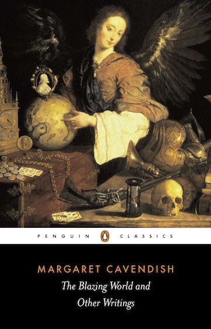

Margaret Cavendish’s _The Blazing World_ is often described as one of the earliest works of science fiction, and its _also_ one of the earliest major works in English by a woman — a woman that was herself a _fascinating_ individual.[^cavendish]

_The Blazing World_ is charming in its way — it’s the story of a young woman blown off course to a new world, where she promptly becomes empress, and then spends the rest of the novel describing the structure of the world.

I’ll be honest, though — I didn’t enjoy _The Blazing World_ very much. It’s mostly just a long, tedious ramble that allows Cavendish to make various philosophical points. You’ll probably do just as well to read a decent summary of it, unless you _really_ care about late-1600s literature and/or the history of science fiction.

I read the [Penguin Classics edition](https://www.penguinrandomhouse.com/books/260930/the-blazing-world-and-other-writings-by-margaret-cavendish/), which also includes some of her other writings — though, honestly, after _The Blazing World_ I didn’t rush to read the rest.

## Paradise Lost (1667)

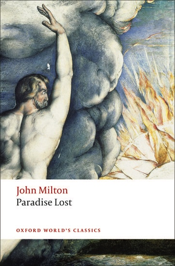

> The reason Milton wrote in fetters when he wrote of Angels & God, and at liberty when of Devils & Hell, is because he was a true Poet and of the Devil's party without knowing it.

- William Blake, _The Marriage of Heaven & Hell_

That’s probably the all-time greatest line of literary criticism. It’s so true! _Paradise Lost_ is the most metal thing ever when the Devil is on screen — it literally opens _in medias res_ with Satan and his conspirators _picking themselves up in Hell after falling millions of miles out of Heaven_ — and then it is boring and didactic every time we go back to check on Adam and Eve. So I really don’t have a lot else to say — if you can stomach the late-1600s English, you should at least read the interesting half.

I have the [Oxford World’s Classics edition](https://global.oup.com/academic/product/paradise-lost-9780199535743?cc=us&lang=en&) which is perfectly fine.

## Gulliver’s Travels (1726)

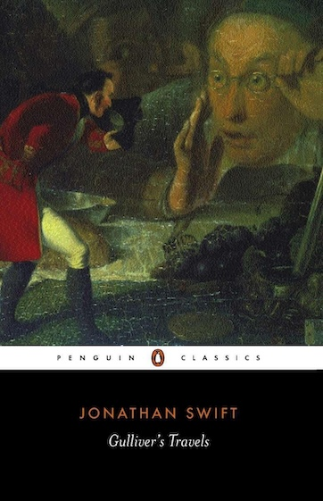

I really _wanted_ to like _Gulliver’s Travels_ (which I read in the [Penguin Classics edition](https://www.penguinrandomhouse.com/books/286386/gullivers-travels-by-jonathan-swift/)). Jonathan Swift is one of the all-time-great satirists! _Gulliver’s Travels_ is structured in an extremely clever way! Some of the concepts (the talking-horse Houyhnhnms ruling over the ape-like Yahoos) are so fun! It’s such an iconic work of English literature!

But the early-1700s prose was just too tough to really enjoy. _Gulliver’s Travels_ is _just so long_ and _just so boring_. But maybe I need to go back and give this another chance at some point.

## Candide (1759)

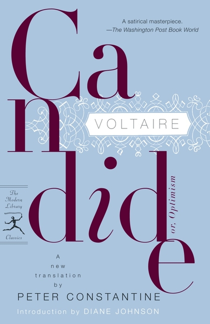

I adore _Candide_ because tonally it has just the blend of sarcastic cynicism and optimism that I love. The plot is basically picaresque, as Candide and his all-too-optimistic mentor Professor Pangloss are shunted around the world, seeing horrible things happen, with Pangloss repeatedly saying it’s all for the best (a parody of Leibniz' best-of-all-possible-worlds philosophy). It is quite funny, in a black comedy way.

Now, _Candide_ is kind of a mess. (People often forget Candide ends up visiting El Dorado? And gets a monkey sidekick?) But it’s so short that it’s worth reading if just for the iconic ending line ("That is well said, but we must cultivate our garden.")

I’m not sure which translation I read, though I think they’re all fine. Right now I own [Peter Constantine’s translation](https://app.thestorygraph.com/books/a6db242a-4ef5-4467-aca8-0368b61a4db2) which appears to be well-regarded.

## Goethe’s Faust (1832)

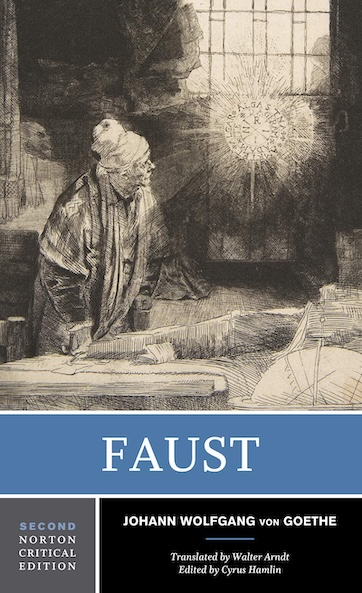

And a fitting conclusion, as Goethe attempts to put a capstone on all of the preceding classics with his _Faust_.

So, the thing to understand is, I _adore_ Goethe’s _Faust_, but I have to admit it is, uh, a complete unmitigated mess. It’s not like _Don Quixote_, where I can just wholeheartedly recommend it to everyone, and it’s not even like the Greek epics or the Bible, where there’s a lot of value if you put the work in. _Faust_ is actively hostile to the reader. To wit:

- It was written across Goethe’s life — the first few chapters are some of the first “real” writing he did as an undergraduate; the ending is the last thing he published, shortly before he died.
- Goethe was very much a Renaissance man interested in everything, which he stuffed into the book — occasionally it’ll lapse into complicated metaphors for the French Revolution or early-1800s disputes in geology.
- Goethe was a conservative Catholic, which feels more awkward compared to many of the previous works because Goethe otherwise feels _so modern_ (the end of his life overlaps with the start of the Industrial Revolution!).
- Also, he just didn’t do a great job editing it. The Norton Critical Edition points out that one chapter jump early in Part 1 is incredibly awkward and confusing because he outlined a chapter to bridge them and just... never wrote it, I guess?
- Also also, it’s just filled to the brim with allusions. A big chunk of Part II is an attempt to ape Euripides’ style as a playwright, and the ending is pulled from the _Divine Comedy_, and much of the book plays with this distinction between Northern Europe and “classical” Italy that presumes familiarity with both German and Roman myth, and the whole thing assumes a familiarity with the Bible (but of course).
- Also also also, it’s _very_ difficult to tell how seriously you’re supposed to take any of it — it’s not a comedy, exactly, but there’s multiple levels of metafiction (it’s technically a play within a play within a play...) and it’s hard to tell what, exactly, Goethe is trying to say about Faust and friends.

But... something about it _does_ work. _Faust_ is ultimately a story about all-too-human limits, about how it’s simply not possible for one human to know everything and experience everything, and how that's sad but also beautiful. It's basically the same plot as _Hamilton_ (don't worry, I have another newsletter about that coming up at some point).

Anyway, if you’re going to read _Faust_, you basically have to read the [Norton Critical Edition](https://wwnorton.com/books/9780393972825) — it’s full of footnotes _and_ an explanatory essay on _each and every chapter_, which is basically necessary in a book this confusing, and William Arndt’s translation attempts to capture some of the poetic moves Goethe is making. I actually first read [Martin Greenberg’s translation](https://yalebooks.yale.edu/book/9780300189698/faust/) and hated it — I got the sense from the introduction that Greenberg doesn’t like Goethe or _Faust_ all that much, and his notes are not all that helpful in explaining what’s actually going on, though he does earn high marks in making it sound very poetic and beautiful, so maybe I need to give it another try now that I’m already familiar with it.

And with that... I’ll wrap up this (overly long) ramble. Do let me know with an email reply if you decide to read any of these works.

I’ll be back next time with a brief overview of the _non_-Western classics I read during this time.

[^inspiration]: I was probably inspired by the [_Literature & History_](https://literatureandhistory.com) podcast, which I still consider not just the greatest podcast of all time, but one of the great works of humanities education.

[^presentism]: Though see Alan Jacob’s [_Breaking Bread with the Dead_](https://www.penguinrandomhouse.com/books/608945/breaking-bread-with-the-dead-by-alan-jacobs/) for a compelling argument that we _should_ read books that “haven’t aged well.”

[^apuleius]: Sometimes also called _Metamphoses_, but _The Golden Ass_ seems the more common name these days. Also, Apuleius was himself a fascinating character — his other major work is a _lawsuit_ where he’s defending himself against an accusation of using witchcraft (!) to kill a wealthy widow and steal her inheritance (!!).

[^cavendish]: Honestly, somebody could write a really cool fantasy novel based on the English Civil War where Cavendish is a major character.
