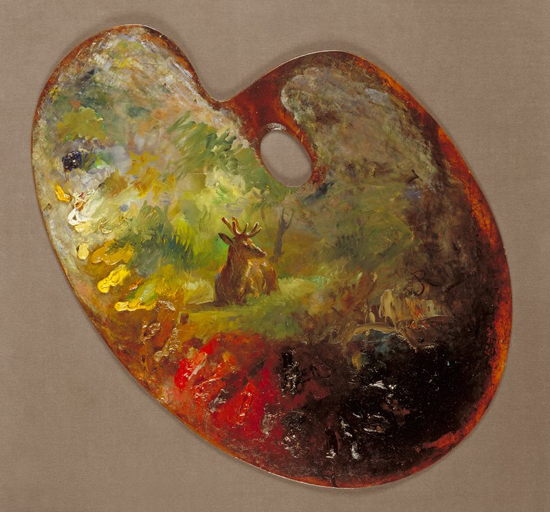

[Palette, Rosa Bonheur](https://collections.artsmia.org/art/4483/palette-rosa-bonheur)

Two reading recommendations this weekend:

- Celine Nguyen has a [thought-provoking commentary on criticism](https://asteriskmag.com/issues/12-books/is-the-internet-making-culture-worse) (literary and otherwise). She makes the point that art is formed in response to and in collaboration with criticism, while also often acting as criticism of its own — “Instead of the accusation that ‘All critics are failed artists,’ it may be more correct to say that ‘All art is successful criticism.’” — but professional criticism is slowly dying, which may explain why culture feels so stagnant. It definitely made me reconsider my own critical practice (lol @ saying I have a critical practice) — maybe I need to write more reviews like my [loving tribute to *Speed Racer*](https://letterboxd.com/rwblickhan/film/speed-racer/) and less quippy one-liners.
- James Somers presents [“The Case That A.I. Is Thinking”](https://www.newyorker.com/magazine/2025/11/10/the-case-that-ai-is-thinking). The article does a good job of balancing the excitement of “something genuinely seems novel here” and the cautious skepticism of “but intelligence is hard to define, let alone measure”. He ends up in a slightly different place than my own [‘If The United States Is Conscious, Then Why Not An LLM?”](https://rwblickhan.org/newsletters/if-the-united-states-is-conscious-then-why-not-an-llm/), but highly recommended nevertheless.

---

A distinction that feels important but under-discussed: being an appreciator versus being a snob.

It’s easy to slide from appreciating to simply being a snob. Distinction and criticism is important — vulgar poptimism is real in 2025 — but I think it’s important to stay on the side of appreciation rather than judgement — to celebrate what is truly great rather than simply putting down what is not great. Even that which is not great can have value! But I know many people who are, perhaps, over-eager to denounce that which they view as inferior, often without much explanation. The mark of a great appreciator is to have a refined palette and the patience to explain why something is not-great while still acknowledging its potential value.

(The other mark of a great appreciator is understanding why *Speed Racer* is one of the greatest films ever made, but I digress.)

Celine Nguyen and James Somers are both great appreciators, and I try my best to stay on the side of appreciation.

---

I used to be somewhat jealous of Celine Nguyen, who went from software designer to newsletterer to published-in-the-*LARB*, or James Somers, a software engineer who’s regularly published in the *New Yorker*. I’ve written something like a quarter million words on this personal site and newsletter, and I’ve written half a dozen novel manuscripts, but I’ve never really put the time into polishing enough to truly *publish* — nor do I put in the effort to self-promote. (Hey, you could forward this to someone! But I don’t really give you a *reason* to, do I?)

Reflecting recently (as I hurtle towards thirty...), I realized that I lack *focus* — I’m too much of a dilettante. But I also realized that *I don’t mind*. I was always subconsciously aware that fame and fortune is a fantasy, *especially* when it comes to writing. You need intense focus, yes, but also intense luck. But I’m simply going to write either way — after all, I’ve somehow ended up with a quarter million words on a website that nobody reads, except you 😉

This was hammered home when I talked to a friend about goal-setting. We realized we’re both intrinsically motivated, in that we care more about the process — entering flow state — than the end result, whereas most of the Bay Area is extrinsically motivated. It would be nice to professionally publish something, but that’s completely beside the point — I write to feel productive, or as a form of self-expression, or simply a way to kill time that uses my brain. That’s true in my career, as well — I’m not particularly motivated by promotions or pay or producing a product, but I am deeply motivated by having a day’s worth of bugs to fix.

---

If you check out [rwblickhan.org](https://rwblickhan.org/), you’ll notice a fetching new color picker in the top right corner that lets you pick either a blue or red accent color for the site.

A few thoughts:

- This is the kind of low-stakes, unimportant, but fun project that Claude Code is perfect for. I built it with a minute of prompting and 10 minutes of tweaks, and while I *probably* could have built it myself given half an hour, I’m not sure I *would* have.
- It’s fun to build out a personal color palette. My main inspiration was Steph Ango’s [Flexoki](https://stephango.com/flexoki), though that’s a *real* color palette.
- For reference: my standard blue is `hsl(208 100% 45%)`, my standard red is `hsl(0 48% 45%)`, the other blues and reds are different saturations and lightnesses of the same hues, the background is “paper white” (`hsl(42 0% 96%)`) stolen from [Robin Sloan’s website](https://www.robinsloan.com/), and the text is good ol’ straight black. I used to support a dark mode color palette, but I don’t use dark mode and I don’t see why you should either 😛

---

Two new pieces of software I’ve been playing with:

- [chezmoi](https://www.chezmoi.io/), a dotfiles (and other configuration file) manager (if you don’t know what that is, feel free to skip this bullet point). I previously used (and was happy with) [dotbot](https://github.com/anishathalye/dotbot), but I saw a recommendation for chezmoi and, bored, decided to set it up. It works on a slightly different model than other dotfile managers — chezmoi maintains its own git repository of dotfiles, which it then copies to your home directory. Crucially, its own copies are actually template files that allow for basic scripting — for instance, I skip some installation steps on my work machine, and I use the 1password integration to retrieve API keys instead of committing them directly. Probably not worth switching if you already have a solution, but if not, it’s relatively easy to set up.
- [helix editor](https://helix-editor.com/), a vim-like command-line modal text editor. The main differences with (neo)vim are that its keybindings follow a more consistent selection-then-action pattern instead of vim’s action-then-selection and that it works out of the box with everything you’d expect of a modern editor, like a file browser and LSP integration. (It also features multi-cursor editing, though that still feels like a gimmick.) I’ve mostly been pretty happy — it’s nice to have LSP integration Just Work™️ without configuration, and the keybindings feel more logical after a brief adjustment period if you’re coming from vim. I’d recommend it if you’re interested in trying a command-line or modal editor but find vim intimidating.

---

I mostly haven’t been including key art in these weeknotes, because I’m lazy, but after [Robin Sloan’s reflections on key art](https://www.robinsloan.com/lab/key-art/), I’m bringing them back. In particular, that article introduced me to [Museo](https://museo.app/), which is a wonderful archive.
