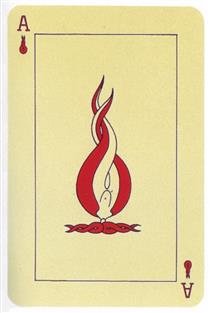
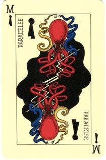

## Balatro and Deliberate Practice

So lately I, like everybody else, have been playing *Balatro*. (You may remember that I recommended it [a month ago](https://rwblickhan.org/newsletters/accessible-understandable-answers-in-a-broad-domain-of-interest/#in-other-news)). *Balatro* is great! You should be playing *Balatro*.

Game design and professor (and game design professor) Frank Lantz has [also been playing *Balatro*](https://franklantz.substack.com/p/playing-balatro). His newsletter is always fantastic,[^donkeyspace] but this one was particularly interesting. He points out that *Balatro* is similar to poker because it’s *high variance* — even a “perfect” playthrough may result in failure due to randomness, which means you get almost no information about “optimal” play from any single result!

Wait! This sounds familiar. I’ve been going through [“The Role of Deliberate Practice in the Acquisition of Expert Performance”](https://www.researchgate.net/publication/224827585_The_Role_of_Deliberate_Practice_in_the_Acquisition_of_Expert_Performance) by Ericsson et.al. — the actual source of that [old Malcolm Gladwell 10,000 hour rule](https://en.wikipedia.org/wiki/Outliers_%28book%29). (I prefer [James Somers’ summary](https://jsomers.net/blog/deliberate-practice).) But one very very important caveat that is only off-handedly mentioned in the paper, but made a central theme of [David Epstein’s *Range*](https://www.goodreads.com/book/show/41795733-range?ac=1&from_search=true&qid=sxdTHtlbqK&rank=1), is that *deliberate practice requires immediate feedback*. Indeed, Epstein points out that lack of immediate feedback is a defining property of so-called “wicked problems,” which is exactly how Lantz refers to *Balatro*! Maria Konnikova makes the same point about poker in [*The Biggest Bluff*](https://www.goodreads.com/book/show/49814228-the-biggest-bluff?ac=1&from_search=true&qid=KvebshUZyQ&rank=1) — poker is difficult to practice because it’s too easy to anchor on a single win or loss.

In some sense, Lantz is arguing that *Balatro* (and, by extension, poker) is fun precisely *because* it’s so difficult to deliberately practice.

Anyway: all this to say that I’m really into *cards* right now. I’m thinking about how we could extend the poker-hands mechanic into other systems. How about using poker hands with tarot minor arcana cards, where you get bonuses depending on which major arcana you pick? Or maybe you make poker hands and *bluff* which major arcana you have, like in *Coup*? 🤔

On a tangentially related note: check out [this *wild* playing card set](https://www.wopc.co.uk/france/grimaud/le-jeu-de-marseille) drawn by André Breton and pals while trying to escape Nazi-occupied Europe (featuring a cameo from [Ubu Roi](https://en.wikipedia.org/wiki/Ubu_Roi)).

## In Other News

- New recipes on my website! I finally wrote up the [tea soda](https://rwblickhan.org/misc/recipes/teasoda/) I’ve been making recently, and I made a [breakfast burger](https://rwblickhan.org/misc/recipes/breakfastburger/) with a [habanero-garlic “aioli”](https://rwblickhan.org/misc/recipes/habanerogarlicaioli/) that was quite tasty.
- I also cleaned up my [logs pages](https://rwblickhan.org/logs/). There’s now a legend on the main page; entries tagged with ❤️ were on my best-of list for that year, which is honestly mostly useful for myself, since the rules change every year 🤷‍♀️

[^donkeyspace]: I first started reading a year ago with [his reflections on art in the age of LLMs](https://franklantz.substack.com/p/well-here-we-are).