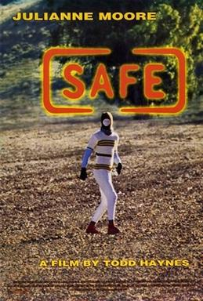

Hello, it is time for my yearly top 5 lists. I have noticed a lot of other people do these sorts of year-in-review articles recently, so hopefully you are not painfully bored of them already, but I will point out that I was doing it first 😈

I have a lot of honorable mentions but if I included them all this newsletter would be 50,000 words. If you are interested in hearing some of my other favorites, feel free to reach out! I also have some thoughts about music, television, and so on but I might include those in a future newsletter, since this one is already more than long enough.

## Books

### 5. _Something To Do With Paying Attention_, David Foster Wallace

Yes yes I know it’s 2023 and it’s passé to read David Foster Wallace, let alone include him on a best-of-the-year list. [“Where be your jibes now?”](https://www.lrb.co.uk/the-paper/v45/n14/patricia-lockwood/where-be-your-jibes-now) and all that.[^1]

But this novella, extracted from _The Pale King_ by a ruthless editor and set in large part in my hometown of [Libertyville](https://en.wikipedia.org/wiki/Libertyville%2C_Illinois) (!), was nevertheless one of my favorite reading experiences of the year, following the steam-of-consciousness of a young teenage “wastoid” as he experiences a near-religious conversion to… accounting and a career in the IRS.

I can’t quite account (pun intended) for why I liked this novella so much, but it did have its magic.

### 4. _The Unbearable Lightness of Being_, Milan Kundera

I’m still trying to unpack how I feel about Kundera, who coulda-shoulda won the Nobel Prize — here’s a good [critical essay](https://drb.ie/articles/the-two-milan-kunderas/) and [one more sympathetic to Kundera](https://compactmag.com/article/why-kundera-never-went-home).

But in the meantime, _damn_ the man could write a good sentence:

> Dog time cannot be plotted along a straight line; it does not move on and on, from one thing to the next. It moves in a circle like the hands of a clock, which - they, too, unwilling to dash madly ahead - turn round and round the face, day in and day out following the same path. In Prague, when Tomas and Tereza bought a new chair or moved a flower pot, Karenin would look on in displeasure. It disturbed his sense of time. It was as though they were trying to dupe the hands of the clock by changing the numbers on its face.

Just imagine reading a book that’s sentence after sentence of that quality! That’s what _The Unbearable Lightness of Being_ is like.

### 3. _The Magic Fish_, Trung Le Nguyen

I read a lot of comics this year, but _The Magic Fish_ was obviously the best — I even [wrote about it before](https://rwblickhan.org/newsletters/as-promised-a-very-dumb-frog/#you-should-read-the-magic-fish)! All you really need to know is that it’s about a gay Vietnamese teen and his refugee mother bonding over fairy tales, it’s extremely charming and heartwarming while also bittersweet, and it has some of the most gorgeous illustrations I’ve ever seen, with a completely different style for each of the fairy tales and the real world.

### 2. _The Hearing Trumpet_, Leonora Carrington

I am still not sure if _The Hearing Trumpet_ was the best book I read this year or merely the strangest — or whether I even see a distinction.

[Leonora Carrington](https://en.wikipedia.org/wiki/Leonora_Carrington) is best known as a capital-S Surrealist artist[^2], so it may be a surprise that _The Hearing Trumpet_, her only novel, starts humbly with a hard-of-hearing nonagenarian learning that her family is about to send her off to a nursing home after receiving a hearing trumpet from her best friend. Don’t worry, though, by the end of the novel she will meet (spoilers follow, although I’m not sure this is a novel that _can_ be spoiled, exactly):

- Little old ladies with murderous intent that live in giant snail shells.
- A bizarre self-improvement cult.
- A nun disguised as a member of the Knights Templar attempting to steal the Holy Grail.
- A pot of life-renewing stew.
- Wolf-human hybrids.
- The Apocalypse.

What I’m trying to say is, this is a novel that _goes places_, and those places are strange and wonderful. I read the entire novel in one sitting on a flight back from Toronto and I recommend you do the same (flight to Toronto optional).

### 1. _Tomorrow, and Tomorrow, and Tomorrow_, Gabrielle Zevin

Come on, you all knew this was coming.

_Tomorrow, and Tomorrow, and Tomorrow_ is a very imperfect book. A lot of the dialogue and prose feel a bit wooden. Some of the plot points are silly. The characters feel way too “2023-brained” for a book primarily set in 2004. The people who do not like this book — and I know quite a few, despite the seemingly-universal praise — have very good reasons.

But.

But _Tomorrow, and Tomorrow, and Tomorrow_ is the only book that made me sob this year, or any year, really.

You should at least give it a try.

## Films

### 5. _Mishima: A Life in Four Chapters_ (1985)

These days, this film about [Japanese-novelist-turned-ultra-right-wing-militia-leader Yukio Mishima](https://en.wikipedia.org/wiki/Yukio_Mishima) is probably best known for its Philip Glass soundtrack, which is one of the all-time greats, but the film really does hold up. It interlaces Mishima’s last day with his troubled upbringing, then combines that with staged versions of some of his short stories, which underline the themes of the other parts of the film.

More importantly, though, it has some of the most fantastic set design I’ve ever seen. There’s one particular scene I love, adapting one of his short stories, where a right-wing campus group is planning an assassination only to be raided by the police. The students are inside four walls on a stage, but as the police raid begins, the walls literally explode outwards as police stream onto stage and arrest the students. It’s a special kind of formalism that is rarely seen in big-budget films these days.

### 4. _Twilight_ (2008)

Watching _Twilight_ in an indie theater full of screaming fans is possibly my favorite moviegoing experience ever.

I am convinced everything about this film was completely intentional. It goes right next to [_Batman_ (1966)](https://en.wikipedia.org/wiki/Batman_(1966_film)) on my list of all-time-greats.

### 3. _Safe_ (1995)

_Safe_ is one of the most quietly terrifying films I’ve ever seen. A suburban housewife (in one of Julianne Moore’s defining roles) comes down with inexplicable, horrifying allergies, so she joins a cult, which doesn’t really hurt but also doesn’t help. And that’s it, that’s the movie. But, much like _Serial Experiments Lain_, it gets so much mileage just out of long takes of buzzing electrical lines and a woman who’s just as confused as we are.

### 2. _World of Tomorrow_ (2015)

Instead of describing _World of Tomorrow_, one of the most transcendent film experiences I’ve ever head, you can [just watch it](https://youtu.be/4PUIxEWmsvI?si=TOkjZIFCx9oanvyo)! 15 mins for free on YouTube. The sequels are fantastic as well.

### 1. Satoshi Kon

I have to include Satoshi Kon as a single entry, or this entire top 5 list would just be his movies.

I didn’t love _Paprika_ when I watched it a few years ago, but this year I become a Satoshi Kon fanboy. _Perfect Blue_ (arguably my favorite film of all time, now) made me question reality, _Millennium Actress_ is a charming homage to the last 75 years of Japanese cinematic history, and_Tokyo Godfathers_ is my perfect Christmas film. His short _Magnetic Rose_ is also fascinating. I highly recommend any or all of these — but start with _Perfect Blue_ first.

[^1]: I really need to get around to Patricia Lockwood’s novels one of these days…

[^2]: And, in my humble opinion, probably the best, save possibly her friend [Remedios Varo](https://en.wikipedia.org/wiki/Remedios_Varo) or maybe Rene Magritte at his best.