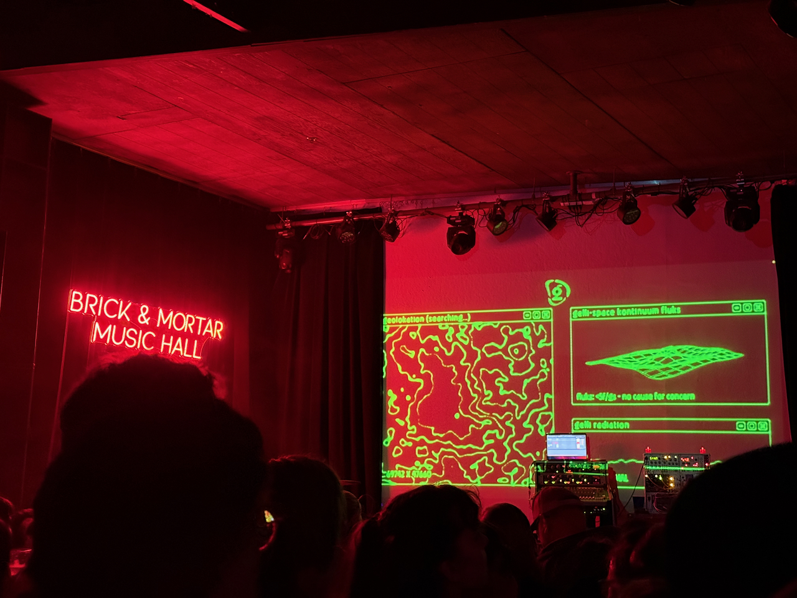

- I got to see [Gelli Haha](https://gelli.world/) live on Thursday, before she gets famous 🥹

Freedom!

Alright, I probably shouldn’t be _too_ excited for my makeshift summer break. But today is indeed the first day of my “funemployment”, as the cool kids are calling it. I have a great big list of things to do while off work, most of which relate to my [yearly goals](https://rwblickhan.org/newsletters/yearly-goals/) or little technical side-projects I haven’t had time to make.

Of course, the _first_ item on that list is to keep working on _Psyche & Mnemosyne_. I am quietly hoping I’ll have (yet another) draft done by the time I start work again, which is frankly unrealistic, but... I _did_ write my 500 words for the day already 😉

The rest of this newsletter is just a bunch of little updates. What, you didn’t expect a [3,000-word post on the ethics of using Claude Code](https://rwblickhan.org/ai/) _every_ week, did you?

---

I cleaned up the [front page of my website](https://rwblickhan.org/), partly inspired by a [BlueSky post from Craig Mod](https://bsky.app/profile/craigmod.com/post/3lpncsamfhs2k):

> i'm constantly baffled: when i land on a new newsletter / blog / site, one of the primary things I want to know is (especially if it's intersting!) WHO IS THIS PERSON.”

You, dear reader, probably know me personally, or if not, you’ve probably been reading long enough to have a pretty good sense of who I am — but, alas, the average internet rando stumbling on this page probably does not.

While I was there, I also updated the epigraph at the top so that it picks randomly from a short list every time the page loads. Try refreshing a couple times 😉

---

Of more far-reaching consequence: I’ve cleaned up the structure of my site, or, as the cool kids call it, the ~ information architecture ~

If you check the [sitemap](https://rwblickhan.org/map/), you’ll now see that there’s only three major categories: evergreen (for “evergreen” lists and notes that I keep up to date), creative writing (for short stories and poetry), and newsletters (for everything else, including essays I didn’t originally send as newsletters).

:::aside{.note}
I’m still trying to think of a better name for “newsletters”. They _are_ mostly newsletters, but it’s also, just, all the rest of the content on the site? If you have a recommendation hit me up...
:::

I’ve been meaning to do this for a long time, but never really had the time — but now I have some time free _and_ a Claude Code that can do all the grunt work of moving the pages around and so on. I _think_ I’ve set up all the redirects correctly, but if you see a broken link, do let me know!

---

Other site updates:

- I moved the search page into a modal popup powered by the [newly-Baseline](https://caniuse.com/wf-invoker-commands) [`commandfor` attribute](https://developer.chrome.com/blog/command-and-commandfor) — no JavaScript required!. I _love_ that the web platform is actually, y’know, getting better over time?
- I switched the monospace font to [Atkinson Hyperlegible Mono](https://www.brailleinstitute.org/freefont/), which I’m also now using in my terminal. As the name implies, it’s designed to be _hyperlegible_, and I feel it achieves that goal while still looking pretty darn nice.

---

You may recall [my breathless excitement for jujutsu version control](https://rwblickhan.org/newsletters/really-truly-breathless-with-excitement/) a few weeks ago. But I _completely forgot_ to mention how I actually learned jujutsu!

Luckily, there’s two _fantastic_ (though incomplete) tutorials which, combined, taught me most everything I need to know about jujutsu in about an hour. First up there’s [_Steve's Jujutsu Tutorial_](https://steveklabnik.github.io/jujutsu-tutorial/introduction/introduction.html) (the Steve being Steve Klabnik, aka the [Rust book author](https://doc.rust-lang.org/book/)) and secondly there’s Madeleine Mortensen’s [_Jujutsu For Busy Devs_](https://maddie.wtf/posts/2025-07-21-jujutsu-for-busy-devs). Both are highly recommended.

Also, as a great big fan of the (fantastic) [fzf](https://github.com/junegunn/fzf) fuzzy-finder CLI tool, I was naturally also a great big fan of the same author’s [fzf-git.sh](https://github.com/junegunn/fzf-git.sh) to operate on git objects. Alas, there was no equivalent for jj. So I had Claude Code [write me one](https://github.com/rwblickhan/fzf-jj.sh?tab=readme-ov-file).

I _also_ finally wrote a custom fish prompt, so that I could [see my jj status](https://github.com/rwblickhan/chezmoi/blob/main/dot_config/fish/functions/jj_prompt.fish) right on the command line without typing `jj log` all the time 🙃

---

Tata for now. I’m off to the [San Francisco Chocolate Salon](https://www.sfchocolatesalon.com/) where I will, hopefully, have some tasty chocolate.
