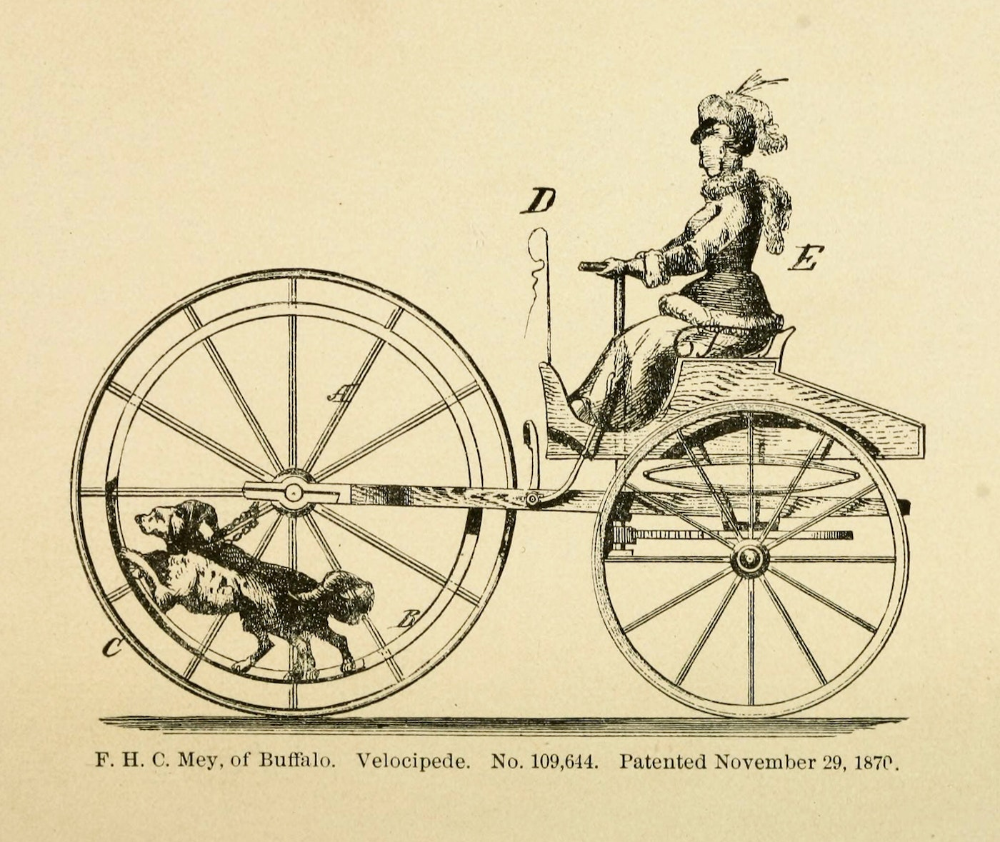

## Table of Contents

## Welcome

Hello, one and all! Welcome to season 6 of `rwblog`, formerly known as Applied Dilletantery!

Why a new season? I want to bring this newsletter back to its original incarnation, which can be summed up as “Russell’s take on [Robin Sloan’s newsletters](https://www.robinsloan.com/newsletters/)”. I want to bring it back to the weird humanistic intersection between tech, design, anthropology, and the humanities that I like reading about. I want to use it as a scratchpad for all the weird thoughts that pass through my head while I’m walking the dog!

I’ll still include occasional updates, but I’m hoping this issue serves a template for this season, with about one issue a month going forward. Jump around! Read the sections that catch your eye! Type a response right below this very email! Maybe even start your own newsletter or blog!

A fresh, clean start! A day full of possibilities! [It’s a magical world... let’s go exploring!](https://3.bp.blogspot.com/-T4RNWSzyxJA/UowxHWRlPYI/AAAAAAAAGq0/o4iTUYPAPPs/s1600/Scan0003.jpg)

[“Flammarion Engraving” (ca. 1888)](https://publicdomainreview.org/collection/flammarion-engraving)

## Cinema as the cathedral of modernity

Occasionally, you can read an article arguing that modernity has lost something because we don’t build cathedrals anymore; us moderns can’t imagine building monuments on a societal, multi-generational scale ([Sagrada Familia](https://en.wikipedia.org/wiki/Sagrada_Fam%C3%ADlia) aside). I find that argument a little specious, for various reasons, but it did lead me to an interesting thought:

*What if cinema is the cathedral of modernity?*

The full end credits of *Avengers Endgame* are literally tens of minutes long! A small city of actors, visual effects artists, and production assistants was kept employed for *years* at a cost of hundreds of millions of dollars, to produce a film that — artistic merits aside — can certainly be called monumental, as the capstone of a decade-plus of filmmaking efforts. That’s a cathedral right there!

[From *Cycling Art, Energy, and Locomotion* (1889)](https://publicdomainreview.org/collection/cycling-art)

## Transmuting calories into time

During my recent sabbatical, I finally (three years after moving to the Bay Area!) bought a new bicycle, specifically a [Trek FX2](https://www.trekbikes.com/us/en_US/bikes/hybrid-bikes/fitness-bikes/fx/fx-2-disc/p/35003/). I’ve since ridden it maybe a hundred miles and started to commute to work with it, and... I think I was reintroduced to my first true love!

Many tech-adjacent folks talking about “tools for thought” like Notion will reference [Steve Jobs’ famous “bicycle for the mind” talk](https://medium.learningbyshipping.com/bicycle-121262546097), but interestingly we don’t often think of flipping that metaphor. Bicycles are kind of magical — a simple set of wheels and gears can transmute calories into time directly and efficiently! My half-hour walk to work is now 10 minutes flat, at the cost of *maybe* 150 calories, which are helpfully converted into fuel for muscles. That’s amazing! Sure, that slightly undersells the overall cultural package that enables bicycling — society did have to pave asphalt and lay out bike lanes and install bike racks — but it still amazes me that such a simple machine can be so effective.

Bicycles completely change the psychogeography of the city. Realistically, you can’t walk across San Francisco in an afternoon, but you can definitely bike it, despite the hills. From my house, my favorite bagelry, [Schlok’s](https://www.schloks.com/), is 45 minutes by transit or 20 minutes by a pricey rideshare (ugh)... *or* a fun 25 minute ride along [the Wiggle](https://en.wikipedia.org/wiki/The_Wiggle). Bicycling is not perfect in the Bay Area — my favourite cafe, [Delah Coffee](https://www.yelp.com/biz/delah-coffee-san-francisco), *still* has no bike rack within a block’s walk — but it feels like the *correct* way to experience a city the size of San Francisco.

## Worshipping on the altar of group chats

Like many IndieWeb™️ folks, I spent a lot of time this week thinking about Robin Sloan’s [“A year of new avenues”](https://www.robinsloan.com/lab/new-avenues/). I fundamentally agree with his conviction that the late-aughts crop of social media services (Facebook and Twitter and the like) are dying, although I’m not quite sure I feel the excitement of new growth yet. I fondly remember the pre-consolidation era of Web 2.0, when a new service like Foursquare could suddenly spawn out of SXSW and leave a suburban kid dreaming of becoming mayor of a coffee shop in the big city — but maybe that’s just nostalgia talking.

That said, it’s obvious to me that services like Mastodon are not the way forward — c.f. also [Alan Jacob’s rather sarcastic take](https://blog.ayjay.org/mastodonic-thoughts/) on Mastodon. I’m excited for what new models for social media might come, although I’m not sure I’m [quite inventive enough](https://rwblickhan.org/nonfiction/thinkingstyles/) to contribute. What I’m perhaps more excited for is a return to my preferred medium: group chats!

Perhaps this will age me someday — perhaps it already does — but I’ve always worshipped on the altar of group chats. That’s the main reason I’m bullish on Discord — it’s group chats all the way down! I never fully understood the appeal of either Twitter’s or Facebook’s posting style, asynchronously spamming strangers or near-strangers with life updates. I want to actually, you know, *talk* to people.

Alternatively: maybe we’re looking for the revival of forums? That’s essentially what Reddit is, after all.

## Arc from the Browser Company

In Robin Sloan’s newsletter, he talks about Arc from the Browser Company, a new Chromium-based browser that reimagines what web browsing could be in the 2020s. It’s pretty neat!

- There’s a distinction between pinned and unpinned tabs, with the latter automatically closed after 12 hours. Tabs can also be favorited, which act almost like an app launcher or dock.
- A la Safari’s tab groups, Arc encourages opening “spaces” for different contexts, like a space for all work-related tabs.
- Arc treats web apps as first-class citizens. It even has a few built-in apps, including a Library to view downloads and screenshots, Notes, and Easel for Pinboard-style pinning. You can also easily arrange sites into split views.
- Links in external apps open in a mini-browser, from whence the link can be directed to any space.
- Cmd+T doesn’t just open a new tab but acts more like a [Cmd+K bar](https://maggieappleton.com/command-bar), where you can control the whole app from the keyboard.
- Plus, since it’s built on Chromium, it has access to the full Chrome app store.

But! I don’t think Arc is for me.

Arc is trying to act almost like an operating system for the web. It feels like it’s built for the kind of person who has 50 tabs open, constantly juggling between Gmail and Notion and a dozen StackOverflow posts. For someone like that, Arc would be really useful — and if it does describe you, I’ve got an [invite link](https://arc.net/gift/12072ae5) for you right here! 😛

But I simply don’t use that many web apps that heavily, since I strongly prefer native apps — I can’t help it, I’m a mobile engineer! I rarely have more than half a dozen tabs open at a time across all my devices, because if a tab is open more than a few hours, it usually ends up shunted to Things or Obsidian or GoodLinks. Logistically, I also do a lot of web browsing on mobile or my iPad, and Arc is macOS-only for now.

That said, I’m still excited that folks are still willing to try something new — in many ways, the world of web browsers still feels like it’s stuck with Chrome circa 2010.

[“Monk Selling Ceremonial Tea Whisks”, c. 1802, Katsushika Hokusai](https://www.artic.edu/artworks/23983/monk-selling-ceremonial-tea-whisks)

## Small Things That Make Life Better

This is not a holiday gift guide, but it’s not *not* a holiday gift guide either.

### Tea Infuser

I’m a proponent of loose-leaf tea. If you can’t taste the difference between English Breakfast and Assam, then loose-leaf tea won’t make a difference, but if you *can*, well... In any case, loose-leaf tea is more convenient if you want to order a 10lb bag and drink through it over a few months. The only problem is straining the tea leaves. Luckily, you can just use a stainless steel infuser. Look, [here’s one for $10](https://www.vahdam.com/products/classic-tea-infuser)! If you like tea, just buy one and keep it around the kitchen.

### Hario Cold Brew Bottle

This year I went to the [San Francisco International Tea Festival](https://www.sfitf.com/) and found that most of the vendors were using [this Hario cold brew bottle](https://www.hario-usa.com/products/cold-brew-tea-wine-bottle-set). You put loose-leaf tea in the bottle, add tap water, and let it brew in the fridge for three-to-six hours. Pour through the filtered cap and you have some delicious cold brew tea, which really does taste different from a normal steep. I recommend trying it with [this rose black tea](https://www.vahdam.com/products/blooming-rose-black-tea).

### Milk Frother

According to our Amazon order history, Sherry and I have bought [this milk frother](https://www.amazon.com/gp/product/B07V2ZGYJ1/ref=ppx_yo_dt_b_search_asin_title?ie=UTF8&psc=1) three times as a gift and one time for ourselves. You might not think you need a milk frother and honestly you’re probably right. But, look, it’s less than $20 and sometimes it really does come in handy. In the past I’ve used mine to make salted cheese for [fake Happy Lemon salted cheese tea](https://www.milkonthemoon.com/recipes/how-to-make-black-tea-with-rock-salted-cheese/).

### Loop Experience Earplugs

I am deadly serious about hearing damage, perhaps because I have mild tinnitus. I have on occasion worn *industrial earplugs* to concerts. Luckily, I learned about [Loop’s Experience earplugs](https://us.loopearplugs.com/products/experience)! They’re $30, last for hundreds of uses, and come in a tiny lanyard case that you can attach to your keys or wallet. They’re rated to reduce noise by 18 dB, which brings all but the noisiest concerts and parties to a comfortable level, and their design minimizes audio distortion. At parties, I can actually hear my conversation partners *better* because the Loops are so effective at blocking out the background noise.

### Vessis

Now that rain and work-from-office have returned to the Bay Area, we must contend with marching to work with soggy feet. Or not, if you get [a pair of Vessis](https://vessi.com/)! This shoe company from Vancouver (of course) produces sneakers that are waterproof by virtue of the knit pattern instead of a chemical coating. That may sound... suspicious, but they work like magic — I’ve walked a mile to work in a downpour and arrived with perfectly dry socks.

### Bicycle

Perhaps this isn’t a “small” thing to make life better, but after waxing lyrical about the joys of urban bicycling above, it seems silly not to include a bicycle on this list. Get a bike! It will make your life better!

### Library Card

Libraries are, alongside public transit, one of the great triumphs of the public provision of goods in modernity. A library card is *free* and lets you check out almost any book you could imagine! You can wander the shelves and take any book that looks interesting and walk out with it! I appreciate a good bookstore, but they really have nothing on libraries. If you haven’t checked out your local library branch, consider a library card a little holiday gift to yourself.

## What’s New On The Site

Inspired by [my pal Yuan](https://yzhang0.github.io/food.html), I wrote up a few [restaurant recommendations](https://rwblickhan.org/misc/restaurantrecs/) for San Francisco and Vancouver. I’ll add more over time as I think of them!

## Next Time

So far this year I’ve read 71 books and watched 52 movies. Next newsletter I reveal my top 10 books and top 5 movies 👀