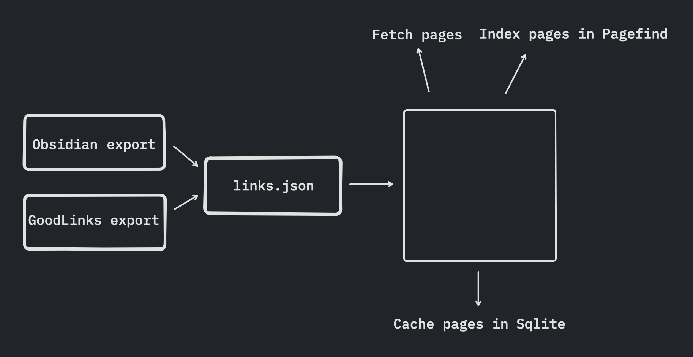

Recently I built a [site](https://bookmarks.rwblickhan.org) to do full-text search of links I’ve bookmarked. This article explains how it’s built and assumes some basic familiarity with JavaScript and web technologies generally. You can see the full code in the [GitHub repo](https://github.com/rwblickhan/bookmarks).

## Table of Contents

## Evolution

So the goal for this project changed pretty significantly over time. I did not intend to create a whole subsite to search everything I’ve read!

I was originally inspired by Gwern’s post ["Archiving URLs”](https://gwern.net/archiving). He argues that it’s prudent to archive web pages that you’ve read or referred to, because linkrot happens faster than you’d think. In particular, he wrote a script that downloaded the raw HTML and also uploaded the page to the Internet Archive’s Wayback Machine, although he now recommends using the [`archivenow`](https://github.com/oduwsdl/archivenow) tool instead, which does the same thing.

Yes, I freely admit this is packrat behavior. But, as Jacob Geller once asked, [how can we bear to throw anything away](https://youtu.be/ukJ_UA-JS5o?si=i4AsyofqMxXzh7pB)?

I use a read-it-later app called [GoodLinks](https://goodlinks.app) to save links I’ve read or plan to read. Luckily, it has a JSON export, so my plan was to write a simple command-line tool to parse the GoodLinks export and pass all the links to `archivenow`. This would also give me a chance to play around with writing command-line tools in [Deno](https://deno.com).

Three problems quickly became apparent. Firstly, `archivenow` is extremely slow — processing a single link takes something like 20 seconds, and I have 2000 or so links, so that would take… 11 hours. Secondly, the full-text export of each link was pretty sizable. Thirdly, `archivenow` would occasionally fail to process a link, for no apparent reason.

So this project laid fallow for quite a few weeks. Then I saw a passing reference to [Readability](https://github.com/mozilla/readability), an open-source library that powers Firefox’s Reader View, and wondered if I could apply it here.

Meanwhile, I’ve always been annoyed using GoodLinks’ search to find essays I’ve read; it has a full-text search, but it’s fairly inconsistent about caching webpages, so it often fails to find results. I realized it would be nice to have a more consistent full-text search, deployed to the web, which could be implemented with [Pagefind](https://pagefind.app) (about which more below).

As a bonus, I realized I could also throw the links from my [Obsidian vault](https://obsidian.md) into Pagefind, as well!

## Goal

The final goal of this project was to parse a GoodLinks-and-Obsidian data export, pass the results through Readability, then use the simple text output by Readability to fill out a Pagefind index, so that I could have a full-text search of any links I had saved.

## ChatGPT

I used ChatGPT to generate some of the code here, as well as using [Codeium](https://codeium.com), a free alternative to GitHub Copilot. The latter is basically enhanced autocomplete, which is very useful but perhaps not as exciting as ChatGPT.

ChatGPT was able to write large parts of the logic for this entire project, although there were certainly some hangups, which I’ll show an example of later. I generally agree with [Simon Willison's](https://simonwillison.net) general argument that LLMs can make programmers more ambitious, since they can let you skip so many time-consuming steps in programming; I’m not sure I would have bothered building this project if I couldn’t have gotten a lot of it “for free” via ChatGPT.

## Deno

I wanted to play around with [Deno](https://deno.com), which is a replacement for the Node runtime. It has some neat features, like full first-class support for TypeScript, built-in testing, formatting, and linting, and a fine-grained permissions model for network access, file access, and so on. In some ways, I like to think of Deno as “Rust’s tooling, but for JavaScript”.

Overall, I had a good experience and I’d recommend Deno for this sort of “script-y” programming, which you might normally use Python or Ruby for.

## Architecture



There’s four main components to this site, linked together by a simple `links.json` file, which I run in order:

1. A script that parses the JSON export from GoodLinks and adds the links to `links.json.`
2. A script that parses that Markdown files in my Obsidian vault for links and adds them to `links.json`.
3. A script that fetches the web contents for each link from `links.json`, passes them through Readability, and then adds it to a Pagefind index.
4. A simple web page that displays Pagefind’s default search interface.

[Pagefind](https://pagefind.app) is really, really fantastic. It’s described as a “fully-static search engine that aims to perform well on large sites, while using as little of your users’ bandwidth as possible, and without hosting any infrastructure.” Even better, Pagefind comes with a default search interface that you can set up with a simple `<script>` tag. So basically, you create an index, then host the output index statically alongside the search interface, and you get full-text search for free! I use it to implement [search](https://rwblickhan.org/search/) on my personal site as well.

The benefit of Readability is that it strips out pretty much everything other than the main article content — HTML tags, headers, footers, ads, all that. That makes the final `textContent` much smaller than the original HTML, and it ensures I don’t pick up any unexpected content (although Pagefind does do some parsing on its own if you give it an HTML file).

`links.json` is as simple as I could make it, with the `title` coming from Readability and `source` defined by which script generated the entry:

```json
[
  {
    "url": "https://maggieappleton.com/historical-trails",
    "title": "Historical Trails",
    "source": "GoodLinks"
  },
  {
    "url": "https://nicoledonut.com/issue-41-gift-guide",
    "title": "Issue 41: The nicoledonut gift guide",
    "source": "Obsidian"
  },
  ...
]
```

## Constructing the Links List

### GoodLinks

Constructing `links.json` from GoodLinks is relatively straightforward. GoodLinks has a fairly standard schema for its link export, which I represent as a TypeScript interface:

```ts
interface GoodlinksLink {
  readAt: string | null;
  starred: boolean;
  title: string;
  url: string;
}
```

Then, I can grab the JSON file exported by GoodLinks and parse it with a normal, web-standard `JSON.parse`:

```ts
const goodlinksLinksExportFile = Deno.readTextFileSync("goodlinks.json");
const goodlinksLinks = JSON.parse(
  goodlinksLinksExportFile
) as GoodlinksLink[];
```

Then, I have some deduplication logic to make sure that the GoodLinks links in `links.json` matches the GoodLinks export exactly, with no extra items, which you can view in the repo. Then I write `links.json` back out:

```ts
Deno.writeTextFileSync("links.json", JSON.stringify(filteredLinks, null, 2));
```

### Obsidian

This part was more interesting, and this is where I turned to ChatGPT.

Obsidian stores its notes as Markdown files in a particular directory. So the goal was to parse all Markdown files and find all Markdown links within those files and add those to `links.json`. I initially thought about using a URL regex, but that sounded… annoying. So, instead, I [asked ChatGPT](https://chat.openai.com/share/350c17ff-d09e-4838-91b5-47b6fe61a061) to write this for me using Deno.

It came up with a pretty good solution, even recommending [a specific Markdown parsing library](https://github.com/markedjs/marked/tree/master) to use!

```ts
import { walk, WalkEntry } from "https://deno.land/std/fs/mod.ts";
import marked from "https://deno.land/x/marked/mod.ts";

async function parseMarkdownLinks(filePath: string): Promise<string[]> {
  const markdownContent = await Deno.readTextFile(filePath);
  const links: string[] = [];

  const tokens = marked.lexer(markdownContent);
  tokens.forEach((token: any) => {
    if (token.type === "link" && token.href) {
      links.push(token.href);
    }
  });

  return links;
}

async function processMarkdownFiles(directoryPath: string): Promise<string[]> {
  const markdownLinks: string[] = [];

  for await (const entry of walk(directoryPath, { exts: [".md"], includeDirs: false })) {
    if (entry.isFile) {
      const links = await parseMarkdownLinks(entry.path);
      markdownLinks.push(...links);
    }
  }

  return markdownLinks;
}
```

But there’s actually a subtle error here. I ran this and found that _no links_ were being added to `links.json`. A few `console.log` statements later and I found the issue…

Markdown, at least as represented by `marked`, is hierarchical — links are typically found _inside_ a paragraph or a list item. ChatGPT’s code simply loops over the tokens at the top level, so it didn’t find _any_ links. A quick look at `marked`’s docs revealed a solution: replace the `tokens.forEach` with `marked.walkTokens`, which correctly recursively walks the hierarchy of Markdown tokens. Notably, I just fixed this bug by myself, but I wonder if ChatGPT would have fixed it if I pointed it out.

Anyway, the rest of the code for actually adding the parsed links to `links.json` just got copied from the GoodLinks script.

## Fetching & Parsing

Once I have `links.json`, the main script first fetches and parses the contents of each link. Luckily, thanks to Deno’s use of Web Standards™️, fetching link contents is easy:

```ts
try {
    const res = await fetch(link.url);
    data = await res.text();
} catch (error) {
    // ...
}
```

Seriously, that’s it. That’s all you have to do to fetch webpages with the [Fetch API](https://developer.mozilla.org/en-US/docs/Web/API/Fetch_API).

Then I throw the raw HTML text output into Readability, which is a little more complicated:

```ts
interface Article {
  title: string;
  textContent: string;
}

const document = new DOMParser().parseFromString(data, "text/html");
const reader = new Readability.Readability(document);
const article = reader.parse() as Article;
```

`Readability` expects an actual [`Document`](https://developer.mozilla.org/en-US/docs/Web/API/Document) object, but we’re running as a Deno script, not in a web browser, and we’ve just grabbed raw HTML text. So we have to use `DOMParser` from [Deno DOM](https://deno.land/x/deno_dom@v0.1.43) (recommended in some Deno doc somewhere) to create a `Document` object. But after that, we can send it through Readability and get back an object with the simplified plaintext.

## Building the Search Index

Pagefind has a nice interface for adding arbitrary text to a search index:

```ts
const { index } = await Pagefind.createIndex({});
for (const link of links) {
    // Parse as above...
    const { errors } = await index.addCustomRecord({
        url: link.url,
        content: (article?.title ?? "") + (article?.textContent ?? ""),
        meta: {
            title: article?.title ?? "",
            site: new URL(link.url).hostname,
            source: link.source,
        },
        filters: {
            site: [new URL(link.url).hostname],
        },
        language: "en",
    });
}
const { errors: writeErrors } = await index.writeFiles({
    outputPath: "public/pagefind",
});
```

At the end, `writeFiles` writes the core JavaScript and CSS files that we’ll serve to show the default Pagefind UI, as well as all the search index files.

## Caching

So this works just fine, but every time I want to add links, I need to rebuild the whole search index. With about 4,000 links, it takes 45 minutes to run 😱

Most of that time is spent fetching and parsing webpages, not adding them to the Pagefind index; Pagefind’s search indexer is a zippy-fast Rust binary. But most of those webpages shouldn’t be changing in between runs; we really just need to fetch the newly-added links. This sounds like a job for… a cache!

I could have done some sort of flat file with all the text, but come on, this is what a database is for! I decided to use SQLite, since it’s trivially easy to embed. (In particular, I was once highly influenced by an argument for using SQLite over, say, Postgres, which may have been in [this article](https://benhoyt.com/writings/the-small-web-is-beautiful/)[^1]). I used a [Deno SQLite module](https://deno.land/x/sqlite@v3.8) that was, again, recommended somewhere in the Deno docs.

```ts
const CACHE = "cache";
const db = new DB("cache.db");
db.execute(`
  CREATE TABLE IF NOT EXISTS ${CACHE} (
    id INTEGER PRIMARY KEY AUTOINCREMENT,
    url TEXT UNIQUE,
    title TEXT,
    parsed_content TEXT
  )
`);

for (const link of links) {
    const rows = db.query<[string, string]>(
        `SELECT title, parsed_content FROM ${CACHE} WHERE url = :url`,
        {
            url: link.url,
        }
    );
    // Use cached data instead of fetching if rows is non-empty...
    // And, if we did fetch, add it to the cache
    if (rows.length === 0) {
        db.query(
            `INSERT INTO ${CACHE} (url, title, parsed_content) VALUES (:url, :title, :parsed_content)`,
            {
                url: link.url,
                title: article?.title ?? "",
                parsed_content: article?.textContent ?? "",
            }
        );
    }
}
db.close();
```

For 4000 links, `cache.db` is only about 50 megabytes! Not bad.

Despite this cache, performance still wasn’t great. That was because a few hosts loaded for a very long time before ultimately failing, in which case they were never added to the cache and would fail again next time. I just added a blocklist to skip any links from those hosts.

With the addition of a cache and the blocklist, the search index can be regenerated from scratch in about 30 seconds, if no new links are added. Each new uncached link only adds on the order of 10 seconds before being cached, so this is pretty effective.

## Errors

I write all the errors I collect into a simple `errors.json` file, with basic metadata about the link that failed, which step failed (fetching? parsing? indexing?), and the performance.

## UI

Keeping this as simple as possible, I just need a static HTML file that calls the JavaScript / CSS that Pagefind outputs and loads it:

```html
<!DOCTYPE html>
<html lang="en">
  <body>
    <script src="pagefind/pagefind-ui.js"></script>
    <link href="pagefind/pagefind-ui.css" rel="stylesheet" />
    <div id="search"></div>
    <script>
      window.addEventListener("DOMContentLoaded", (event) => {
        new PagefindUI({
          element: "#search",
          showSubResults: true,
          showEmptyFilters: false,
          pageSize: 10,
        });
      });
    </script>
  </body>
</html>

```

Since I first wrote this, I’ve made this more complicated, adding a `<head>` for basic metadata and an extra stylesheet for more styling… but that’s all normal web stuff 😉.

## Hosting

For simple static sites, I’ve had a lot of success with [Cloudflare Pages](https://pages.cloudflare.com). I also happen to have bought my rwblickhan.org domain through Cloudflare, so it’s trivially easy to point a new subdomain like bookmarks.rwblickhan.org to a new project. When I want to upload a new version of the index, I just use [Wrangler](https://developers.cloudflare.com/workers/wrangler/):

```bash
npx wrangler pages deploy public --project-name rwblickhan-bookmarks
```

[^1]: Fun fact: I was only able to find that article again due to bookmarks.rwblickhan.org 😅