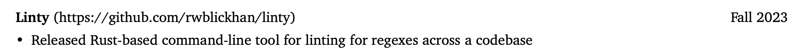

I recently realized it’s been over 4 years since I last updated [my resume](https://rwblickhan.org/resume.pdf) (!). While trying to update it, I grew frustrated manually setting typography again and again in Pages, not to mention my inability to version-control it like a good little software engineer.

The other option is a full typesetting markup system, like [LaTeX](https://www.latex-project.org). However, I know from experience as a former math major that LaTeX is a pain at best. Luckily, I learned about a new option from [this article](https://mattrighetti.com/2023/10/25/i-rewrote-my-cv-in-typst): [Typst](https://typst.app)!

## What is This Typst Thing Anyway

Typst is a markup language, like LaTeX or Markdown, which can be compiled to pretty-looking PDFs. Like LaTeX and unlike Markdown, Typst provides fine-grained control over layout and typography. However, unlike LaTeX, it’s usable by normal human beings 🤪

Typst-the-organization provides an online editor, but I’ve heard anecdotally that it sometimes loses work. Luckily, there’s also a [command-line interface](https://github.com/typst/typst) and a [language server](https://github.com/nvarner/typst-lsp) that works great with VS Code. I keep a terminal window open with `typst watch` to recompile and reload the output PDF every time I save a file.

## But What Does Typst Look Like

Typst mixes markup text with scripting commands. The interesting thing is that Typst distinguishes between “markup mode” and “code mode”; in markup mode, text is assumed to be markup strings and you have to prepend function calls or other scripting commands with a `#`, while in code mode, text is assumed to be scripting expressions.

However, it’s important to understand that the markup commands are syntactic sugar to function calls. For instance, a heading like `= Title` is equivalent to a function call like `#heading(Title)`, except the function call allows you to edit the parameters.

There’s also “math mode”, which is `$`-delimited blocks with special formatting, just like LaTeX.

The other interesting thing is that Typst distinguishes between raw strings, content blocks (arbitrary markup mode content wrapped in `[]`), and code blocks (arbitrary code mode content wrapped in `{}`).

This snippet shows all this in action:

```typst
#let linty = {
  personal_project_item(
    "Linty",
    "Fall 2023",
    "https://github.com/rwblickhan/linty",
  )[
    - Released Rust-based command-line tool for linting for regexes across a codebase
  ]
}
```

`#let linty` is a [`let` binding](https://typst.app/docs/reference/scripting/#bindings) that lets me refer to `linty` as a variable; `let` needs to be prepended with `#` because the document starts in markup mode. The `let` binding is assigned to a [code block](https://typst.app/docs/reference/scripting/#blocks) that puts us into code mode, so the function `personal_project_item` doesn’t need a `#`.

`personal_project_item` takes four parameters — three strings and a content block that, in this case, contains a bullet-point list, but could include nested function calls prepended with `#`. Then, the `personal_project_item` function outputs a block of markup that is rendered like this:



Another neat thing is [set rules](https://typst.app/docs/tutorial/formatting/#set-rules) and [show rules](https://typst.app/docs/tutorial/formatting/#show-rules). Set rules let you set a parameter for all function calls within a block, so for instance you can `#set par(justify: true)` and then every paragraph will justify its content. Show rules let you write an anonymous function applied to every instance of a function call within a block.

If that was hard to follow, I promise Typst’s [tutorial](https://typst.app/docs/tutorial/) is very clear.

## How I Used Typst

I split off my files into a “template” and an “implementation”, loosely inspired by an example I found on GitHub. The template handles the page setup and formatting, while the implementation handles the content.

What does that look like?

The template has one major `#let` binding that’s imported by the implementation:

```typst
#let resume(experiences, personal_projects) = {
  // ...
}
```

Inside the code block, I set basic variables for the page, like the font:

```typst
set document(title: "Resume", author: "Russell Blickhan")

set page(
  paper: "us-letter",
  margin: (left: 0.50in, right: 0.50in, top: 0.50in, bottom: 0.50in),
)

set text(font: "Charter", lang: "en")

show par: set block(above: 0.75em, below: 0.75em)
set par(justify: true)
```

Then, I start defining the page structure, like the header:

```typst
let header = {
  align(center)[
    #pad(bottom: 5pt)[
      #text(size: 24pt, weight: "bold")[Russell Blickhan]
    ]

    #set text(size: 11pt)
    #text("San Francisco, CA")
    |
    #text("628-230-8646")
    |
    #link("mailto:rwblickhan@gmail.com")[#text("rwblickhan@gmail.com")]
    |
    #link("https://rwblickhan.org")[#text("rwblickhan.org")]
  ]
}
```

It also exports a few helpers for the implementation to use, like an entry for each experience item:

```typst
#let experience_item(organization, role, timeframe, body) = {
  set text(size: 10pt)

  block[
    #text(weight: "bold")[#organization]
    #if role != none {
      text(style: "italic")[| #role]
    }
    #box(width: 1fr)[
      #align(right)[
        #timeframe
      ]
    ]
  ]
  body
}
```

Then, the implementation can create an instance of `resume`:

```typst
#resume[#asana #snowmobile #thinkbox #t2][#linty #tag_search]
```

Which references content like `linty`, mentioned above.

## But Was It Worth It?

Typst is a pretty interesting markup system; the mix of markup and scripting is unlike any other environment I can think of, other than LaTeX, which somewhat obscures the scripting element. That alone made it worth learning!

That said: Typst does feel a little fiddly at times, especially the difference between content blocks and code blocks and the layout functions, and the output is clearly not as typographically refined as LaTeX. I’m not completely convinced I can easily maintain this resume going forward, at least if I come back to it after another 4 year gap. Still, if I needed to typeset a mathematics paper, I would consider trying Typst first; it really is just so much less annoying than LaTeX.