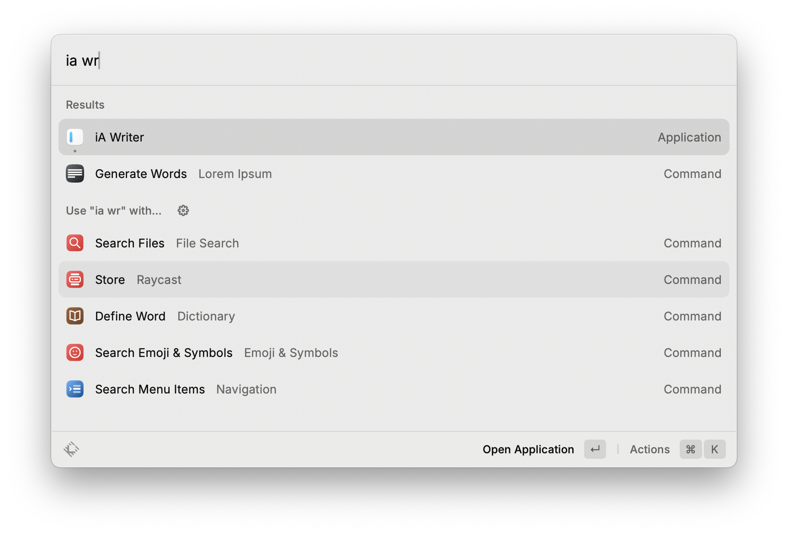
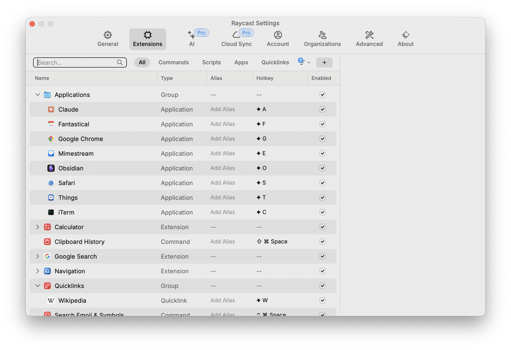
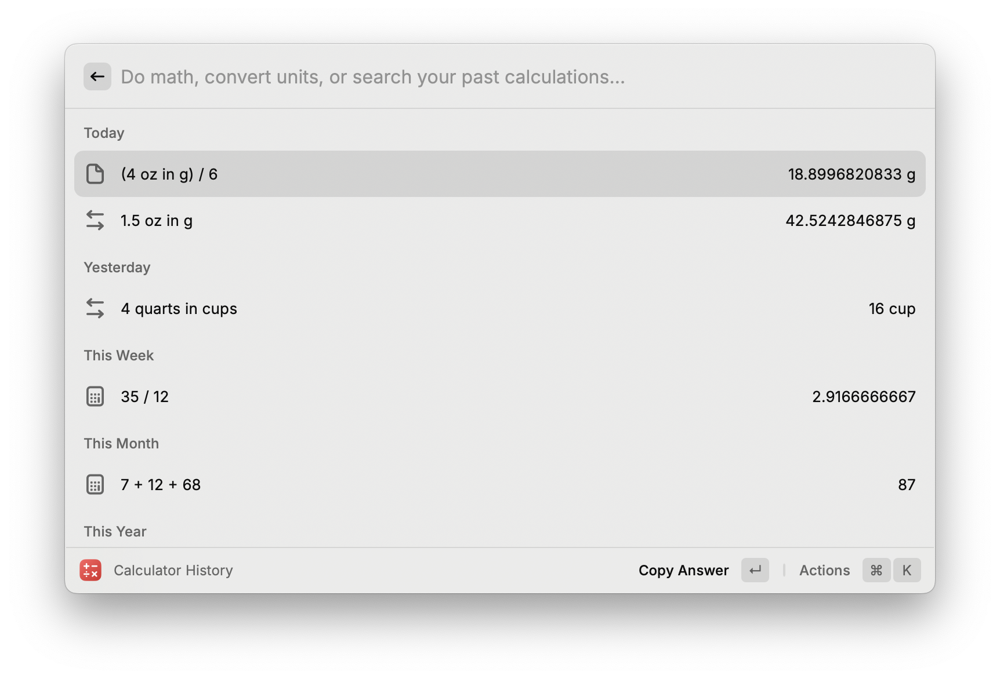
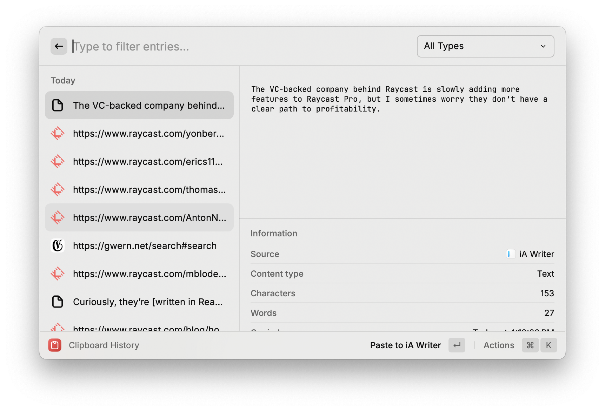
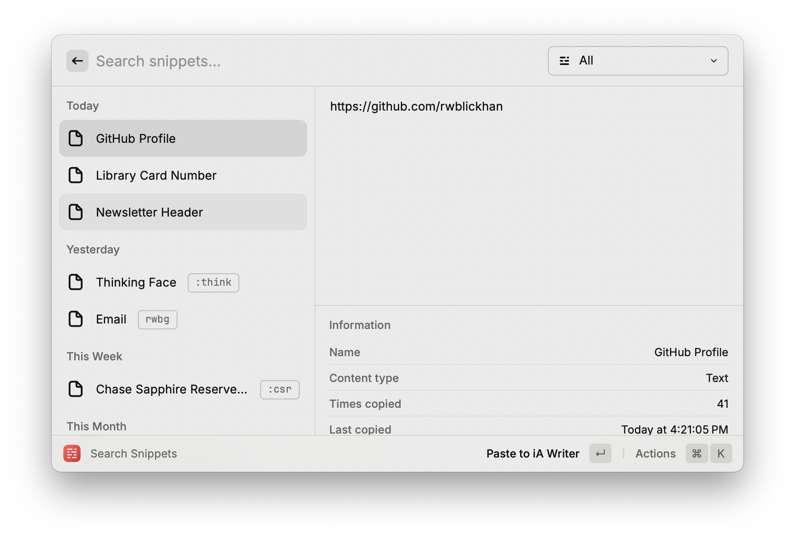
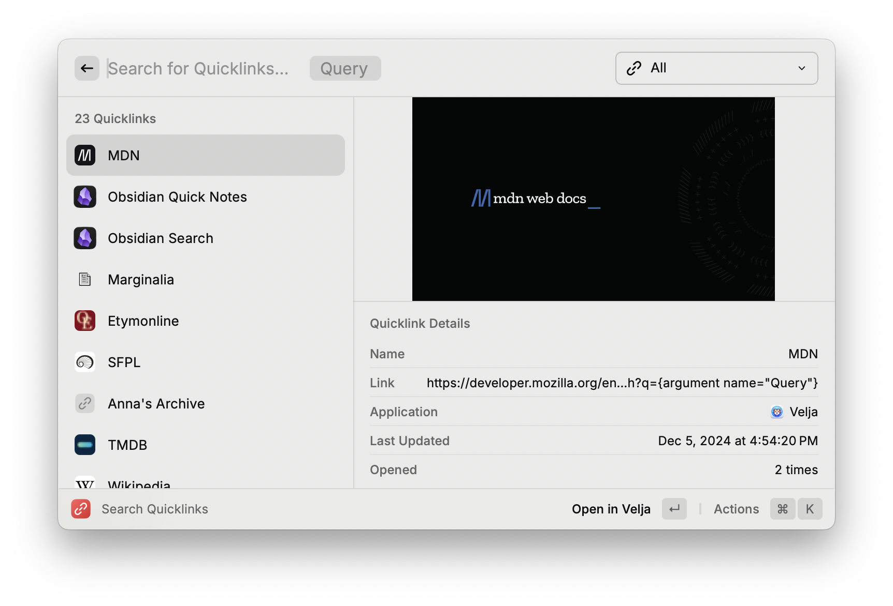
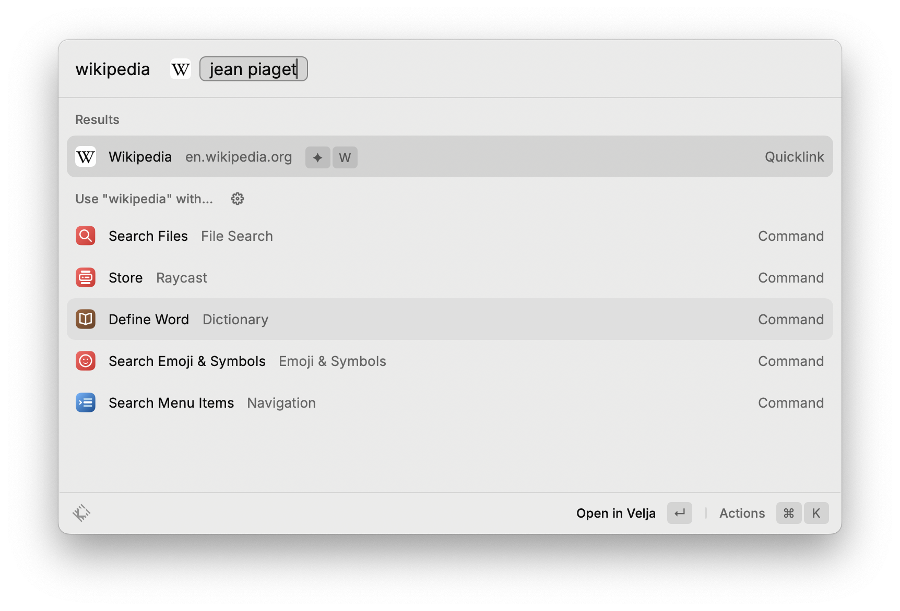
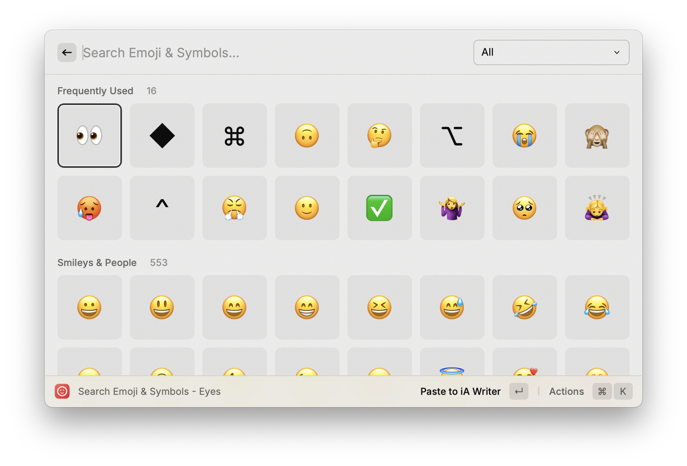

A couple years ago, I started using [Raycast](https://www.raycast.com), which quickly became indispensable. It started as, roughly, a replacement for macOS’ Spotlight or a modern version of [Alfred](https://www.alfredapp.com), but has slowly grown more features over time. Here’s a few of the ways I use it.

## Table of Contents

## File and Application Search That Actually Works

I originally tried Raycast because macOS’ built-in Spotlight search was so flaky, at least a couple macOS updates ago. By contrast, Raycast’s file and application search is snappy and never fails.

By default, Raycast opens to a fuzzy search for any installed applications, as well as any extensions or commands enabled in Raycast. One such command is File Search, which does exactly what it says — it opens a submenu to fuzzy-search files across your machine. The application search is so snappy that it immediately replaced hunting for an app icon on the Dock or in Finder — if I want to open an app, I virtually always open Raycast and start typing the application name (unless I’m using a keyboard shortcut, about which see below).

Raycast recommends using the ⌘Space shortcut, replacing Spotlight completely, but you can also pick a separate shortcut.  I would recommend trying to replace Spotlight — I never looked back.

## Keyboard Shortcuts for Days

Any command in Raycast can be assigned a global keyboard shortcut. Raycast even has special support if you have a [hyperkey](https://rachsmith.com/hyperkey/) assigned, referring to it as the ◆ key. I use the [Hyperkey app](https://hyperkey.app) to reassign the right ⌘ (Command) to ◆.

My most-used applications all have mnemonic hyperkey shortcuts, so I can pull them up from anywhere — ◆T for Things, ◆F for Fantastical, ◆S for Safari, ◆O for Obsidian, and so on.

This works for *any* Raycast command, including Apple Shortcuts. So I also assign keyboard shortcuts to Shortcuts, like “Copy Current Safari Tab as Markdown Link” assigned to ^⌥L.

## Quick Calculator

The main Raycast search interface doubles as a calculator, including unit conversions like “4 quarts in cups”. (4 quarts is apparently 16 cups.) No need to find a sketchy converter on Google while cooking! This is my number one feature request for the iOS version — having that search field on my iPad while cooking would be useful all on its own.

Raycast also has a Calculator History command, which can be handy. However, I find it too difficult to use prior calculations — I wish it also had a notepad interface like [Soulver](https://soulver.app).

## Clipboard Manager

Raycast has a full clipboard history manager built in. I have it assigned to ⇧⌘Space.

If you’ve never used one before, a clipboard manager is surprisingly useful. It stores everything you’ve copied or pasted — though you can configure Raycast to ignore apps like Passwords — in a searchable interface. If you’ve ever found yourself accidentally copying over something before you pasted, or going back and forth between two apps to repeatedly copy-and-paste, having a clipboard manager is so much easier.

## Snippets

In addition to the clipboard, Raycast has a text snippet system. It provides a fuzzy-search interface for snippets (I have it assigned to ⌥Space) as well as inline expansion from a trigger phrase in any text field (!). They can also have [dynamic placeholders](https://manual.raycast.com/dynamic-placeholders ) like the current date or the most recent clipboard copy.

So, for instance, I have it set to expand `rwbg` to my full email, and I also have non-expanding snippets for my known traveler number (which every airline seems to forget every time I book a flight...) or the Markdown frontmatter for articles on this site. At work, I use a snippet with a UUID placeholder to make a globally-unique username when I’m testing sign-up flows.

In the past, the inline expansion was a bit flaky, but the Raycast team has put in a number of fixes in the last few releases and it’s working much more smoothly now.

## Quicklinks

Raycast can store links as titled quicklinks that show up in the main search and can have dynamic placeholders. As with all Raycast commands, they can also be targeted by keyboard shortcuts.

I use quicklinks for a few different purposes:

- Quicklinks can simply be bookmarks to websites, replacing browser-specific bookmarks or heavier solutions like [golinks](https://www.golinks.io).
- Quicklinks with an “argument” dynamic placeholder can serve as a shortcut to a search engine. For instance, I have a quicklink to Wikipedia’s search at `https://en.wikipedia.org/w/index.php?search={argument name="Article"}` — when I search for Wikipedia followed by a query, Raycast will open the appropriate Wikipedia page. That’ll work for any site that uses a reasonable URL scheme for its search.
- Some apps, including Obsidian and iA Writer, have well-maintained URI schemes that can control the app from URL parameters. Quicklinks work great for those, too — I have a quicklink to open Obsidian immediately to a particular tag.

## Better Emoji Picker

I’ve completely replaced Apple’s built-in emoji picker with Raycast’s emoji picker, by assigning it to the ^⌘Space shortcut. It includes all the standard emojis and symbols in a much better fuzzy search interface, including editable custom keywords. It also has other useful options like “Copy Unicode” if you want the codepoint instead of the literal icon.

## Window Management

I’m not actually a heavy window management user — I never adopted any of those apps — and the more advanced window management commands in Raycast are behind the paywall. But the basic window management commands like Maximize and Left Half often come in handy.

## Extensions

Raycast has a full extension API, but I don’t use very many:

- I use [Google Search](https://www.raycast.com/mblode/google-search) (assigned to ◆Space) for the one-button Google searching [recommended by Gwern](https://gwern.net/search#search). The extension’s search history feature is the main reason I don’t use a quicklink like I do for other search engines like Wikipedia.
- I use the semi-official [Visual Studio Code](https://www.raycast.com/thomas/visual-studio-code) extension to open projects directly from Raycast, instead of opening VS Code and then opening a project.
- I have the [Lorem Ipsum](https://www.raycast.com/AntonNiklasson/lorem-ipsum) generator for the occasional case where I need to fill out a couple paragraphs of lorem ipsum text to test out a web layout.
- [Change Case](https://www.raycast.com/erics118/change-case), changing from title case to snake case or so on, is sometimes useful for software development.
- [Dice & Coin](https://www.raycast.com/yonbergman/dice-and-coin) is useful when I want to flip a coin. I wish it was more configurable, though.

Bonus fun fact: extensions are [written in React / TypeScript / Node, but compiled to native Swift code](https://www.raycast.com/blog/how-raycast-api-extensions-work) (!).

## Other Minor Stuff

- There’s a Search Menu Item command that searches macOS menu items. I assigned that to ◆P to get [a “Command K bar” in any app](https://rwblickhan.org/technical/til/20230802-command-k-via-raycast/).
- There’s a few sysadmin commands like Restart, Empty Trash, and Toggle System Appearance (to switch between light mode and dark mode) that are handier than hunting for the appropriate button.
- The Calendar extension puts a link to your next Zoom call right at the top of the main search panel.

## Raycast Pro

Raycast has a subscription-based paid tier called Raycast Pro. At the time of writing, it’s about $8 a month.

I love Raycast so much I would happily pay for it, but very few features are behind the paywall — everything I listed above is free! At the end of 2024, Raycast Pro mainly unlocks AI features that let you chat with an LLM from Raycast or translate text. It also has a cloud settings sync (if you have multiple machines) and more advanced window management commands.

The VC-backed company behind Raycast is slowly adding more features to Raycast Pro, but I worry they don’t have a clear path to profitability. That’s the only reason I would hesitate to recommend Raycast, though hopefully if they did go out of business they would open-source the core platform.